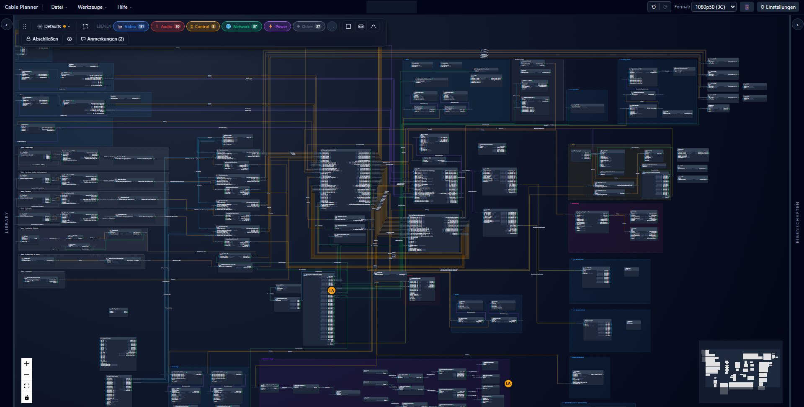
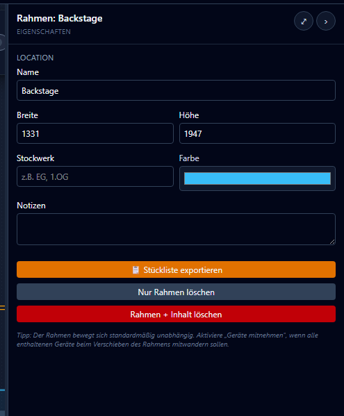
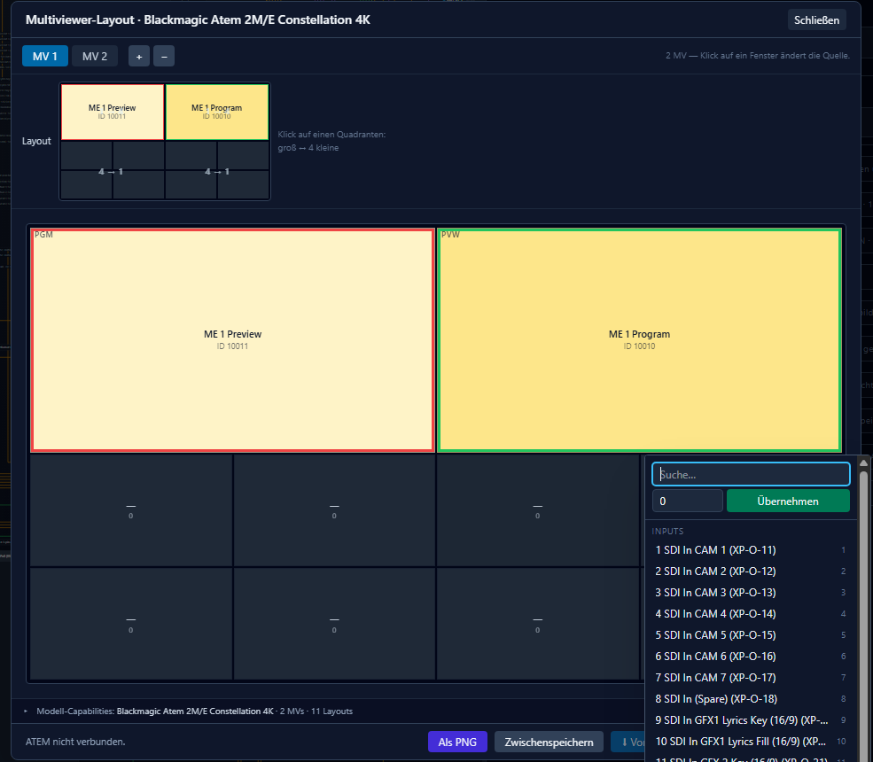
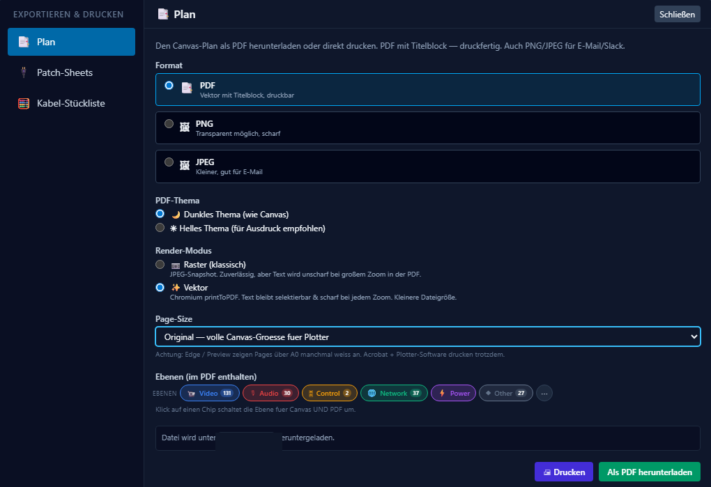
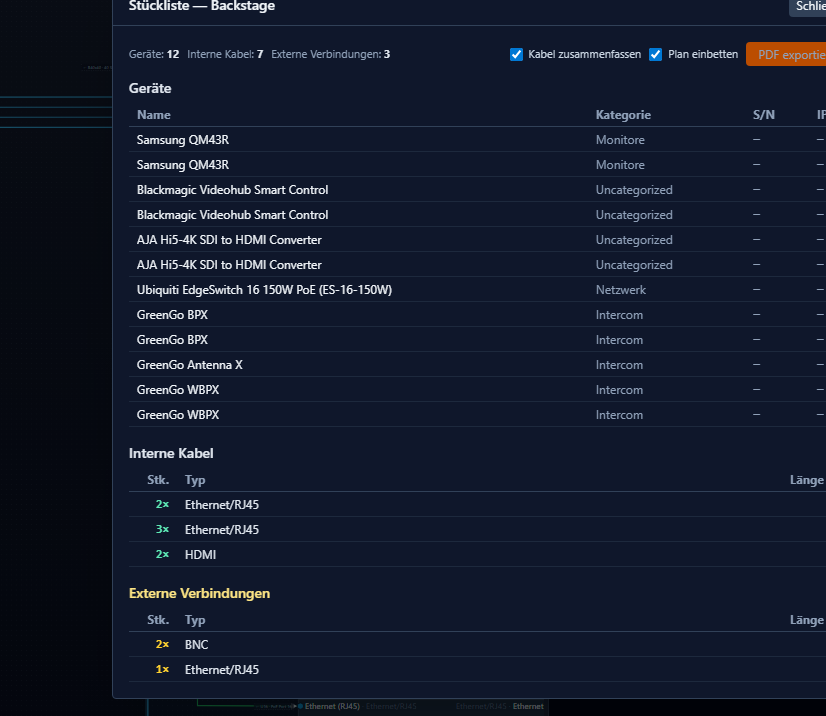
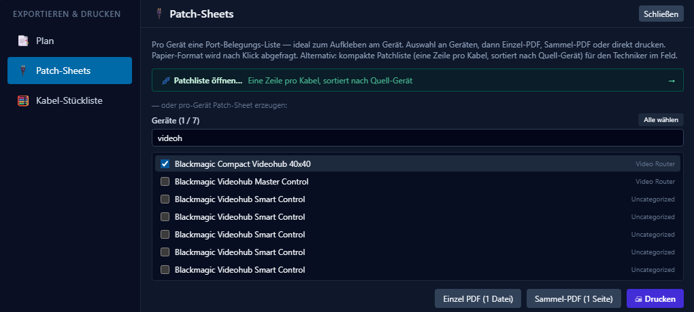

<h1 align="center">⚡ CablePlanner</h1>

<p align="center">
  <b>Broadcast cable planning software</b> — a node-based editor for AV, Network and Power Signal flow,<br />
  ATEM multiviewer layouts and Blackmagic Videohub routing.
</p>

<p align="center">
  
  
  
  
</p>

<p align="center">
  Plan, visualize, and document complex broadcast cabling systems — from camera to switcher to encoder — with real-world production integrations.
</p>

<!-- DOWNLOAD CTA — always points at the newest GitHub release (installers auto-built in CI) -->
<p align="center">
  <a href="https://github.com/larszu/cable-planner/releases/latest">
    
  </a>
  &nbsp;
  <a href="https://larszu.github.io/cable-planner/">
 
  </a>
  <br />
  <sub>Free &amp; MIT-licensed · <code>.dmg</code> (Apple Silicon + Intel) and <code>.exe</code> installers attached to every release</sub>
</p>

<!-- HERO IMAGE — see docs/screenshots/README.md for capture + redaction guide -->
<p align="center">
  
  <br />
  <sub><i>The node-based canvas — equipment nodes, ports and routed signal cabling.</i></sub>
</p>


---

## ✨ Overview

**CablePlanner** is free, open-source **broadcast cable planning software** for designing and visualizing **SDI signal flow**, **ATEM multiviewer** layouts and **Blackmagic Videohub routing** on a node-based canvas. It runs **fully offline** on macOS and Windows, so every audio, video and data run is documented before you ever pull cable on site.

Built with **Electron, React, and TypeScript**, it is designed for real-world production environments such as studios, OB vans, and live event setups — a modern, open alternative to legacy AV/broadcast wiring tools.

✔ Fully offline desktop application  
✔ macOS & Windows support  
✔ Production-focused broadcast tooling  
✔ Extensible integration system  

---

## 📸 Screenshots


<table>
  <tr>
    <td width="50%" align="center">
      <br />
      <b>Device &amp; location properties</b>
    </td>
    <td width="50%" align="center">
      <br />
      <b>ATEM multiviewer editor</b>
    </td>
  </tr>
  <tr>
    <td width="50%" align="center">
      <br />
      <b>Export &amp; print hub</b>
    </td>
    <td width="50%" align="center">
      <br />
      <b>Cable bill of materials</b>
    </td>
  </tr>
  <tr>
    <td colspan="2" align="center">
      <br />
      <b>Per-device patch sheets</b>
    </td>
  </tr>
</table>

---

## ✨ Core Features

### 🎛️ Visual Cable Canvas
- Drag & drop node-based interface (React Flow)
- Equipment nodes with input/output ports
- Interactive cable connections between devices
- Cable metadata (type, length, color, notes)
- Zoom, pan, minimap navigation
- Real-time signal topology visualization

---

### 🔌 Equipment & Cable Management
- Built-in broadcast equipment library
- Custom device templates
- Port-level connection system
- Cable properties:
  - Type (SDI, HDMI, Ethernet, etc.)
  - Length tracking
  - Color coding
  - Labeling & notes
- Reusable project components

---

### 📡 ATEM Multiviewer Configuration
- Visual multiview layout editor
- Camera / program / preview assignment
- Grid-based layout system
- Preconfigured source mapping
- Exportable production configs

Compatible with Blackmagic ATEM switchers (Television Studio, Constellation, and M/E models).

---

### 🔀 Videohub Routing Configuration
- SDI routing visualization
- Source → destination patch mapping
- Logical router configuration editor
- Visual signal path overview
- Exportable routing setups

Designed for Blackmagic Videohub infrastructure.

---

### 🔗 Rentman Integration
- Secure API integration with the Rentman rental-management platform
- Import projects, equipment, and categories
- Token-based authentication (encrypted local storage)
- No credentials stored in source code
- Selective import workflow (project/equipment filtering)

---

### 📄 Export & Documentation
- PDF export of full cable layouts
- Includes:
  - Equipment lists
  - Cable metadata
  - Signal routing overview
- Print-ready production documentation

---

## 🧠 Project Management
- Local JSON project system
- New / Open / Save / Save As workflows
- Recent projects list (auto-managed)
- Safe file handling with concurrency protection

---

## ⚙️ Experimental Features
- 🌐 Shared network-drive sync for multi-planner collaboration *(experimental)*
- 🗄️ 3D rack builder with STL export *(in progress)*
- 🎧 GreenGo intercom configuration export *(experimental)*
- 📱 Mobile build-day viewer (LAN + QR) for field technicians

---

## 🛠️ Tech Stack

| Layer | Technology |
| ----- | ---------- |
| Desktop shell | **Electron** |
| UI | **React 19** + **TypeScript** |
| Canvas | **React Flow** (node graph) |
| 3D rack view | **three.js** / react-three-fiber |
| Styling | **Tailwind CSS** (token-based theming) |
| State | **Zustand** stores with localStorage autosave |
| Build | **Vite** |
| Export | **jsPDF** (vector + raster PDF, PNG/JPEG/SVG) |

The app is **offline-first**: every project is a local JSON file, all
state lives on-device, and integrations (Rentman, ATEM, Videohub) are opt-in.

---

## 🆚 CablePlanner vs. the alternatives

Looking for a **WireCAD alternative**, a **D-Tools** or **Microsoft Visio**
replacement for AV/broadcast wiring, or something more domain-specific than
**draw.io**? Here is where CablePlanner fits:

| | **CablePlanner** | WireCAD | D-Tools SI | Visio / draw.io |
| --- | --- | --- | --- | --- |
| Price | **Free · MIT** | ~$1,500–4,500 | $1,000s / yr | Subscription / free |
| Platforms | **macOS + Windows** | Windows only | Windows + SQL Server | Windows / web |
| File format | **Open JSON (git-diffable)** | Proprietary | Proprietary | VSDX / XML |
| Broadcast-smart defaults | **Yes** (connector→layer, BOM, patch sheets) | Yes | Partial | No |
| ATEM / Videohub live control | **Yes** | No | No | No |
| 3D rack view | **Yes** *(in progress)* | No | No | No |

- **vs. WireCAD** — CablePlanner wins on platform support, open file format,
  modern UX and live hardware control; WireCAD has the deeper symbol library and
  a longer-established workflow.
- **vs. D-Tools System Integrator** — different league: D-Tools covers the full
  quote → invoice business lifecycle, while CablePlanner is a focused planning
  tool (complementary, not competing).
- **vs. EPlan / WSCAD** — those target industrial-electrical and control-cabinet
  design; CablePlanner is purpose-built for AV/broadcast signal flow.
- **vs. draw.io / Visio** — general diagramming tools are a workaround for AV;
  CablePlanner adds connector-aware layers, a cable bill of materials and
  patch-sheet logic out of the box.

📊 Full structural comparison: [`docs/comparison.html`](docs/comparison.html).

---

## 🚀 Getting Started

**Prerequisites:** [Node.js](https://nodejs.org/) 20+ and npm.

```bash
# 1. Install dependencies
npm install

# 2. Run the desktop app in development (Vite + Electron, hot-reload)
npm run dev

# 3. Type-check, lint
npx tsc -p tsconfig.app.json --noEmit
npm run lint

# 4. Production build (renderer + main + preload)
npm run build

# 5. Package distributable installers (macOS / Windows)
npm run dist
```

> Tip: `npm run dev` launches the full Electron shell. The renderer also runs
> in a plain browser (`npm run dev:renderer` → `localhost:5173`) for quick UI
> work, though desktop-only features (file I/O, ATEM/LAN) are inert there.

---

## 📚 Documentation
- [`docs/architecture.md`](docs/architecture.md) — Process model, IPC, store
  architecture, build & release workflow, non-negotiable invariants.
- [`docs/app-structure.html`](docs/app-structure.html) — interactive module
  overview (open in a browser).
- [`docs/comparison.html`](docs/comparison.html) — competitor comparison.

---

## 👤 Author

Built and maintained by **Lars Zumpe**

---

## ❤️ Support / Donate

If CablePlanner saves you time on your next show, consider buying me a coffee:

<p>
  <a href="https://paypal.me/larszumpe">
    
  </a>
</p>

Donations are completely optional — the app stays MIT-licensed and free either way. 🙌

---

## 📄 License

MIT
