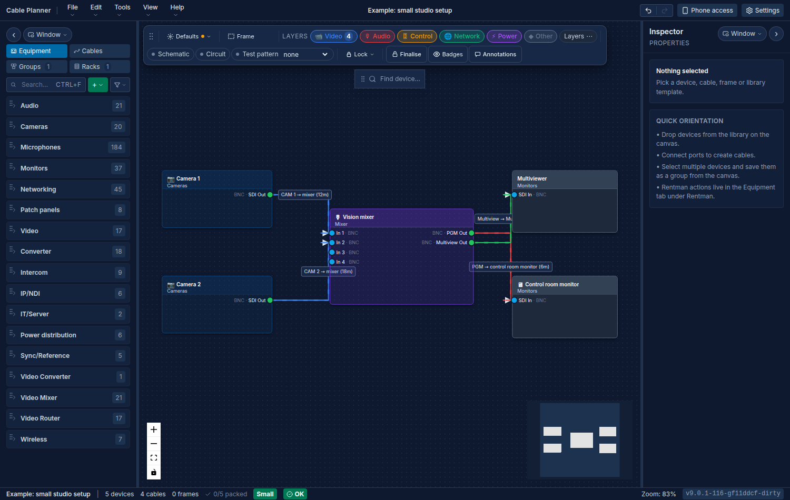
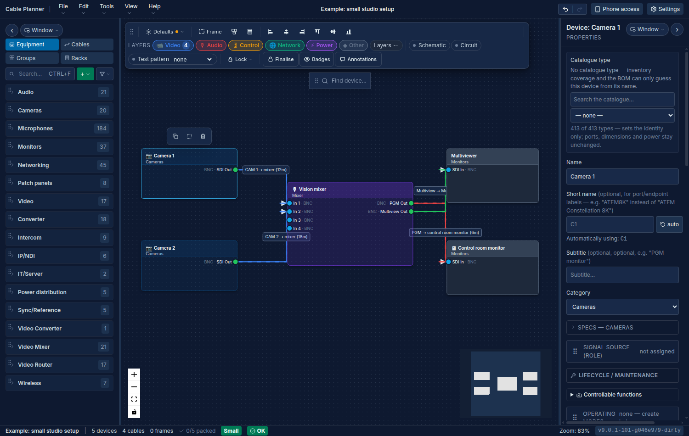
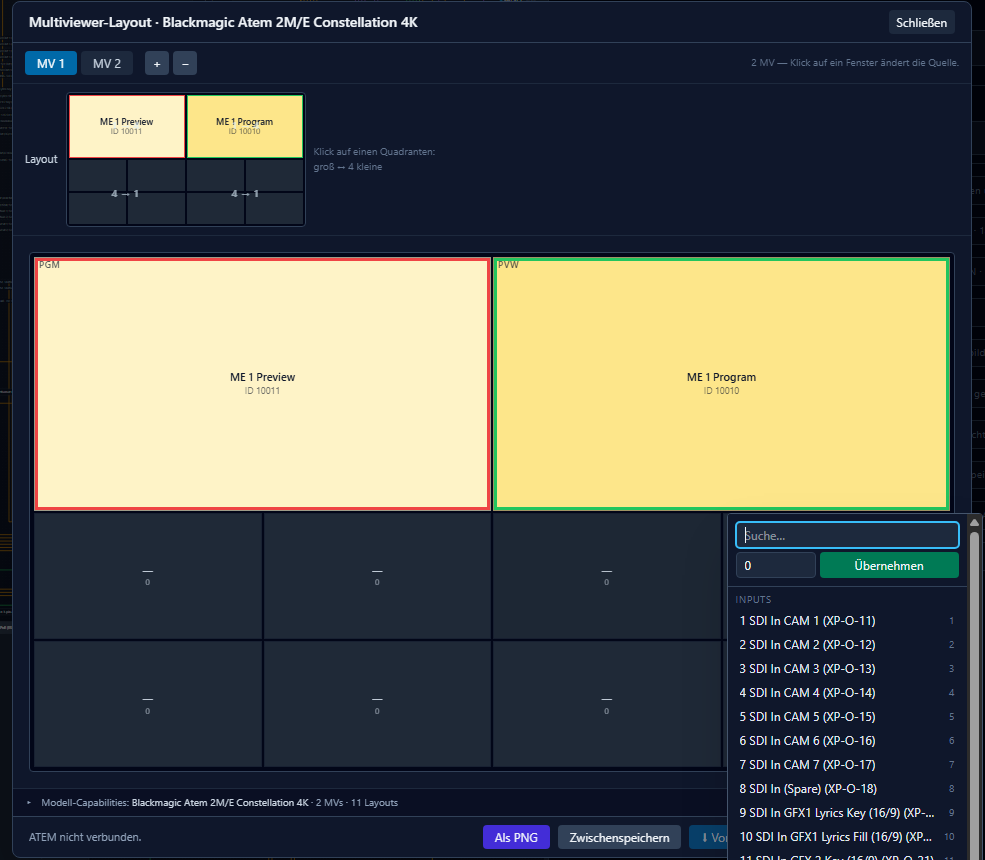
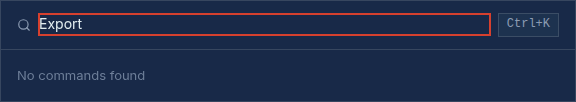
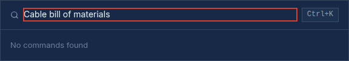
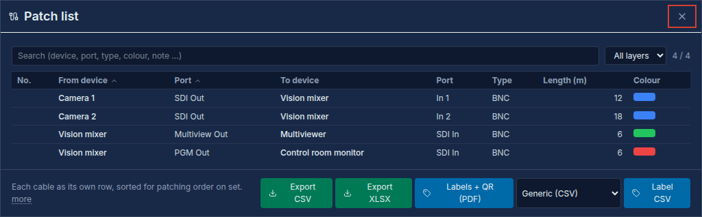

<h1 align="center">⚡ CablePlanner</h1>

<p align="center">
  <b>Broadcast cable planning software</b> — a node-based editor for AV, Network and Power Signal flow,<br />
  ATEM multiviewer layouts and Blackmagic Videohub routing.
</p>

<p align="center">
  
  
  
  
</p>

<p align="center">
  Plan, visualize, and document complex broadcast cabling systems — from camera to switcher to encoder — with real-world production integrations.
</p>

<!-- DOWNLOAD CTA — always points at the newest GitHub release (installers auto-built in CI) -->
<p align="center">
  <a href="https://github.com/larszu/cable-planner/releases/latest">
    
  </a>
  &nbsp;
  <a href="https://larszu.github.io/cable-planner/">
 
  </a>
  <br />
  <sub>Kostenlos nutzbar, proprietär lizenziert · <code>.dmg</code> (Apple Silicon + Intel) and <code>.exe</code> installers attached to every release</sub>
</p>

<!-- HERO IMAGE — see docs/screenshots/README.md for capture + redaction guide -->
<p align="center">
  
  <br />
  <sub><i>The node-based canvas — equipment nodes, ports and routed signal cabling.</i></sub>
</p>


---

## The web page

Every push to the default branch builds this repo's page from
`.github/workflows/pages.yml` and publishes it:

**https://larszu.github.io/cable-planner/**

The workflow **asks the Pages API before it configures anything.** With no
Pages site it still builds — that is a real check — and skips only the
publishing step, with a warning and the one missing step in the run summary.
A run that must stay red for a click nobody made teaches people to ignore red.

Measured 2026-09-09: **published** — the `deploy` job ran and succeeded.

---
## ✨ Overview

**CablePlanner** is free-to-use **broadcast cable planning software** for designing and visualizing **SDI signal flow**, **ATEM multiviewer** layouts and **Blackmagic Videohub routing** on a node-based canvas. It runs **fully offline** on macOS and Windows, so every audio, video and data run is documented before you ever pull cable on site.

Built with **Electron, React, and TypeScript**, it is designed for real-world production environments such as studios, OB vans, and live event setups — a modern alternative to legacy AV/broadcast wiring tools. The source is public to read; the licence is proprietary (see [LICENSE](LICENSE)).

✔ Fully offline desktop application  
✔ macOS & Windows support  
✔ Production-focused broadcast tooling  
✔ Extensible integration system  

---

## 📸 Screenshots


<table>
  <tr>
    <td width="50%" align="center">
      <br />
      <b>Device &amp; location properties</b>
    </td>
    <td width="50%" align="center">
      <br />
      <b>ATEM multiviewer editor</b>
    </td>
  </tr>
  <tr>
    <td width="50%" align="center">
      <br />
      <b>Export &amp; print hub</b>
    </td>
    <td width="50%" align="center">
      <br />
      <b>Cable bill of materials</b>
    </td>
  </tr>
  <tr>
    <td colspan="2" align="center">
      <br />
      <b>Per-device patch sheets</b>
    </td>
  </tr>
</table>

---

## ✨ Core Features

### 🎛️ Visual Cable Canvas
- Drag & drop node-based interface (React Flow)
- Equipment nodes with input/output ports
- Interactive cable connections between devices
- Cable metadata (type, length, color, notes)
- Zoom, pan, minimap navigation
- Real-time signal topology visualization
- **Rooms and floors**: a frame on the canvas is a room; it picks its floor from
  the project's floor list (bottom to top, with the floor level in metres —
  *Floors* in the frame's properties). Renaming a floor renames it on every
  frame; old projects with typed-in floors become the list on load
- **Where each cable end sits**: the cable's properties, the pull list and the
  cable schedule show *floor · room · device · port* for both ends, read from
  where the device lies — e.g. `EG · Hall 3 · CAM 3 · SDI Out → 3rd floor ·
  Gallery · Videohub · SDI 12`

---

### 🔌 Equipment & Cable Management
- Built-in broadcast equipment library
- Custom device templates
- Port-level connection system
- Cable properties:
  - Type (SDI, HDMI, Ethernet, etc.)
  - Length tracking
  - Color coding
  - Labeling & notes
- **Runs split into the stock lengths you actually own** (#875): record the
  drums this production runs (Settings → Project → *Available stock lengths*),
  and the cable bill of materials turns a 137 m run into 100 + 50 with one
  coupler. Fewest couplers first, least excess second — a coupler is a
  connection that can come loose, ten metres of excess cost coiling. The split
  and the coupler count go into the on-screen list, the CSV and the PDF, and
  the list says what the stock does not cover. An entry without a counted
  quantity produces no warning: nobody counted, so there is nothing to warn
  about.
- Reusable project components

---

### 💾 The recovery copy says when it fails

The plan is auto-saved into the browser store every few hundred milliseconds.
That store holds about 5 MB — and until now, the moment a project outgrew it,
the copy stopped being written **silently** (`catch {}`). Keep planning, lose
the machine, and you are back at the state from whenever that happened,
without anyone having said so.

The status bar now says **“No recovery copy”** with the project's size, and
what to do (save to a file). The plan itself is unaffected — only the copy in
the browser is missing, and the message says that too.

---

### 🔁 Adapters, gender changers, converters

Three different things, kept apart (#876):

- An **adapter** changes the shape of the plug — BNC to RCA. The signal stays
  what it was; a piece of metal does it.
- A **gender changer** changes only pin or socket. Two XLR plugs do not mate,
  although both are XLR. Port gender was already recorded and was invisible
  to every compatibility check until now — that is the error nobody sees in
  the plan and everybody finds at the dock.
- A **converter** changes the signal — SDI to HDMI. It has a manufacturer, a
  bandwidth limit and a price, and none of those is in the plan. The planner
  therefore **names** it and never inserts it.

The first two can be inserted with one click on the selected cable: one run
becomes two with the device in between, at its place on the canvas and in the
picking list. **One undo takes all of it back** — the insertion is a single
store write, not three that happen to fall inside a coalescing window.

The inserted adapter claims nothing: direction and power stay "unknown", so
the plan check lists it as an **open point** and not as a green tick. A green
tick for a part nobody has checked costs more than an open point.

---

### 🔌 Faceplate editor

Wall panels, stage boxes and rack plates (#879): place each connector on the
plate **in millimetres**, print the label strip and the drilling sheet **1:1**.

- The connectors **are the ports of that device** — not a drawing beside them.
  What you move here is the same position the rack view and the 3D view read;
  nothing has to be kept in sync because there is only one field.
- **Cutout diameters are entered, never guessed.** A Neutrik D-hole is 24 mm, a
  BNC bushing 10 to 12.7 mm depending on the part — which one applies is in the
  manufacturer's document. Connectors without the figure are *not* checked
  against each other, and the report says so: a plate without cutout sizes is
  unchecked, not collision-free.
- Checks: a hole that runs over the edge, two holes that run into each other
  (with the overlap in millimetres), and connectors that have no position yet.
- The **faceplate list** goes through the report editor like every other list,
  so it groups, filters and prints with the same settings.
- A **wall panel, stagebox or plate passes the signal through**, socket n at
  the back to socket n at the front — so the signal path runs camera → hall
  plate → house run → 3rd-floor plate → gallery as one chain instead of
  stopping at the first plate. Untick *Patch panel* on a plate that does not
  (a stagebox with a converter inside).

---

### 📋 Report editor

Every list this program prints — pull list, termination list, cable schedule,
asset register, network sheet, spectrum plan, delivery, tally map, handover —
goes through one editor (#880):

- **Columns**: show, hide, reorder.
- **Group** by any column, **sort** by several (a hidden column sorts too — who
  orders by room and does not want to print it would otherwise get a list in no
  order at all), **filter** per column.
- **Templates**, saved either *with the project* ("this production's pull list")
  or *for all projects* ("my pull list"). Those are two statements, so they have
  two homes.
- **The preview is the export.** Not a rendering of it: the table on screen, the
  CSV file and the printed sheet are the same computed result. A preview that
  re-implements the export agrees on day one and drifts afterwards.

A template written against last month's list still opens: a column that no
longer exists drops out, a new one joins **visible** — a silently missing column
on a pull list is worse than one too many.

---

### 🧵 Fibre breakouts and polarity

One socket, several fibres (#885). An opticalCON QUAD carries four of them
behind a single connector, and until now the plan could only show that as four
cables — which loses the outer connector, the one figure the cable actually has
to match.

- The **breakout lives on the socket**: each fibre with its position, what it
  carries (`TX`, `RX` or *not stated*) and its own connector at the tail.
- Each cable end says **which fibre it uses**. Patch list and pull list carry
  it as a column, and only when the plan has a breakout at all.
- The plan check finds **three of four fibres patched**, two cables on the same
  fibre, and a fibre the socket does not have.
- **Polarity** is checked only against a method you entered — TIA-568 knows the
  methods A, B and C, and they differ in *where* the fibres cross. Which one
  applies is in the site's own document, so none is built in. Until one is
  chosen the direction is reported as **unchecked**, never as correct.
- *Not stated* is a state of its own throughout: it never turns into a green
  tick, and it is never quietly read as `TX`.

---

### 🟥 LED walls

- Panel types with the figures off the datasheet — pixel pitch, resolution,
  size, and, where stated, weight and power (average **and** peak)
- Opening in millimetres → grid, with the leftover shown: a tile that only
  half fits does not fit, and the remainder is the figure you hang the wall by
- Totals: panel count, resolution, size, weight, load
- Sending card: how many ports the wall needs against how many it has
- **Connected to power and to the picking list**: the wall names the building
  outlet it is fed from. Its *continuous* figure joins the load at that outlet,
  its *peak* gets a finding of its own — the breaker is chosen by the peak, and
  a wall draws a multiple of its average on a white frame. A panel type without
  a power figure is **not** counted as zero; the plan says its load is missing
  from the sum. The panels themselves are counted per type in the picking list.
- **Pixel map as PNG**, exactly as large as the wall has pixels, tiles
  numbered row by row from the top left — the order a wall is built in
- Nothing is estimated: a panel type without a weight gives a wall of unknown
  weight, not one of zero, and a sending card nobody recorded says nothing
  rather than "fine"

---

### 📡 ATEM Multiviewer Configuration
- Visual multiview layout editor
- Camera / program / preview assignment
- Grid-based layout system
- Preconfigured source mapping
- Exportable production configs

Compatible with Blackmagic ATEM switchers (Television Studio, Constellation, and M/E models).

---

### 🔀 Videohub Routing Configuration
- SDI routing visualization
- Source → destination patch mapping
- Logical router configuration editor
- Visual signal path overview
- Exportable routing setups

Designed for Blackmagic Videohub infrastructure.

---

### 🤖 Use with Claude

The planner can answer questions about the open plan through a **local MCP
server** (#872) — devices, ports, signal paths, cables and what the plan check
says.

- **It only reads.** Stage 1 has no writing tools at all, and every tool is
  declared `readOnlyHint`. Nothing in the plan can be changed through it.
- **It asks the plan, not a file.** The question goes into the planner window
  and is answered from the live store with the *same* functions the screen
  uses. A file on disk is the state of the last save; a second implementation
  of "what is connected to what" would disagree with the screen sooner or later.
- **Off by default**, switched on under *Settings → MCP*. It binds to
  `127.0.0.1` only, requires a pairing token kept in the operating system's
  credential store, and rejects requests whose `Host`/`Origin` is not the
  loopback address (DNS-rebinding protection). While it runs, the status bar
  says so — and says when a client is asking.

```bash
claude mcp add --transport http cable-planner http://127.0.0.1:<port>/mcp \
  --header "Authorization: Bearer <token>"
```

The settings page shows the line with the port and token already filled in.

**Writing is a second switch** (#873), off by its own default. With it on, Claude
can connect and remove cables, set cable details and rename devices — through
the *same store actions the canvas uses*, so the validation, the type
inheritance and the layer detection are the ones you already know. Each call is
**one undo step**, and each leaves a line under *What Claude changed*, which
travels in the plan file.

If two ends do not mate, the answer says what would: *"No cable in the catalogue
connects BNC to HDMI directly - this needs a converter, and the planner names
converters instead of inserting them."* A refusal without a way forward just
makes a model try the same thing again.

**Switching commands are never offered.** Reading a Videohub or an ATEM: yes.
Routing them from a tool: no — a model that changes routing during a show is a
risk without a payoff.

---

### 🔗 Integrations & Interchange
- **Rentman** — import projects, equipment and categories from the rental
  platform, with a selective import workflow
- **NetBox** — import racks, devices and cable paths from the DCIM side
- **GraphML** — import existing diagrams, with a preview before anything lands
  in the plan
- **Green-GO** — intercom configuration export (`.gg5`), plus a
  **vendor-neutral intercom exchange file** that someone building a Riedel or
  Clear-Com system can also read
- **`.avplan`** — the shared exchange format across the planner suite. When the
  file carries the MultiCam plan's cameras, opening it offers to place them in
  the signal plan
- **MultiCam cameras** (`.cameras.json`, *File → Import MultiCam cameras*) —
  every placed camera becomes a device with its datasheet ports, lens, zoom
  range and set focal length (shown on the node and under *Optics* in its
  properties). Importing again **reconciles** instead of duplicating: names
  and optics follow the camera plan, position, ports and cables stay, and a
  camera that left the MultiCam plan is marked, not deleted — cables may hang
  on it
- **Racks for the warehouse** (`rack-belegung.json`, *Library → Racks → For the
  warehouse*) — what sits in each rack, with unit and name, for the Inventory
  Planner. A rack that travels in a case is a case there: the warehouse owns
  the empty shell (how many units, how deep), the plan owns what is mounted
  in it. The inventory checks one against the other and says so when the plan
  fills units 1–14 of a 12-unit case — before the truck leaves. Units are
  counted from the bottom in the file, the way the trade counts them.
- **Building statement** (`.avfacility`, from the facility planner) — outlets,
  cable routes and the control addresses the show may use. The plan **refers**
  to them and keeps no copy: the checks ask the statement, so a device wired to
  an outlet or a control address that the latest statement no longer lists says
  so. A **DALI address whose kind is not stated** is reported too — short
  address, group and broadcast are three different things, and the last one is
  the whole bus, emergency lighting included.

API tokens live in the **operating system's credential store** (macOS Keychain,
Windows Credential Manager, libsecret) through `keytar` — not in the project
file, not in browser storage, not in source. Exports strip them before writing.

---

### 👥 Live Collaboration
- Real-time co-editing over **WebRTC** with a CRDT document — no server holds
  your plan
- Presence: who is in the room, and where they are working
- Join by **invite link**, or find open sessions on the LAN automatically
- **Room password** encrypts the session end-to-end; without it, anyone who
  knows the room name can read along
- Bring your own **signaling relay and STUN/TURN servers** for connections
  across networks — or switch on **local-only** mode, where nothing leaves
  your LAN
- Collaborative undo takes back *your* edits, not other people's

---

### 🗄️ Inventory & Stock
- Warehouse stock with storage locations, serial numbers and quantities
- The plan's demand checked against what is actually in stock — including the
  parts that are not equipment nodes (drum kits, wireless rigs, patch fields)
- Portable stock file, importable and mergeable

---

### 📄 Export & Documentation
- PDF export of full cable layouts
- Includes:
  - Equipment lists
  - Cable metadata
  - Signal routing overview
- Print-ready production documentation

---

## 🧠 Project Management
- Local JSON project system
- New / Open / Save / Save As workflows
- Recent projects list (auto-managed)
- Safe file handling with concurrency protection

---

## 📱 On Site
- **Mobile build-day view** over the LAN, opened by QR code — no install, no
  account. It is not read-only: the build team ticks off what is done, adds
  cables it actually pulled, files change requests and sends photos, all of
  which come back into the plan.
- **Photos for the documentation**, from the planner and from the phone. They
  point at a device or a cable (or at nothing, and then belong to the project),
  are scaled down on the way in, and travel inside the plan file.
- **Label sheets and QR labels** for cables and devices, print-ready.
- **Read-only web viewer** for sharing a plan with someone who does not run the
  app.

---

## ⚙️ Experimental Features
- 🌐 Shared network-drive sync for multi-planner collaboration *(experimental)*
- 🗄️ 3D rack builder with STL export *(in progress)*

---

## 🛠️ Tech Stack

| Layer | Technology |
| ----- | ---------- |
| Desktop shell | **Electron** |
| UI | **React 19** + **TypeScript** |
| Canvas | **React Flow** (node graph) |
| 3D rack view | **three.js** / react-three-fiber |
| Styling | **Tailwind CSS** (token-based theming) |
| State | **Zustand** stores with localStorage autosave |
| Build | **Vite** |
| Export | **jsPDF** (vector + raster PDF, PNG/JPEG/SVG) |

The app is **offline-first**: every project is a local JSON file, all
state lives on-device, and integrations (Rentman, ATEM, Videohub) are opt-in.

---

## 🆚 CablePlanner vs. the alternatives

Looking for a **WireCAD alternative**, a **D-Tools** or **Microsoft Visio**
replacement for AV/broadcast wiring, or something more domain-specific than
**draw.io**? Here is where CablePlanner fits:

| | **CablePlanner** | WireCAD | D-Tools SI | Visio / draw.io |
| --- | --- | --- | --- | --- |
| Price | **Kostenlos · proprietär** | ~$1,500–4,500 | $1,000s / yr | Subscription / free |
| Platforms | **macOS + Windows** | Windows only | Windows + SQL Server | Windows / web |
| File format | **Open JSON (git-diffable)** | Proprietary | Proprietary | VSDX / XML |
| Broadcast-smart defaults | **Yes** (connector→layer, BOM, patch sheets) | Yes | Partial | No |
| ATEM / Videohub live control | **Yes** | No | No | No |
| 3D rack view | **Yes** *(in progress)* | No | No | No |

- **vs. WireCAD** — CablePlanner wins on platform support, open file format,
  modern UX and live hardware control; WireCAD has the deeper symbol library and
  a longer-established workflow.
- **vs. D-Tools System Integrator** — different league: D-Tools covers the full
  quote → invoice business lifecycle, while CablePlanner is a focused planning
  tool (complementary, not competing).
- **vs. EPlan / WSCAD** — those target industrial-electrical and control-cabinet
  design; CablePlanner is purpose-built for AV/broadcast signal flow.
- **vs. draw.io / Visio** — general diagramming tools are a workaround for AV;
  CablePlanner adds connector-aware layers, a cable bill of materials and
  patch-sheet logic out of the box.

📊 Full structural comparison: [`docs/comparison.html`](docs/comparison.html).

---

## 🚀 Getting Started

**Prerequisites:** [Node.js](https://nodejs.org/) 20+ and npm.

```bash
# 1. Install dependencies
npm install

# 2. Run the desktop app in development (Vite + Electron, hot-reload)
npm run dev

# 3. Type-check, lint
npx tsc -p tsconfig.app.json --noEmit
npm run lint

# 3b. Every *:check script is actually run by CI
npm run ci:complete

# 4. Production build (renderer + main + preload)
npm run build

# 5. Package distributable installers (macOS / Windows)
npm run dist
```

> Tip: `npm run dev` launches the full Electron shell. The renderer also runs
> in a plain browser (`npm run dev:renderer` → `localhost:4181`) for quick UI
> work, though desktop-only features (file I/O, ATEM/LAN) are inert there.

### Submitting your own device templates

Built a template for a device the catalogue does not have? **Library → `+` →
Submit templates…** checks your own templates and writes a submission file.

The check is the point, and one rule of it is hard: **no datasheet link, no
submission.** A template nobody can verify looks, in a plan six months later,
exactly like one that was. Every port needs a connector type and a label too —
not for tidiness, but because "Replace device" matches ports by exactly those
two, and a template missing them falls back to matching by position, which
cables the wrong socket.

Power draw is the opposite case: it is **reported, not required.** A passive
splitter has none and a PoE device draws it from the network; forcing a number
there would mean inventing one so a form is happy. It stays "not stated" in
the catalogue rather than a 0 that looks measured.

What does not pass is written **into the file** with its reason, next to what
did — a submission that quietly drops half of itself looks complete.

### On a tablet — the web edition

The deployed page is installable: open it on an iPad and add it to the home
screen, and it runs full-screen with its own icon (it has its own manifest —
the one the phone viewer uses describes a different app, and installing that
one would put the viewer on your home screen).

On a touch screen the canvas behaves like a touch app: pinch zooms the plan
and not the page, two fingers pan, and **a long press on a device opens the
context menu** that the right mouse button opens on a desktop — 500 ms and
10 px of slop, the same values iOS and Android use for their own "touch and
hold", because a gesture that feels different in one app makes the user think
they are clumsy. Port hit areas grow **outwards** on a coarse pointer, never
upwards: above and below sit the neighbouring ports, and hitting the wrong
port is worse than missing — you notice missing immediately, and the wrong
cable at the show-through.

What the browser cannot do is listed **before** you click it, in
Settings → Integrations: ATEM, Videohub, NetBox, LAN sync, phone access, the
MCP server, show control, switching, the direct path to the Tally-Pi, the
Rentman export and the update check each say *why* — a socket, a listening
port, or the OS keychain. The list is checked against `lib/bridge.ts`, so it
cannot go stale without turning a test red.

---

## 📚 Documentation
- [**`docs/README.md`**](docs/README.md) — index of everything in `docs/`,
  grouped by operations, development, domain concepts and dated audits.
- [`docs/cloud/nachfragetest.md`](docs/cloud/nachfragetest.md) — the threshold
  for the planned Pro/Cloud tier, written down **before** it was measured (20
  paid pre-orders in three months) and what happens if it is not reached. The
  desktop app stays free, offline and complete either way — the cloud is an
  addition, never a requirement.
- [`docs/cloud/recht-und-betrieb.md`](docs/cloud/recht-und-betrieb.md) — the
  checklist for the tax adviser and the lawyer, with the part only the code
  can answer filled in: which data each planned service would touch, and which
  it would not.
- [`docs/self-hosted-relay.md`](docs/self-hosted-relay.md) — run your own
  signaling relay and TURN server for live collaboration across networks.
- [`docs/architecture.md`](docs/architecture.md) — Process model, IPC, store
  architecture, build & release workflow, non-negotiable invariants.
- [`docs/app-structure.html`](docs/app-structure.html) — interactive module
  overview (open in a browser).
- [`docs/comparison.html`](docs/comparison.html) — competitor comparison.

---

## 👤 Author

Built and maintained by **Lars Zumpe**

---

## ❤️ Support / Donate

If CablePlanner saves you time on your next show, consider buying me a coffee:

<p>
  <a href="https://paypal.me/larszumpe">
    
  </a>
</p>

Donations are completely optional — the app stays free to use. It is proprietary software, not open source. 🙌

---

## 📄 License

Proprietär — © 2026 Lars Zumpe, alle Rechte vorbehalten. Nutzung der veröffentlichten Builds ist kostenlos; Weiterverbreitung und abgeleitete Werke sind es nicht. Siehe [LICENSE](LICENSE).

Die gebündelten Fremdpakete behalten ihre eigenen Lizenzen; deren Texte und
Copyright-Hinweise stehen vollständig in
[THIRD-PARTY-LICENSES.md](THIRD-PARTY-LICENSES.md) (erzeugt von
`scripts/generate-notices.mjs` aus dem Produktions-Dependency-Baum).
