# LZ Cable Planner — Benutzerhandbuch

Broadcast- und AV-Verkabelung planen, dokumentieren und übergeben:
Signalfluss, Räume und Etagen, Kabellängen, Patch-Listen und die Unterlagen
für den Aufbautag.

English version: [manual.en.md](manual.en.md)

---

## Inhalt

1. [Erste Schritte](#1-erste-schritte)
   - [Installation](#installation)
   - [Erstes Projekt](#erstes-projekt)
2. [Programmoberfläche](#2-programmoberfläche)
   - [Menü Bearbeiten](#menü-bearbeiten)
   - [Menü Ansicht](#menü-ansicht)
   - [Menü Hilfe](#menü-hilfe)
   - [Befehlspalette](#befehlspalette)
   - [Statusleiste](#statusleiste)
   - [Designeinstellungen](#designeinstellungen)
   - [Canvas-Sichtbarkeitsoptionen](#canvas-sichtbarkeitsoptionen)
   - [Informationen und Hilfe](#informationen-und-hilfe)
   - [Nicht aufgenommene Funktionen](#nicht-aufgenommene-funktionen)
3. [Canvas](#3-canvas)
   - [Werkzeugleiste (Toolbar)](#werkzeugleiste-toolbar)
   - [Einstellungen: Defaults (Voreinstellungen für neue Kabel)](#einstellungen-defaults-voreinstellungen-für-neue-kabel)
   - [Rahmen (Location Frames)](#rahmen-location-frames)
   - [Auswahl und Mehrfach-Verkabelung](#auswahl-und-mehrfach-verkabelung)
   - [Ausrichtung und Anordnung](#ausrichtung-und-anordnung)
   - [Geräte im 2D-Rack-Builder anordnen](#geräte-im-2d-rack-builder-anordnen)
   - [Kontextmenüs (Rechtsklick)](#kontextmenüs-rechtsklick)
   - [Layer-Sichtbarkeit (Video, Audio, Control, Network, Power)](#layer-sichtbarkeit-video-audio-control-network-power)
   - [Signalfluss-Darstellung (Flow Mode)](#signalfluss-darstellung-flow-mode)
   - [Grundriss (Floor Plan)](#grundriss-floor-plan)
   - [Symbole (Electrical, Alarm, PA, IT, AV)](#symbole-electrical-alarm-pa-it-av)
   - [Raumsichtbarkeit (Rooms)](#raumsichtbarkeit-rooms)
   - [3D-Gebäudeansicht](#3d-gebäudeansicht)
   - [Signalweg anzeigen](#signalweg-anzeigen)
   - [Geräte-Suche (Strg+F / Cmd+F)](#geräte-suche-strgf--cmdf)
   - [Inline-Auswahl-Toolbar (Multiple Selection)](#inline-auswahl-toolbar-multiple-selection)
   - [Sperren (Lock)](#sperren-lock)
   - [Finalisieren (Plan-Lock)](#finalisieren-plan-lock)
   - [Anmerkungen (Annotations)](#anmerkungen-annotations)
   - [Zoom und Navigation](#zoom-und-navigation)
   - [3D-Rackansicht](#3d-rackansicht)
   - [Kabel-Details](#kabel-details)
   - [Stream-Vorschau](#stream-vorschau)
   - [Tastenkürzel auf dem Canvas](#tastenkürzel-auf-dem-canvas)
4. [Bibliothek](#4-bibliothek)
   - [Geräte (Equipment)](#geräte-equipment)
   - [Kabel](#kabel)
   - [Gruppen](#gruppen)
   - [Racks](#racks)
   - [Häufig genutzte Einstellungen](#häufig-genutzte-einstellungen)
5. [Inspector](#5-inspector)
   - [Nichts ausgewählt](#nichts-ausgewählt)
   - [Geräteeigenschaften](#geräteeigenschaften)
   - [Die Abschnitte im Detail](#die-abschnitte-im-detail)
   - [Kabeleigenschaften](#kabeleigenschaften)
   - [Rahmen-Eigenschaften](#rahmen-eigenschaften)
   - [Mehrfachauswahl](#mehrfachauswahl)
6. [Datei und Import](#6-datei-und-import)
   - [Neues Projekt](#neues-projekt)
   - [Neu aus Vorlage](#neu-aus-vorlage)
   - [Öffnen](#öffnen)
   - [Speichern](#speichern)
   - [Speichern unter](#speichern-unter)
   - [Import yEd / GraphML](#import-yed--graphml)
   - [Import MultiCam-Kameras](#import-multicam-kameras)
   - [Import Equipment aus CSV](#import-equipment-aus-csv)
   - [Rentman-Import](#rentman-import)
   - [NetBox-Import](#netbox-import)
   - [Gesamtprojekt exportieren](#gesamtprojekt-exportieren)
   - [Gesamtprojekt importieren](#gesamtprojekt-importieren)
   - [Identitäts-Karte exportieren](#identitäts-karte-exportieren)
   - [Identitäts-Karte importieren](#identitäts-karte-importieren)
   - [Verknüpfte Venue-Planung ansehen](#verknüpfte-venue-planung-ansehen)
   - [Projekt-Dateiformat: `.cableplan`](#projekt-dateiformat-cableplan)
   - [Sicherungskopie in der Statusleiste](#sicherungskopie-in-der-statusleiste)
7. [Exportieren und Drucken](#7-exportieren-und-drucken)
   - [Patchliste](#patchliste)
   - [Festinstallation: Doku & Übergabe](#festinstallation-doku--übergabe)
   - [Stage Plot](#stage-plot)
   - [Exportieren & Drucken](#exportieren--drucken)
   - [Cloud & Lese-Link](#cloud--lese-link)
   - [Export als Viewer-Datei](#export-als-viewer-datei)
   - [Anmerkungen importieren](#anmerkungen-importieren)
   - [Plan-Stände vergleichen](#plan-stände-vergleichen)
   - [Ausgegebene Dokumente](#ausgegebene-dokumente)
8. [Werkzeuge: Planen](#8-werkzeuge-planen)
   - [Berechnen](#berechnen)
   - [Prüfen](#prüfen)
   - [Planen](#planen)
   - [Erstellen & Verwalten](#erstellen--verwalten)
   - [Device-Konfiguration](#device-konfiguration)
9. [Werkzeuge](#9-werkzeuge)
   - [Patchliste](#patchliste)
   - [Patch-Reihenfolge](#patch-reihenfolge)
   - [LED-Wand](#led-wand)
   - [Frontplatten-Editor](#frontplatten-editor)
   - [Berichts-Editor](#berichts-editor)
   - [Adern und Farbnormen](#adern-und-farbnormen)
   - [Empfangene Show-Control-Nachrichten](#empfangene-show-control-nachrichten)
   - [Mehrere Kabel verbinden](#mehrere-kabel-verbinden)
   - [Neues Rack erstellen](#neues-rack-erstellen)
   - [Rack-Builder](#rack-builder)
   - [KI-Plan generieren](#ki-plan-generieren)
   - [Revisionen & Snapshots](#revisionen--snapshots)
   - [Lager / Bestand](#lager--bestand)
   - [ATEM Multiviewer-Layout](#atem-multiviewer-layout)
   - [ATEM Audio-Routing](#atem-audio-routing)
   - [ATEM Input-Labels](#atem-input-labels)
   - [Videohub-Routing / Labels](#videohub-routing--labels)
   - [GreenGo-Intercom](#greengo-intercom)
   - [Hinweise](#hinweise)
10. [Einstellungen](#10-einstellungen)
   - [Projekt](#projekt)
   - [Darstellung](#darstellung)
   - [Bearbeiten](#bearbeiten)
   - [Kabeltypen](#kabeltypen)
   - [Stammdaten](#stammdaten)
   - [Konfigurationen](#konfigurationen)
   - [Gerätebibliothek](#gerätebibliothek)
   - [Integrationen](#integrationen)
   - [MCP](#mcp)
   - [Module](#module)
   - [Nachweise](#nachweise)
   - [Schema-Builder](#schema-builder)
   - [Sync](#sync)
   - [Tastenkürzel](#tastenkürzel)
   - [Erweitert](#erweitert)
11. [Claude (MCP)](#11-claude-mcp)
12. [Web-Ausgabe und Tablet](#12-web-ausgabe-und-tablet)
13. [Daten, Sicherheit und Fehlerbehebung](#13-daten-sicherheit-und-fehlerbehebung)

---

## 1. Erste Schritte

### Installation

Das Installationsprogramm liegt im
[neuesten Release](https://github.com/larszu/cable-planner/releases/latest):

- **macOS**: `.dmg` für Apple Silicon und Intel
- **Windows**: `.exe`

Die App läuft vollständig offline. Internet braucht nur die Gerätebibliothek,
die Cloud-Kopie und die Live-Sitzung über Netzgrenzen hinweg.

Ohne Installation läuft die Web-Ausgabe unter
**https://larszu.github.io/cable-planner/** (was sie nicht kann: Kapitel 21).

### Erstes Projekt

- **Datei → Neues Projekt** beginnt einen leeren Plan. **Öffnen…**,
  **Speichern** und **Speichern unter…** wie gewohnt; die Liste der letzten
  Projekte füllt sich selbst.
- Ein Projekt ist eine einzelne JSON-Datei (`.cableplan`). Sie lässt sich mit
  git versionieren und wie Text vergleichen.
- Während der Arbeit schreibt die App alle paar hundert Millisekunden eine
  Sicherungskopie. Wird das Projekt größer als dieser Speicher (etwa 5 MB),
  zeigt die Statusleiste **„Keine Sicherungskopie"** mit der Projektgröße —
  dann in eine Datei speichern. Der Plan selbst ist davon nicht betroffen.
- Rückgängig und Wiederholen reichen 100 Schritte zurück.


---

## 2. Programmoberfläche


Die Oberfläche von LZ Cable Planner besteht aus vier Hauptbereichen: der Menüleiste oben, der Bibliothek-Seitenleiste links, der Canvas-Fläche in der Mitte und dem Inspector-Panel rechts. Am unteren Rand liegt die Statusleiste.

### Menü Bearbeiten


Das Menü Bearbeiten enthält Funktionen zum Verändern der Auswahl.

| Funktion | Tastaturkürzel | Beschreibung |
|---|---|---|
| Rückgängig | Strg+Z | Letzten Schritt rückgängig machen |
| Wiederherstellen | Strg+Y | Letzten rückgängig gemachten Schritt wiederherstellen |
| Duplizieren | Strg+D | Ausgewählte Geräte oder Kabel duplizieren |
| Auswahl löschen | Entf | Ausgewählte Elemente löschen |
| Alles auswählen | Strg+A | Alle Geräte und Kabel im Plan auswählen |
| Auswahl aufheben | Esc | Aktuelle Auswahl aufheben |

### Menü Ansicht


Das Menü Ansicht stellt Funktionen zur Verfügung, um die Canvas-Ansicht zu beeinflussen und die Anzeige verschiedener Panels zu kontrollieren.

#### Zoom und Anpassung

| Funktion | Beschreibung |
|---|---|
| Einpassen | Canvas so zoomen, dass alle Elemente sichtbar sind |
| Zoom 100 % | Zoom auf 100 % zurücksetzen |
| Vergrößern | Canvas vergrößern |
| Verkleinern | Canvas verkleinern |

#### Design und Darstellung

| Funktion | Beschreibung |
|---|---|
| Helles Design | Zwischen hellem und dunklem Design umschalten |
| System-Theme folgen | Das Design des Betriebssystems verwenden |
| Vollbild | App im Vollbildmodus anzeigen |

#### Kabel und Beschriftungen

| Funktion | Beschreibung |
|---|---|
| Am Raster ausrichten | Geräte auf einem Raster ausrichten |
| Kabel-Labels ausblenden | Kabelbezeichnungen auf dem Canvas verbergen |
| Off-Page-Namen anzeigen | Namen von Geräten außerhalb des Plans anzeigen |
| Kabelfarbe nach Länge | Kabel nach ihrer Länge einfärben |
| Kabelfarbe nach Gewerk | Kabel nach ihrer Disziplin/Gewerk einfärben |

#### Panels und Werkzeuge

| Funktion | Beschreibung |
|---|---|
| Gerät suchen | Canvas-Suchfeld ein- und ausblenden |
| Werkzeugleiste | Canvas-Werkzeugleiste anzeigen oder ausblenden |
| Anmerkungen-Panel | Annotations-Panel ein- und ausblenden |

### Menü Hilfe


Das Menü Hilfe bietet Zugang zu Dokumentation und Informationen über die App.

| Funktion | Tastaturkürzel | Beschreibung |
|---|---|---|
| Befehlspalette… | Strg+K | Schnellzugriff auf Befehle durch Tippsuche |
| Tastaturkürzel… | | Übersicht aller Tastaturkürzel anzeigen |
| Erste-Schritte-Tour… | | Interaktive Einführung in die App starten |
| Auf Updates prüfen… | | Nach neuen Versionen suchen |
| Über LZ Cable Planner… | | Versionsinformation und Credits anzeigen |

### Befehlspalette


Die Befehlspalette ist ein schneller Zugriff auf die wichtigsten Aktionen. Sie wird mit **Strg+K** geöffnet oder über *Hilfe → Befehlspalette…* aufgerufen. Sie erlaubt das Suchen und Ausführen von Befehlen durch Textsuche.

Die Befehlspalette enthält:
- **Bearbeiten**: Rückgängig, Wiederherstellen, Duplizieren, Alles auswählen
- **Ansicht**: Einpassen, Vergrößern, Verkleinern, Zoom zurücksetzen
- **Werkzeuge**: Plan-Überprüfung, Patch-Liste, Analysen, Massenverbindung, Revisionen, KI-Plan-Generierung, CSV-Import, und weitere Funktionen

Die Befehlspalette ist besonders nützlich, wenn Sie sich die genauen Menü-Pfade nicht merken oder wenn Sie eine Funktion schnell ausführen möchten, ohne durch die Menüs zu navigieren. Geben Sie einfach die ersten Buchstaben des gesuchten Befehls ein, um die Liste zu filtern.

### Statusleiste


Die Statusleiste am unteren Rand des Fensters zeigt wichtige Informationen zum aktuellen Projekt:

| Element | Beschreibung |
|---|---|
| Projektname | Name des aktuell geöffneten Projekts |
| Geräte | Anzahl der Equipment-Elemente |
| Kabel | Anzahl der Kabelverbindungen |
| Rahmen | Anzahl der Rackrahmen |
| Gepackt | Status und Anzahl gepackter Geräte |
| Dateigröße | Größe der Projektdatei |
| Plan-Check | Status der Planüberprüfung (grün OK, rot Probleme) |
| Zoom | Aktuelle Zoomstufe in Prozent |
| Version | Installierte App-Version |

Zusätzlich können folgende Badges angezeigt werden:
- **Live-Kollaboration**: zeigt an, wenn eine Live-Zusammenarbeit aktiv ist
- **MCP-Server**: zeigt an, ob der MCP-Server läuft und ob Claude den Plan liest
- **Aufgaben**: zeigt an, wenn es fällige Aufgaben gibt

### Designeinstellungen

#### Helles Design


Das App-Design kann zwischen einem hellen und dunklem Design umgeschaltet werden. Im hellen Design hat die App einen weißen/hellen Hintergrund, im dunklen Design (Standard) einen dunklen Hintergrund. Die Farbpalette wird automatisch angepasst.

Sie können auch einstellen, dass das System-Theme des Betriebssystems verwendet wird. Dann wechselt die App automatisch zwischen hellem und dunklem Design, je nach Systemeinstellung.

### Canvas-Sichtbarkeitsoptionen

#### Einrasten


Mit der Option „Am Raster ausrichten" werden Geräte, die Sie auf dem Canvas verschieben, automatisch auf einem Raster ausgerichtet. Dies erleichtert die Anordnung und erzeugt ein ordentliches Layoutergebnis. Sie können diese Option im Menü Ansicht aktivieren oder deaktivieren.

#### Beschriftungen ausblenden


Kabel können Beschriftungen (Labels) wie die Portnummern tragen. Mit „Kabel-Labels ausblenden" im Menü Ansicht können diese ausgeblendet werden. Dies ist nützlich, wenn der Canvas überlastet wirkt oder wenn Sie nur die Verbindungsstruktur sehen möchten.

#### Kabelfarben

##### Farbe nach Länge


Mit dieser Option werden Kabel je nach ihrer physikalischen Länge eingefärbt. Kurze Kabel erhalten eine Farbe, lange Kabel eine andere. Dies hilft, auf einen Blick zu erkennen, welche Kabel besonders lang sind und daher möglicherweise kostspielig oder schwierig zu verlegen sind.

##### Farbe nach Gewerk


Mit dieser Option werden Kabel nach ihrer Disziplin/ihrem Gewerk eingefärbt (z. B. Video, Audio, Daten, Stromversorgung). Das erleichtert die Unterscheidung zwischen verschiedenen Kabeltypen auf einem komplexen Plan.

### Informationen und Hilfe

#### Über die App


Der About-Dialog zeigt die aktuelle Version von LZ Cable Planner sowie Informationen über den Lizenzgeber und die Lizenzen der mitgelieferten Fremdbibliotheken. Er ist erreichbar über *Hilfe → Über LZ Cable Planner…*.

Hier finden Sie:
- Die aktuelle Versionsnummer
- Das Veröffentlichungsdatum
- Den Autor (Lars Zumpe)
- Das GitHub-Repository (github.com/larszu/cable-planner)
- Verwendete Technologien (Electron, React, ReactFlow, Vite, Tailwind)
- Hinweis zur Fehlermeldung (Issues und Feature-Anfragen sollten direkt auf GitHub gemeldet werden)

### Nicht aufgenommene Funktionen

Die folgenden Elemente konnten nicht vollständig dokumentiert werden:

- **Handy-Zugriff Dialog**: Der Button zum Starten des Handy-Zugriffs ist in der Test-Umgebung möglicherweise nicht verfügbar oder wurde nicht erfolgreich aktiviert.
- **Zusammenarbeit Panel**: Das Sync-Panel wurde nicht erfolgreich vom Testskript geöffnet.
- **Tastaturkürzel Dialog**: Der Dialog konnte nicht erfolgreich aktiviert werden.

Diese Funktionen sind alle im Code vorhanden und funktional. Die Dokumentation konzentriert sich auf die Hauptmenüs und die wichtigsten Einstellungen zur Konfiguration der Benutzeroberfläche.

---

## 3. Canvas

Die Arbeitsfläche ist das Herzstück von Cable Planner. Hier planen Sie Ihr Verkabelungssystem, visualisieren den Signalfluss und verwalten die Anordnung aller Geräte. Die schwebende Werkzeugleiste oben links bietet direkten Zugriff auf alle Funktionen.

### Werkzeugleiste (Toolbar)

Die Toolbar ist eine schwebende Leiste oben links auf dem Canvas. Sie enthält alle wichtigen Funktionen und lässt sich mit dem Zieh-Griff verschieben.

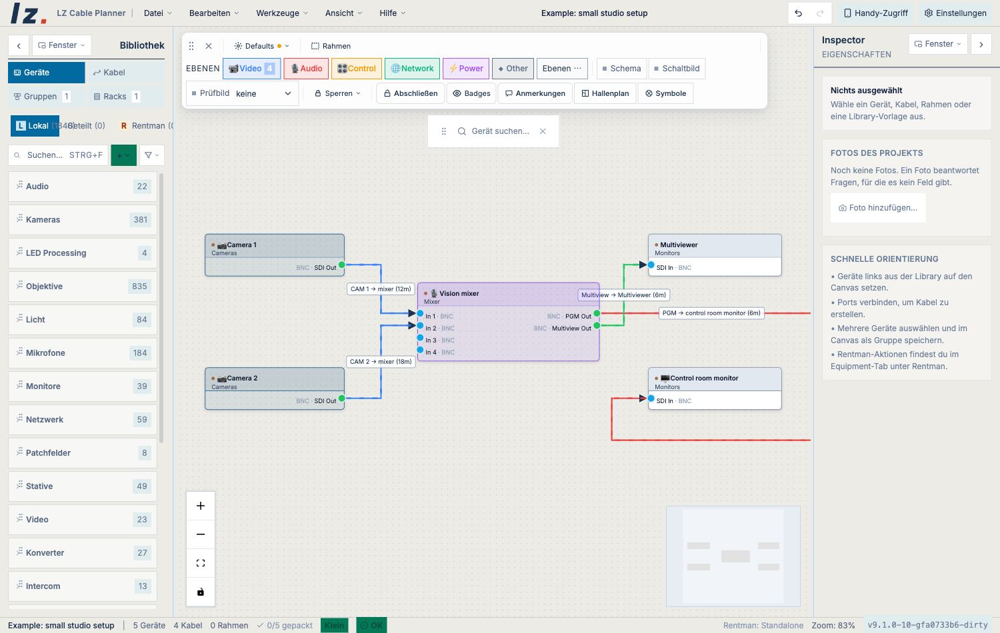

#### Toolbar schließen und wieder öffnen

Der **X**-Button neben dem Zieh-Griff versteckt die Toolbar. Sie können sie über das *Ansicht* → *Canvas-Werkzeugleiste* Menü wieder öffnen. Dies ist nützlich auf kleinen Bildschirmen oder für ungestörte Pläne.

### Einstellungen: Defaults (Voreinstellungen für neue Kabel)

Das Menü *Defaults* fasst alle Standard-Verhaltenswerte zusammen, die beim Erstellen neuer Kabel gelten. Klicken Sie auf den Defaults-Button (Zahnrad-Symbol) um das Menü zu öffnen.

#### Routing (Kabel-Verlauf)

Bestimmt die Standardform neuer Kabel:

- **Orthogonal** (rechtwinkliges Gitter): Kabel verlaufen waagerecht und senkrecht
- **Straight** (direkt): Gerade Linien zwischen den Anschlüssen
- **Curved** (geschwungen): Sanfte Kurven

#### Pfeile (Signalrichtung)

Aktiviert kleine Pfeile an den Kabeln, die die Signalrichtung anzeigen.

#### Kabelbrücken (Cable Bumps)

Zeigt kleine Hügel an Kreuzungspunkten, damit Kabel optisch übereinander gehen, statt sich zu schneiden.

#### Ports nach Typ färben

Färbt die Anschlüsse je nach Typ (z. B. SDI, Audio, Power) unterschiedlich.

#### Kabelfarben

Wählen Sie die Färbungs-Logik für Kabel:

- **Manuell**: Sie wählen die Farbe für jedes Kabel einzeln
- **Nach Länge**: Automatische Färbung je nach Kabellänge (mit Farblegenden)
- **Nach Layer**: Automatische Färbung je nach Signaltyp (Video, Audio, Control, Network, Power)

### Rahmen (Location Frames)

Rahmen sind farbige Rechtecke, um Gerätegruppen zu kennzeichnen — zum Beispiel alle Kameras, alle Mischer oder alle Switch-Komponenten.

**Neuen Rahmen hinzufügen:**
1. Klicken Sie auf den **Frame**-Button in der Toolbar
2. Ein leerer Rahmen wird am Viewport-Zentrum erstellt
3. Ziehen Sie den Rahmen und die Ecken, um ihn anzupassen
4. Rechtsklick auf einen Rahmen öffnet das Kontextmenü zum Bearbeiten

**Rahmen um ausgewählte Geräte:**
1. Wählen Sie ein oder mehrere Geräte
2. Der **Frame**-Button zeigt jetzt "Frame um die X Geräte"
3. Klicken Sie ihn an — ein neuer Rahmen wird automatisch um alle Geräte gezogen

### Auswahl und Mehrfach-Verkabelung

#### Ein Gerät auswählen

Klicken Sie auf ein Gerät. Es wird mit blauem Umriss markiert. Die Ausrichtungs-Buttons erscheinen nun in der Toolbar.

#### Mehrere Geräte auswählen

Halten Sie **Strg** (Windows/Linux) oder **Cmd** (Mac) gedrückt und klicken Sie auf weitere Geräte. Sie können auch ein Rechteck ziehen, um mehrere Geräte auf einmal zu erfassen.

#### Mehrfach-Verkabelung (Bulk Connect)

Wenn genau **zwei Geräte** ausgewählt sind, erscheint der **Connect cables**-Button in der Toolbar.

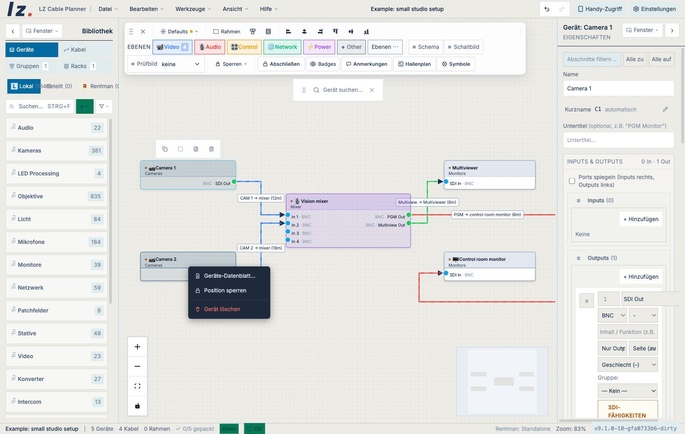

Im Dialog können Sie mehrere Verbindungen auf einmal erstellen:
- Wählen Sie Output-Ports des ersten Gerätes
- Wählen Sie Input-Ports des zweiten Gerätes
- Wählen Sie den Kabeltyp und die Farbe
- Klicken Sie "Verbinden", um alle auf einmal anzulegen

### Ausrichtung und Anordnung

Die Ausrichtungs-Buttons erscheinen nur, wenn mindestens ein Gerät ausgewählt ist.

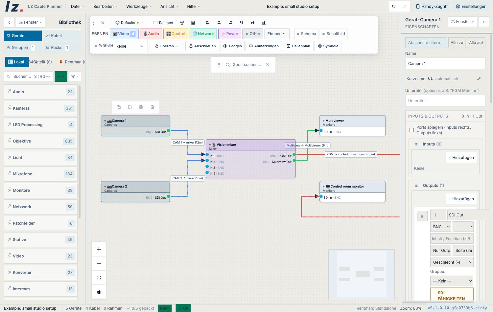

| Button | Funktion |
|--------|----------|
| **Links** | Bei 1 Gerät: am linken Viewport-Rand; bei mehreren: linke Kanten bündig |
| **Mitte horizontal** | Bei 1 Gerät: horizontal im Viewport zentriert; bei mehreren: mittig aneinander |
| **Rechts** | Bei 1 Gerät: am rechten Viewport-Rand; bei mehreren: rechte Kanten bündig |
| **Oben** | Bei 1 Gerät: am oberen Viewport-Rand; bei mehreren: obere Kanten bündig |
| **Mitte vertikal** | Bei 1 Gerät: vertikal im Viewport zentriert; bei mehreren: mittig aneinander |
| **Unten** | Bei 1 Gerät: am unteren Viewport-Rand; bei mehreren: untere Kanten bündig |
| **Verteilen horizontal** | (nur bei 3+ Geräten) Gleiche Abstände horizontal |
| **Verteilen vertikal** | (nur bei 3+ Geräten) Gleiche Abstände vertikal |

#### Gerätegruppen speichern

Wählen Sie ein oder mehrere Geräte und klicken Sie den **Gruppen-speichern**-Button (3 Rechtecke). Ein Eingabefeld erscheint. Geben Sie einen Namen ein und klicken Sie den grünen **Speichern**-Button.

Gruppen können Sie später aus der Bibliothek auf den Canvas ziehen und die Anordnung wird beibehalten.

### Geräte im 2D-Rack-Builder anordnen

Wenn Sie ein oder mehrere normale Geräte ausgewählt haben, können Sie sie mit dem **Rack**-Button der Werkzeugleiste oder per Rechtsklick → **Im Rack-Builder anordnen** in den 2D-Rack-Builder verschieben, um sie in Reihen anzuordnen (z. B. um einen Schrank zu simulieren). Ist ein Rack in der Auswahl, fehlt beides: Racks lassen sich nicht in Racks packen.

Wenn Sie ein bestehendes Rack (schwarz-weiße Black-Box) auswählen, erscheint stattdessen ein **Bearbeiten**-Button zum Öffnen des Rack-Builders für dieses spezifische Rack.

### Kontextmenüs (Rechtsklick)

#### Geräte-Kontextmenü

Klicken Sie mit der rechten Maustaste auf ein Gerät. Ein Menü erscheint mit diesen Optionen:

- **Gerät umbenennen**: Beschriftung ändern
- **Farbe ändern**: Rahmen- und Hintergrundfarbe des Geräts
- **Gerät duplizieren**: Kopiert das Gerät mit allen Verbindungen
- **Gerät löschen**: Gerät und alle seine Kabel entfernen
- **Beschriftung verbergen**: Symbol ohne Namen anzeigen
- **Anschlüsse verbergen**: Nur das Gerätsymbol ohne Port-Punkte
- **Im Rack-Builder anordnen**: Öffnet den Rack-Builder mit dem Gerät bzw. der ganzen Auswahl (wie der Rack-Button der Werkzeugleiste)

#### Kabel-Kontextmenü

Klicken Sie mit der rechten Maustaste auf ein Kabel. Folgende Optionen sind verfügbar:

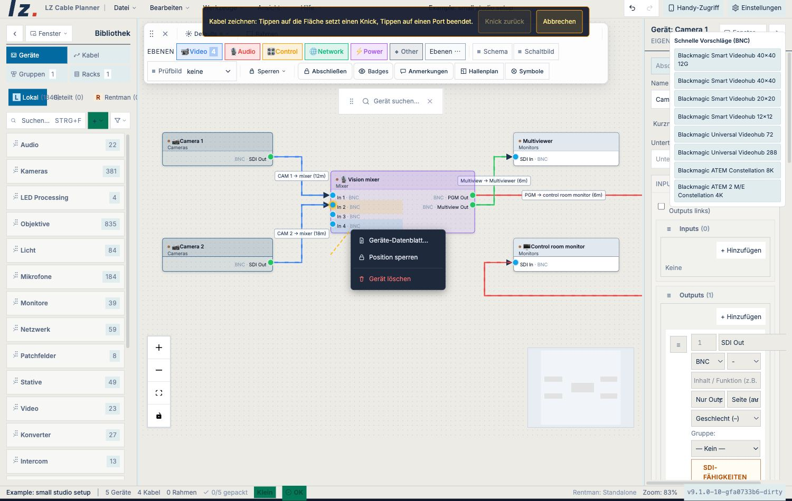

- **Kabel umbenennen**: Beschriftung ändern
- **Kabeltyp wechseln**: Port-Typen neu zuweisen (z. B. SDI ↔ Optical)
- **Farbe ändern**: Kabelfarbe überschreiben
- **Länge ändern**: Kabellänge in Metern eintragen
- **Verbindung prüfen**: Wenn verfügbar, wird die Kabelverbindung validiert
- **Knickpunkte anzeigen**: Zeichnet Zwischenpunkte sichtbar, um Wegführung zu ändern
- **Adapter einsetzen**: Dialog zum Hinzufügen eines Gender-Changers (z. B. XLR M↔F)
- **Seitenverbinder**: Führt das Kabel über einen Off-Page-Connector raus und wieder rein
- **Kabel löschen**: Verbindung entfernen

#### Canvas-Kontextmenü (Leerefläche)

Klicken Sie mit der rechten Maustaste auf eine leere Fläche:

- **Neues Gerät hier…**: Öffnet die Geräte-Bibliothek gefiltert für schnelle Auswahl am Klick-Punkt
- **Rahmen hinzufügen**: Erstellt einen neuen Rahmen am Cursor
- **Einfügen**: Wenn Sie ein Gerät kopiert haben, wird es hier eingefügt

### Layer-Sichtbarkeit (Video, Audio, Control, Network, Power)


Die farbigen **Chips** nach dem Signalweg-Button filtern, welche Kabel sichtbar sind. Sie verbergen nur die Kabel — die Geräte bleiben immer sichtbar.

Klicken Sie auf einen **Video**-, **Audio**-, **Control**-, **Network**- oder **Power**-Chip, um diese Kabel ein-/auszublenden. Ein **X** im Chip bedeutet, dass dieser Layer verborgen ist.

Für benutzerdefinierte Layer (z. B. "RF", "Intercom"), die Sie angelegt haben, erscheinen zusätzliche Chips.

### Signalfluss-Darstellung (Flow Mode)

Der **Flow Mode**-Chip bestimmt, wie Kabel dargestellt werden:

- **Linear**: Direkte Verbindungen ohne zusätzliche Visualisierung
- **Schematic**: Grafische Darstellung mit Signalfluss-Visualisierung (Pfeile und Farben zeigen Signal-Richtung)
- **Circuit**: Elektrotechnische Schaltplan-Ansicht (wenn verfügbar)

### Grundriss (Floor Plan)

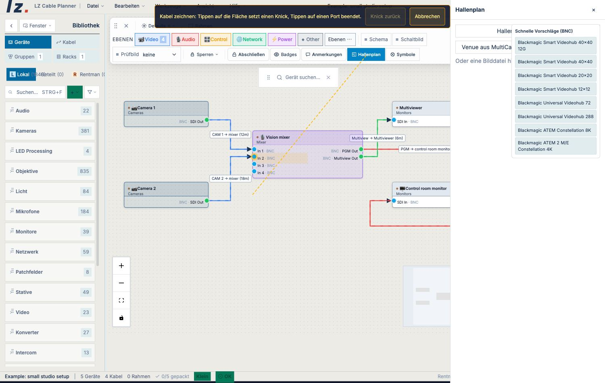

Der **Floor plan**-Button blendet oder verbirgt einen Grundriss unter der Canvas, um räumliche Positionen zu zeigen.

**Im Grundriss-Panel können Sie:**
- Einen Grundriss hochladen (JPG/PNG) oder aus der Datei-Bibliothek wählen
- Maßstab / Kalibrierung anpassen
- **Zwei-Punkt-Kalibrierung**: Zwei Punkte im Plan markieren und deren reale Meter eingeben
- **Vier-Ecken-Kalibrierung**: Ein Grundriss-Rechteck auf die Canvas-Koordinaten abbilden

### Symbole (Electrical, Alarm, PA, IT, AV)


Der **Symbols**-Button öffnet ein Panel mit Planzeichen:

- **Kategorien**: Electrical, Alarm, PA, IT, Automation, AV
- **Symbol ziehen**: Wählen Sie ein Symbol und ziehen Sie es auf den Canvas
- **Import**: Externe SVG-Symbole hochladen
- **KI-Erzeugung**: Mit Beschreibung neue Symbole erzeugen lassen
- **CSV-Import**: Große Symbolmengen aus Datei importieren

### Raumsichtbarkeit (Rooms)

Der **Rooms** ▾-Button zeigt alle definierten Räume des Projekts. Klicken Sie einen Raum an, um nur die Geräte in diesem Raum anzuzeigen. Dies ist nützlich bei größeren Projekten mit mehreren Räumen.

### 3D-Gebäudeansicht

Der **3D**-Button öffnet eine dreidimensionale Gebäude-Ansicht. Hier sehen Sie die Positionen aller Geräte räumlich — nützlich, um Kabel-Laufwege und Raumaufteilung zu visualisieren.

Verwenden Sie die Maus, um die Ansicht zu drehen und zu zoomen.

### Signalweg anzeigen

Wenn ein Gerät ausgewählt ist, werden alle Kabel, die ein Signal zu oder von diesem Gerät transportieren, hervorgehoben. So sehen Sie schnell den kompletten Signalfluss.

### Geräte-Suche (Strg+F / Cmd+F)

Drücken Sie **Strg+F** (Windows/Linux) oder **Cmd+F** (Mac) oder klicken Sie auf die Lupe. Ein Suchfeld erscheint oben über dem Canvas.

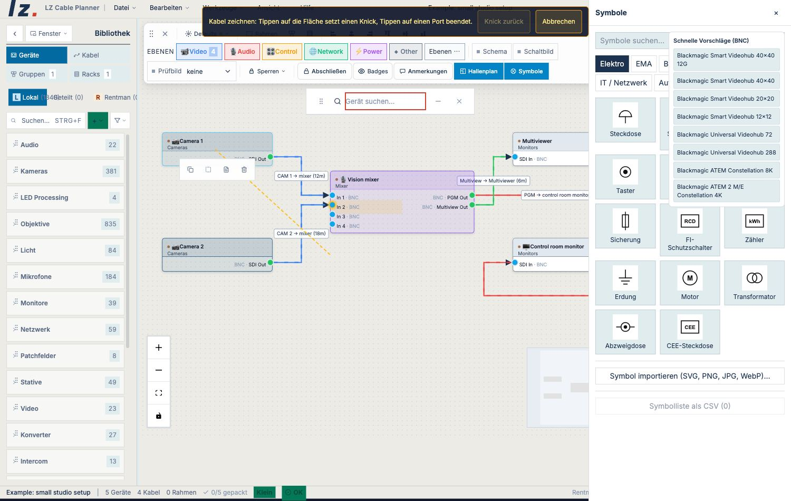

Tippen Sie den Namen eines Geräts ein. Gefundene Geräte werden hervorgehoben und die Canvas zoomt heran.

### Inline-Auswahl-Toolbar (Multiple Selection)

Wenn Sie mehrere Geräte auswählen, erscheint über der Auswahl eine kleine Werkzeugleiste mit schnellen Optionen:

- **Farbe**: Ändert die Farbe aller ausgewählten Geräte
- **Löschen**: Entfernt alle ausgewählten Geräte
- **Weitere Optionen**: Menü für alle Aktionen

### Sperren (Lock)

Der **Sperren**-Button fasst drei Schutzmaßnahmen zusammen:

| Bereich | Effekt |
|---------|--------|
| **Rahmen sperren** | Rahmen können nicht verschoben oder gelöscht werden |
| **Geräte sperren** | Geräte können nicht verschoben oder gelöscht werden |
| **Kabel sperren** | Kabel können nicht verschoben, geändert oder gelöscht werden |

Das Button-Label zeigt die Anzahl der aktiven Sperren. Wenn alle drei aktiv sind, wird der Button grau und zeigt "Sperren: 3".

### Finalisieren (Plan-Lock)

Der **Finalize**-Button auf der rechten Seite der Toolbar sperrt den gesamten Plan:

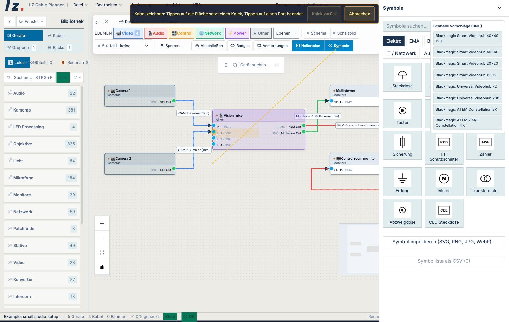

- **Editing** (Standard): Sie können alle Änderungen machen
- **Finalised**: Kein Verschieben, keine neuen Verbindungen, keine Löschungen. Ein Bestätigungsdialog warnt vor Änderungen
- **Viewer**: Read-only-Datei (`.cpviewer`), kann nicht bearbeitet werden

Ein Klick toggelt zwischen Editing und Finalised. Der Plan bleibt in dieser Datei gespeichert.

### Anmerkungen (Annotations)


**Badges** zeigen/verstecken die farbigen Kreis-Marken auf dem Canvas, ohne Anmerkungen zu löschen.

**Annotations** öffnet das Anmerkungs-Panel mit einer Liste aller Markierungen. Hier können Sie Notizen hinzufügen, Farben ändern und Anmerkungen verwalten.

Im **Viewer-Modus** wird der Anmerkungen-Button lila und zeigt "Viewer", um Reviewer zu ermutigen, Feedback zu geben.

### Zoom und Navigation


Unten links im Canvas:

- **+** und **−** zum Zoomen
- **1:1** zum Zurücksetzen auf Originalgröße
- **Fit** um alle Geräte sichtbar zu machen
- **Minimap** zeigt eine Vogelperspektive, klicken Sie drauf um zu springen

Sie können auch mit dem **Mausrad** zoomen oder die rechte Maustaste (nicht auf Geräten!) zum Verschieben nutzen.

### 3D-Rackansicht

Wenn Sie ein Rack öffnen oder vom Canvas aus den Rack-Builder aufrufen, wird eine 3D-Ansicht aller Rack-Units angezeigt. Hier können Sie Geräte in einzelne Units einordnen und die räumliche Anordnung sehen.

Die 3D-Ansicht kann mit der Maus rotiert und gezoomt werden.

### Kabel-Details

Doppelklicken Sie auf ein Kabel oder öffnen Sie sein Kontextmenü, um Details zu bearbeiten:

- **Name/Label**: Beschriftung (erscheint auf dem Kabel)
- **Länge**: In Metern (wird zur Kabelplanung und Farb-Kodierung genutzt)
- **Typ**: Port-Typ (SDI, Optical, Audio, Power, etc.)
- **Farbe**: Farbe des Kabels (nur bei manueller Färbung)
- **Waypoints**: Knickpunkte zum Kontrollieren des Verlaufs

### Stream-Vorschau

Wenn Sie einen Stream-Output eines Geräts aktivieren, kann eine kleine Vorschau-Kachel auf dem Canvas angezeigt werden (z. B. ATEM-Multiviewer oder Videohub-Ausgang). Diese zeigt das Live-Signal.

### Tastenkürzel auf dem Canvas

| Shortcut | Funktion |
|----------|----------|
| **Klick** | Gerät/Kabel auswählen |
| **Strg+Klick** (Cmd+Klick) | Zur Auswahl hinzufügen |
| **Ziehen** | Gerät oder Kabel verschieben |
| **Rechtsklick** | Kontextmenü |
| **Strg+F** (Cmd+F) | Geräte-Suche |
| **Strg+D** (Cmd+D) | Auswahl duplizieren |
| **Entf** | Auswahl löschen |
| **Strg+Z** (Cmd+Z) | Rückgängig |
| **Strg+Y** (Cmd+Y) | Wiederherstellen |
| **Mausrad** | Zoomen |
| **Rechte Taste + Ziehen** | Canvas verschieben |

---

## 4. Bibliothek

Die Bibliothek links organisiert Gerätevorlagen, Kabeltypen, Gerätegruppen und Racks
zum Speichern, Laden und Wiederverwenden von Plänen.

### Geräte (Equipment)

Die Geräte-Registerkarte zeigt lokale Vorlagen und externe Quellen.

#### Lokale Bibliothek


Die lokale Bibliothek enthält die 150+ mitgelieferten Geräte und alle selbst angelegten Vorlagen.

- *Suchen*: Suchfeld mit `Strg+F`-Kurzbefehl. Der Such-Text filtert nach Name oder Kategorie.
- *Filter-Menü*: Sortierrichtung (Manuell, A→Z, Z→A), Anzeige versteckter Geräte, nur Eigentum anzeigen.
- *Kategorien*: Aufklappen/Einklappen, Bearbeiten-Button zum Umbenennen.
- *Einträge*: Ein Eintrag pro Gerät. Hover zeigt Aktionen. Ein Klick markiert den Eintrag und zeigt seine Eigenschaften; platziert wird per Doppelklick oder Ziehen auf den Canvas – der markierte Eintrag nennt beides.

##### Eigenes Gerät anlegen

Neue Geräte mit Anschlüssen und optional Fotos erstellen:

*Bibliothek → +* (grüner Button) *→ Eigenes Gerät anlegen*


Die Felder:

- **Name**: Wie das Gerät heißen soll.
- **Kategorie**: Z.B. Kameras, Mixer, Monitore; steht zu Beginn auf „Sonstiges“. Wird in der Bibliothek als Ordner angezeigt. Neue Kategorien entstehen hier.
- **Ist ein 19" Rack-Gerät**: Checkbox. Falls ja, Höhe in Rack-Einheiten (RU) eingeben.

###### Reiter: Anschlüsse


Anschlüsse zu Gruppen zusammenfassen („4x BNC In", „2x HDMI Out"):

- **+Input group** oder **+Output group**: Neue Gruppe hinzufügen.
- *Für jede Gruppe*:
  - *Richtung*: Input oder Output.
  - *Anzahl*: Wie viele Anschlüsse dieser Art.
  - *Name*: Z.B. „SDI In" oder „Ethernet Out".
  - *Stecker*: BNC, HDMI, DisplayPort, USB, Ethernet, XLR, Power, etc. oder Custom.

Die Gruppen werden beim Speichern in einzelne Anschlüsse aufgelöst (z.B. „SDI In 1", „SDI In 2", …).

###### Reiter: Foto


Anschlüsse automatisch vom Gerätedatenblatt oder einem Foto erkennen:

- **Fotos hochladen**: Drag-and-Drop oder Button.
- **Erkennen**: Erkennt Stecker-Art und -Anzahl.
  - Falls mehrere Modelle passen: Bestes Treffer-Gerät anzeigen.
  - Ergebnisse als Tabelle mit Checkboxes (unsichere Einträge sind unchecked).
- **Fotos speichern**: Checkbox — Bilder werden mit der Vorlage gespeichert.

Die Erkennung braucht einen API-Schlüssel für die Gerätebibliothek oder KI (Einstellungen → KI-Einstellungen).

###### Port-Guessing

Anschlüsse aus dem Gerätenamen raten:

*„Guess the ports from the device name"* — Knopf **Ausfüllen** (mit Quelle aus Einstellungen):
- **KI** (Claude API, OpenAI GPT, Google Gemini): Sendet Namen und optional Beschreibung an die KI.
- **Websuche**: Sucht öffentliche Datenblätter und Hersteller-Seiten.
- **Heuristik**: Einfache Regeln nach Name (Z.B. „ATEM 4 Pro": 4 Eingänge erwartet).

KI-Quelle und API-Schlüssel stehen in *Einstellungen → KI-Anbieter*.

###### Speichern

Unten drei Buttons:

- **Nur platzieren**: Gerät auf den Canvas, keine Vorlage speichern.
- **In Bibliothek speichern**: Nur Vorlage, kein Gerät auf Canvas.
- **Speichern und platzieren**: Beides.

#### Vorlagen einreichen

Selbst erstellte Geräte zur Gerätebibliothek beitragen:

*Bibliothek → +* *→ Vorlagen einreichen*


- Wähle aus, welche lokalen Vorlagen versendet werden sollen.
- Gib Hersteller und Modell an, optional Datenblatt-Link.
- Die Vorlage wird hochgeladen und von anderen Nutzern bestätigt (Voting).

Die Gerätebibliothek ist eine Community-Ressource. Verifizierte Geräte verstecken die „lokale" Version.

#### NetBox-Import

Netzwerk-Infrastruktur aus NetBox importieren:

*Bibliothek → +* *→ Import-Datei …* oder über NetBox-Integration


- **Suchfeld**: Z.B. „Cisco Catalyst". Sucht in NetBox-Datentypen.
- **Kategorie wählen**: Wird die importierte Vorlage eingeordnet.
- **Importieren**: Gerät wird zur lokalen Bibliothek hinzugefügt.

#### Gerätebibliothek

Öffentliche Gerätedatenbank mit 500+ verifizierten Vorlagen:


- Geräte aus der Datenbank laden (erfordert Anmeldung).
- Bestätigungsstatus sehen: wie viele Nutzer das Gerät verifiziert haben.
- Mit lokalen Versionen abgleichen und zusammenführen.

#### Rentman

Rentman-Projekte mit Gerätebestand abgleichen (falls Rentman-Modul aktiv):


- **Linked Project**: Das Rentman-Projekt abrufen.
- **Imported**: Welche Rentman-Geräte bereits importiert sind.
- **Catalog**: Weitere Geräte zum Import anschauen.
- **Reconcile**: Abweichungen zwischen Plan und Rentman-Projekt zeigen.

### Kabel

Verfügbare Kabeltypen und deren Konfigurationen:


- **Kabeltypen** (SDI, HDMI, DisplayPort, Ethernet, Lichtleiter, Audio/XLR, USB, Strom, Custom):
  Je eine Gruppe mit den Kabeln dieser Art.
- *Pro Kabel*:
  - Anzeige-Name (z.B. „SDI 75 Ω" oder „HDMI 2.1").
  - Konnektoren an beiden Enden.
  - Maximale Länge (optional).
  - Signalstandards.
  - **Verbaut** / **Geplant**: Anzahl aktuell verlegter/geplanter Kabel im Plan.

Die Kabel-Bibliothek ist fest vorgegeben; eigene Typen sind „Custom".

#### Kabeltypen verwalten

Neue Kabeltypen definieren oder bestehende bearbeiten:

*Bibliothek → Kabel-Reiter → „Manage cable types…"*


- Neue Gruppe: z.B. „Satellite" mit eigenem Konnektoren-Paar und Standards.
- Kabel editieren: Name, Länge, Farbe, Signale, Status (Empfohlen/Custom/Modified).

### Gruppen

Mehrere Geräte + Kabel zusammen speichern und später einzusetzen:


*So entsteht eine Gruppe*:

1. Geräte auf dem Canvas anordnen und miteinander verdrahten.
2. Die markierten Geräte + Kabel **wählen** (Mehrfach-Auswahl auf dem Canvas).
3. *Canvas-Toolbar → „Als Gruppe speichern"*.
4. Namen eingeben → Gruppe erscheint in der Bibliothek.

*Eine gespeicherte Gruppe verwenden*:

- Aus der Bibliothek auf den Canvas ziehen → alle Geräte + Kabel werden an dieser Position platziert.
- Beim Speichern mit Positionsdaten, damit sie an Ort und Stelle landen.

*Operationen auf Gruppen*:

- **Umbenennen** (Stift-Icon)
- **Exportieren** → `.cpgroup`-Datei
- **Löschen**

### Racks

2D-Rack-Layout speichern: Welche Geräte, an welcher Höhe, hintereinander:


#### Rack Builder

Ein leeres oder bestehendes Rack editieren:

*Bibliothek → Racks-Reiter → „+" → Neues Rack*


- **Rack-Name**: Z.B. „Server Rack 1".
- **Rack-Höhe**: Gesamthöhe in Rack-Einheiten (meist 42 RU).
- **Geräte einfügen**: Rechts aus der Liste hinzufügen.
- **Slot-Editor**: Jedes Gerät bekommt eine Anfangsposition (oberste freie Stelle).
- **Übereinanderstapeln**: Mehrere Geräte im gleichen Rack.

Nach dem Speichern:

- Das Rack wird zu einer Vorlage (wie eine Gruppe).
- Auf den Canvas ziehen → alle Geräte im Rack werden platziert.
- Im Canvas-Toolbar: **Rack bearbeiten** öffnet den Builder für ein bereits platziertes Rack.

#### Zum Lagern exportieren

Rack-Bestand für Lagerbestandssystem exportieren:

*Bibliothek → Racks-Reiter → „For the warehouse"*


Erzeugt `rack-belegung.json` für dein Lagerbestands-System (z.B. Inventory-Planner).

### Häufig genutzte Einstellungen

**Quelle für Port-Guessing** (automatische Anschluss-Erkennung):
- *Einstellungen → KI-Anbieter* → wähle OpenAI, Claude oder Google Gemini.
- Gib deinen API-Schlüssel an.
- Die Heuristik (Namens-Analyse) läuft ohne Schlüssel.

**Kategorien verwalten**:
- Neue Kategorien entstehen, wenn du ein Gerät anlegst oder umbenennst.
- Kategorie-Namen sind zweisprachig (Deutsch + Englisch).
- Über das Filter-Menü **Expand all** / **Collapse all** schaltet alle Kategorien auf einmal.

**Suche und Filter**:
- Suchfeld = Echtzeit-Filterung nach Name oder Kategorie.
- **Nur Eigentum**: Zeigt nur Geräte, die in deinem Lagerbestand eingetragen sind.
- **Versteckte zeigen**: Geräte, die du aus Ansicht geklappt hast.

---

## 5. Inspector

Der Inspector ist die rechte Seitenleiste der Anwendung. Sie zeigt Eigenschaften des aktuell ausgewählten Objekts — eines Geräts, eines Kabels, eines Rahmens oder einer Bibliotheks-Vorlage. Ist nichts ausgewählt, sieht der Inspector den Ist-Zustand des Plans: Fotos, die dem Plan gehören, und eine Schnelle Orientierung.


### Nichts ausgewählt

Wenn Sie kein Objekt auf dem Canvas ausgewählt haben, zeigt der Inspector drei Dinge:

- **Hinweis**: Eine kurze Orientierung — Geräte aus der Bibliothek auf den Canvas ziehen, Anschlüsse verbinden, um Kabel zu erstellen.
- **Fotos des Plans**: Der Abschnitt *Projekt-Fotos* enthält alle Bilder, die Sie ohne Zielgerät an den Plan anhängt haben. Das gehört dem Plan als Ganzes, nicht einem einzelnen Gerät.

### Geräteeigenschaften

Wenn Sie ein Gerät auf dem Canvas anklicken, zeigt der Inspector alle Eigenschaften dieses Geräts in verschiebbaren und umsortierbar Abschnitten.

#### Struktur und Umsortieren

Der Inspector organisiert Geräteeigenschaften in etwa 30 aufklappbaren Abschnitten. Jeder Abschnitt kann:

- **Auf-/zugeklappt** werden durch Klick auf die Kopfzeile. Der Zustand wird gespeichert.
- **Umsortiert** werden: Das ⠿-Griff-Symbol am linken Rand erlaubt Drag&Drop, um die Reihenfolge zu ändern. Die neue Reihenfolge wird pro Gerät gespeichert und überträgt sich auf alle Geräte derselben Art (z. B. alle Kameras).


#### Abschnitte filtern

Im oberen Bereich des Inspectors befindet sich ein Suchfeld mit dem Label *Abschnitte durchsuchen*. Geben Sie einen Namen oder Stichwort ein:

- Der Filter sucht in der **Abschnitt-ID** (z. B. `network-config`), im **Titel** (z. B. „Netzwerk") und im **Untertitel** (z. B. „3 in · 2 out").
- Alle Abschnitte, die nicht treffen, werden ausgeblendet.
- Ein Treffer wird automatisch aufgeklappt.

#### Alle aufklappen / zuklappen

Neben dem Suchfeld gibt es zwei Schaltflächen:

- **Alle auf** — öffnet alle Abschnitte.
- **Alle zu** — schließt alle Abschnitte.

### Die Abschnitte im Detail

#### Name und Notiz (oben, nicht verschiebbar)

- **Name**: Eindeutige Bezeichnung des Geräts (z. B. „ATEM 1", „Kamera Main").
- **Notiz**: Freies Textfeld für alles, was keinen Platz in einem anderen Feld hat (z. B. Web-UI, Firmware-Version, Standort, Zugehörigkeit).
- **Kurzname**: Automatisch aus dem Namen generiert (z. B. „ATEM" statt „ATEM Constellation 8K"). Wird in platzknappen Kontexten wie Port-Labels verwendet. Sie können den Auto-Vorschlag durch ein eigenes Wort überschreiben oder mit dem Refresh-Button (↻) zurücksetzen.

#### Ein- und Ausgänge (oben, Standardposition)


Die Anschlüsse sind direkt unter Name und Notiz — oben im Panel, weil die ganze Anwendung um die Verkabelung dreht.

- **Eingänge**: Liste der Eingangs-Anschlüsse mit Typ (z. B. SDI, HDMI, Fiber).
- **Ausgänge**: Liste der Ausgangs-Anschlüsse.
- Je nach Gerät können Sie Anschlüsse hinzufügen, bearbeiten oder löschen.
- Jeder Anschluss zeigt seinen Namen (z. B. „SDI 1") und seinen Typ.

#### Kategorie

Wählen Sie die Geräte-Art (z. B. „Kamera", „Mischer", „Monitor", „Lagerbestand"). Die Kategorie bestimmt, welche anderen Felder im Inspector sichtbar sind (z. B. erscheint das Feld „Optik/Linse" nur bei Kameras).

#### Fotos

Laden Sie Bilder des Geräts hoch. Sie werden in der Galerie unter den Eigenschaften angezeigt.

- **Hinzufügen**: Klicken Sie auf das Plus-Symbol oder ziehen Sie Bilder direkt ins Feld.
- **Löschen**: Klicken Sie auf das X-Symbol eines Bildes.

#### Informationen zu Geräteart

Wenn das Gerät eine Spezial-Unterstützung hat (z. B. ATEM, Videohub, GreenGo Intercom), zeigt dieser Abschnitt einen Knopf zum Öffnen eines Geräteinformationen-Dialogs oder zum Exportieren (z. B. Export-Patch für ATEM).

#### Katalog und Herkunft

- **Katalog-Typ**: Der Hersteller und die Modell-Nummer aus der Geräte-Bibliothek (z. B. „Blackmagic Design: ATEM Constellation 8K").
- **Herkunft**: Zeigt, woher die Port-Informationen kommen (z. B. aus dem Datenblatt, manuell eingegeben, von Rentman).
- **In die Bibliothek speichern**: Legt das Gerät als Vorlage ab, um es später schneller platzieren zu können.

#### Netzwerk und Zugang

- **IP-Adresse**: Die Netzwerk-Adresse des Geräts (z. B. `192.168.1.10`).
- **Benutzername, Passwort**: Anmeldedaten für die Web-UI oder die API des Geräts.
- Diese Daten werden im Betriebssystem-Credential-Store gespeichert — nicht in der Projekt-Datei.

#### Streams und Ausspielziele

Falls das Gerät Live-Video-Feeds aussendet:

- **Stream-URL**: Der HTTP(S)- oder RTMP-Endpoint des Geräts.
- **Stream-Keys / Zugangsdaten**: Werden sicher im Credential-Store hinterlegt.

#### Optik und Linsendaten (nur Kameras)


Für Kameras zeigt dieser Abschnitt:

- **Linsenmodell**: Z. B. „Canon CN7x7", „Fujinon HA22x7.6".
- **Fokussierer-Typ**: Manuell oder motorgesteuert (z. B. „Canon R-FS").
- **Steuerungsart**: Serielle Steuerung, ESP32-Bridge, Simulator (zu Test-Zwecken).

#### Stromversorgung und Stromkreis

- **Stromverbrauch**: Die typische Leistungsaufnahme in Watt (z. B. 150 W).
- **Stromkreis-Bauart**: Die Netzfrequenz und Betriebsart (z. B. „230 V AC, 16 A Kühlschrank" oder „12 V DC Batterie").
- **Anschlusspunkte**: Eine Tabelle zeigt, welche Anschlüsse an welche Stromschiene gehen (z. B. „Eingang 1 → Stromkreis A, Klemme 1").

#### Adapter

Falls das Gerät Adapter benötigt (z. B. XLR → BNC, Stecker → Buchse):

- Liste verfügbarer Adapter.
- Sie können Adapter hinzufügen oder aus einer Vorlage übernehmen.

#### DMX (für Steuergeräte)

Für Geräte mit DMX-Steuerung:

- **DMX-Startkanal**: Der erste belegte Kanal (z. B. 1, 65, etc.).
- **DMX-Geräte-ID**: Die Universum- und Kanal-Nummer.

#### Hausverkabelung

Dokumentiert Verkabelungsrouten innerhalb des Geräts (z. B. vom Eingang zum Mischer-Kern zum Ausgang).

#### Formatprofil

Die Eingangs-/Ausgangs-Formate und Codec-Profile, wenn das Gerät mehrere Betriebsmodi unterstützt.

#### Abmessungen

Breite, Höhe und Tiefe in Millimetern. Wird später für 3D-Rack-Visualisierung und Platzbedarf-Planung verwendet.

#### Netzwerk-Konfiguration

Erweiterte Netzwerk-Settings (falls das Gerät mehrere Netzwerk-Modi oder VLANs unterstützt).

#### Modi

Falls das Gerät verschiedene Betriebsmodi hat (z. B. „Aufnahme", „Live-Streaming", „Simulator"), können Sie diese hier konfigurieren.

#### Rackplatz

- **Rackposition**: Die HE (Höheneinheit) und Tiefe im 19"-Rack.
- **Rack-3D-Ansicht**: Zeigt eine 3D-Visualisierung der Geräte im Rack.

#### Lebenszyklus

- **Installationsstatus**: z. B. „Geplant", „Installiert", „Getestet", „Live".
- **Test-Ergebnisse**: Bestätigung, dass das Gerät funktioniert.
- **Wartungsplan**: Wartungstermine und nächste Überprüfung.

#### Druck und Dokumentation

Generiert Patch-Sheets und Dokumentation zum Ausdrucken (z. B. Geräte-Übersicht, Port-Listen).

#### Anhänge

Laden Sie Datenblätter, Handbücher oder andere Dateien hoch.

### Kabeleigenschaften

Klicken Sie auf ein Kabel auf dem Canvas, um seine Eigenschaften zu sehen.


#### Verbindung (Von/Zu)

- **Von-Gerät und Von-Port**: Das Quell-Gerät und sein Port (z. B. „Camera 1 → SDI out").
- **Zu-Gerät und Zu-Port**: Das Ziel-Gerät und sein Port (z. B. → „Mixer → SDI in 1").
- Sie können diese durch Dropdown-Listen ändern.


#### Beschriftung und Farbe

- **Name**: Eine Beschriftung für das Kabel (z. B. „Main Camera Feed").
- **Farbe**: Klicken Sie auf das Farbfeld, um die Darstellungsfarbe zu ändern.

#### Kabel-Typ und Spezifikation

- **Kabel-Spezifikation**: Wählen Sie einen Standard-Kabeltyp aus dem Katalog (z. B. „Belden 1694A SDI", „Fiber Optic SM9/125").
- **Länge**: Die Kabellänge in Metern.
- **Custom-Kabel**: Falls nicht im Katalog, können Sie den Typ als Freitext eingeben.


#### Routing

- **Orthogonal** (rechtwinkliger Knick): Das Kabel folgt einem rechtwinkeligen Weg (Standard).
- **Diagonal**: Das Kabel verläuft gerade von Quelle zu Ziel.
- **Gebogen**: Das Kabel zeigt einen Bezier-Kurvenverlauf.

#### Aderaufbau (bei Mehrleitern-Kabeln)

Falls das Kabel mehrere Adern hat (z. B. ein Audio-Multikabel mit 4 Paaren):

- Liste der einzelnen Adern mit ihren Funktionen (z. B. „Ader 1: Audio L", „Ader 2: Audio R").

#### Glasfaser-Modus (Fiber Optic)

Falls das Kabel eine Glasfaser ist:

- **Modus**: Singlemode (SM) oder Multimode (MM).
- **Wellenlänge**: z. B. 1310 nm, 1550 nm.

#### Hausverkabelung und Steigschacht

- Dokumentiert, ob das Kabel durch einen Hausverteilschrank oder Steigschacht führt.
- Notizen zum Installationsroute.

#### Lebenszyklu und Test-Ergebnisse

- **Status**: z. B. „Geplant", „Installiert", „Getestet", „Live".
- **Test-Resultat**: Pass/Fail mit Datum und Techniker.

### Rahmen-Eigenschaften

Klicken Sie auf einen Rahmen (LocationFrame), um seine Eigenschaften zu sehen.

#### Name

Der Name des Rahmens/Raums (z. B. „Studio A", „Serverraum", „Kontrolle").

#### Größe

- **Breite, Höhe** in Pixeln auf dem Canvas (bestimmt die sichtbare Größe der Box).

#### Farbe

Klicken Sie auf das Farbfeld, um die Rahmendarstellung zu ändern.

#### Etage

- **Stockwerk**: Wählen Sie aus vorhandenen Etagen oder erstellen Sie eine neue.
- Etagen können eine Höhenkote (z. B. „3. Stock (18 m)") haben.

#### Steigschacht

Ein besonderer Rahmen, durch den mehrere Kabelleitungen vertikal verlaufen (Routing-Dokumentation).

### Mehrfachauswahl

Wenn Sie mehrere Geräte gleichzeitig auswählen (Ctrl+Click oder Drag-Auswahl), zeigt der Inspector Eigenschaften, die **für alle** gelten:

- **Kategorie**: Nur wenn alle ausgewählten Geräte dieselbe Kategorie haben.
- **Gemeinsame Felder**: Felder, deren Wert bei allen gleich ist.

Dies erlaubt Batch-Änderungen, z. B. um mehrere Geräte auf einmal die gleiche Farbe zu geben oder in die gleiche Kategorie zu verschieben.

---

## 6. Datei und Import

Das Menü *Datei* ist das zentrale Tor zum Projektmanagement: Projekte anlegen, öffnen, speichern, Import-Datenquellen, Export-Formate und die Zusammenarbeit mit externen Entwürfen.

### Neues Projekt

*Datei → Neu*

Öffnet das Formular *Neues Projekt* mit Projektname, Kunde und Logos. *Projekt anlegen* ersetzt den aktuellen Plan durch einen leeren. Enthält der aktuelle Plan schon Geräte, Kabel oder Orte, steht im Formular der Hinweis, dass ungespeicherte Änderungen verloren gehen.

Tastatur: `Strg+N`

### Neu aus Vorlage

*Datei → Neu aus Vorlage…*

Öffnet einen Dialog mit allen verfügbaren Vorlagen. Projektvorlagen sind vordefinierte Bausteine: Raum-Layouts, Standard-Geräte oder Verkabelungs-Muster, die als Grundlage für neue Entwürfe dienen. Der Dialog zeigt die Vorlagen themenweise gruppiert; ein Klick auf eine Vorlage erzeugt das neue Projekt.


### Öffnen

*Datei → Öffnen…*

Öffnet einen Datei-Dialog des Betriebssystems. Es werden Dateien mit den Endungen `.cableplan`, `.json` oder (beim Mergen von Anmerkungen) `.cpviewer` gelesen. Die ausgewählte Datei wird im aktiven Fenster geladen.

Tastatur: `Strg+O`

### Speichern

*Datei → Speichern*

Speichert das aktive Projekt unter seinem aktuellen Namen und Pfad. War das Projekt noch nie gespeichert, öffnet sich ein „Speichern unter"-Dialog. Die Datei trägt die Endung `.cableplan` und ist ein JSON-Dokument, das alle Projekt-Daten enthält: Geräte, Kabel, Einstellungen, Metadaten.

Tastatur: `Strg+S`

Bestandteile der `.cableplan`-Datei:
- Projektmetadaten (Name, Ersteller, Änderungsdatum)
- Alle Geräte und ihre Positionen
- Alle Kabel und deren Verbindungen
- Kategorien und benutzerdefinierte Geräte-Vorlagen
- Drucksettings und Rahmen-Anordnung
- Fotoanhänge (sofern vorhanden; ab etwa 40 MB wird eine `.cableplan` unhandlich zum Versand per E-Mail)

**Automatische Sicherungskopie:** Die App speichert regelmäßig automatisch und behält eine `.bak`-Datei neben der aktuellen Projektdatei. Dreht sich das Speichersymbol in der Statusleiste, wird gerade eine Kopie geschrieben.

### Speichern unter

*Datei → Speichern unter…*

Speichert das aktive Projekt unter einem neuen Namen oder an einem anderen Pfad. Die Originalversion bleibt ungeändert; die neue Datei wird als aktives Projekt geladen.

Tastatur: `Strg+Umschalt+S`

### Import yEd / GraphML

*Datei → Import yEd / GraphML…*

Importiert Verkabelungsentwürfe aus yEd (Grapheneditor der y.Works) oder beliebigen GraphML-Dateien. Der Dialog lädt eine `.graphml`-Datei, analysiert sie und zeigt eine Vorschau mit drei Reitern:

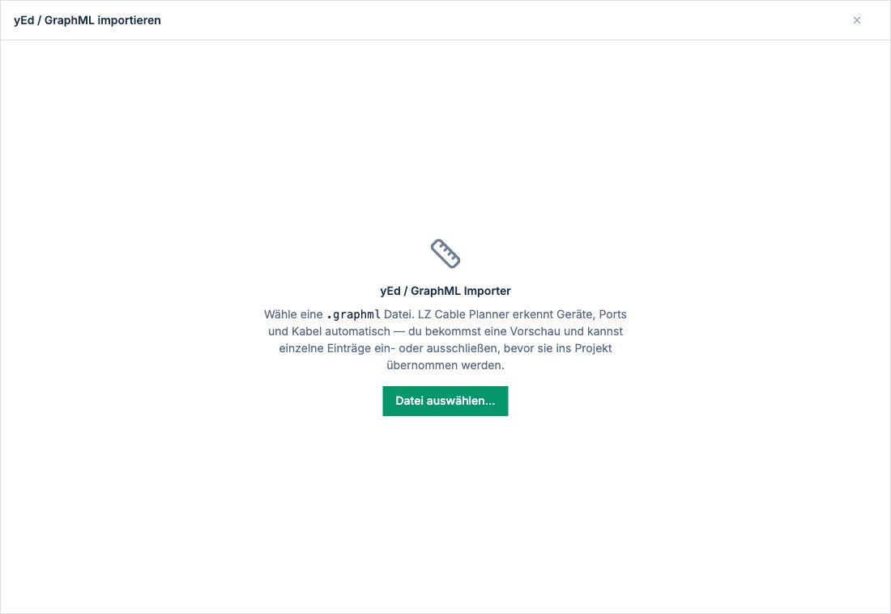

**Reiter 1: Geräte** — Listet alle erkannten Knoten auf. Die App versucht, Knotennamen gegen die Gerätebibliothek abzugleichen (HIGH = sicher erkannt, MED = möglicherweise, LOW = Lücke). Die Spalten sind:

| Spalte | Wirkung |
|---|---|
| ☐ (Kontrollkästchen) | Kontrollkästchen zum Auswahl/Abwahl von Geräten. Markiert: wird importiert |
| Name | Der Knotenname aus der yEd-Datei; kann manuell umbenannt werden |
| Kategorie | Die erkannte Gerätekategorie (z. B. Camera, Mixer); kann überschrieben werden |
| Vertrautheit | Farbkodierte Erkennungssicherheit (HIGH/MED/LOW) |

Funktionen:
- Einzelne Zeile anklicken und editieren, um Namen oder Kategorie zu ändern
- Mehrere Zeilen markieren; dann über die Dropdown-Liste oben eine Kategorie stapelweise zuordnen
- Der grüne Button **Alle auswählen** markiert alle Geräte; **Keine** demarkiert alle

**Reiter 2: Kabel** — Listet alle erkannten Verbindungen (Kanten zwischen Knoten).

| Spalte | Wirkung |
|---|---|
| ☐ (Kontrollkästchen) | Kontrollkästchen zum Auswahl/Abwahl von Kabeln |
| Von | Quell-Gerätename |
| Port | Quellenport (oder leer, wenn nicht spezifiziert) |
| Zu | Ziel-Gerätename |
| Port | Zielport (oder leer) |

Funktionen:
- Jedes Kabel kann einzeln ein- oder ausgeschlossen werden
- Gleiches Stapel-Verfahren wie bei Geräten (mehrere Zeilen, dann Aktion)

**Reiter 3: Übersprungen** — Zeigt alle Knoten oder Kanten, die nicht importiert werden können (z. B. Beschriftungen, reine Strukturknoten, nicht zugeordnete Kategorien). Die Liste dient der Fehlersuche: Was wurde ausgelassen und warum?

**Optionen:**
- **Anfügen** (Standard) — Die importierten Geräte und Kabel werden zum bestehenden Projekt hinzugefügt
- **Ersetzen** — Das gesamte Projekt wird durch die Import-Daten überschrieben

**Besonderheiten:**
- Knotenpositionen aus yEd werden übernommen (soft mapping auf das Cable-Planner-Koordinatensystem)
- Unbekannte Kategorien werden mit "unklar" gekennzeichnet und können manuell korrigiert werden
- Verbindungen ohne Geräte-Zuordnung werden als Fehler angezeigt

### Import MultiCam-Kameras

*Datei → Import MultiCam cameras…*

Importiert Kameradefintionen aus einer MultiCam-Kameraliste. Die Datei wird über einen Datei-Dialog des Betriebssystems ausgewählt. Das Format ist Text-basiert; die App prüft die Struktur und fügt erkannte Kameras zur Gerätebibliothek hinzu.

Der Dialog öffnet sich nicht — stattdessen wird direkt der Datei-Dialog angezeigt (verstecktes `<input type="file"`). Nach Dateiauswahl wird die Liste importiert und eine Bestätigung angezeigt.

### Import Equipment aus CSV

*Datei → Import Equipment aus CSV…*

Importiert Geräte-Kataloge aus einer CSV-Datei (Comma-Separated Values). Das Format ist flexibel: die Kopfzeile (Name, Kategorie, Leistung, Seriennummer, …) wird automatisch erkannt. Der Dialog unterstützt mehrsprachige Spaltennamen (DE/EN-Aliase).

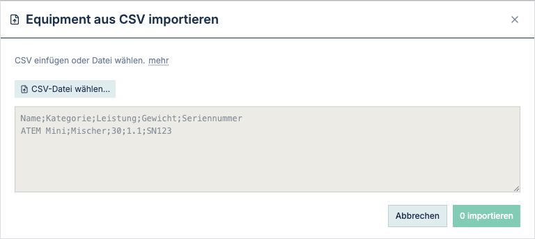

**Ablauf:**

1. **Datei laden** — Klick auf *CSV-Datei wählen…* öffnet den Betriebssystem-Datei-Dialog
2. **CSV-Text eingeben/anpassen** — Der erkannte Text wird im Textbereich gezeigt und kann manuell editiert werden
3. **Vorschau** — Alle erkannten Spalten und deren Inhalte werden unten angezeigt; bekannte Spalten sind grün gekennzeichnet
4. **Stille Verluste sichtbar** — Die App zählt und zeigt:
   - Unbekannte Spalten (ignoriert beim Import)
   - Zeilen ohne Namen (übersprungen)
   - Doppelnamen (nur die erste Zeile wird importiert)
5. **Importieren** — Der grüne Button *0 importieren* zeigt die Zahl der neuen Geräte; ein Klick committet den Import

**Spalten-Aliase:**

| Deutsch | English | Wirkung |
|---|---|---|
| Name | Name | Gerätename (Pflicht) |
| Kategorie | Category | Gerätekategorie (z. B. Camera) |
| Leistung | Power | Stromaufnahme in Watt |
| Gewicht | Weight | Gewicht für Lastberechnung |
| Seriennummer | Serial number | Eindeutige Geräte-ID |

Die App merkt sich die Spalten-Zuordnung für nachfolgende CSV-Importe.

### Rentman-Import

*Datei → Rentman-Import…* (nur wenn die Rentman-Integration aktiviert ist)

Verbindet sich mit dem Rentman-Mietmanagement-System und lädt Geräte aus der Rentman-Klassifizierung als Gerätebibliothek in LZ Cable Planner. Der Dialog durchläuft mehrere Schritte:

**Schritte im Dialog:**

1. **Authentifizierung** — Gibt den Rentman-API-Token ein (gespeichert im OS-Credential-Store)
2. **Projektauswahl** — Listet alle Rentman-Projekte auf; der Nutzer wählt eines
3. **Kategorien-Zuordnung** — Rentman-Geräteklassen werden auf Cable-Planner-Kategorien abgebildet
4. **Vorschau** — Zeigt alle zu importierenden Geräte
5. **Import** — Bestätigung und Durchführung

Die Integration wird in den *Einstellungen → Integrationen* freigeschaltet. Der Workflow ist non-destruktiv: bestehende Geräte werden nicht überschrieben.

### NetBox-Import

*Datei → NetBox-Import…* (nur wenn die NetBox-Integration aktiviert ist)

Lädt eine Netzwerk-Infrastruktur-Inventarbild aus NetBox (IPAM/DCIM-System). Der Dialog ähnelt dem Rentman-Import: Authentifizierung, Inventar-Auswahl, Kategorien-Mapping, Vorschau und Import.

**Besonderheiten:**
- NetBox-Gerätetypen werden als Kategorien interpretiert
- Schnittstellenangaben (z. B. „SFP+") werden als Portnamen übernommen
- Die Integration wird in den *Einstellungen → Integrationen* freigeschaltet

### Gesamtprojekt exportieren

*Datei → Exportieren Gesamtprojekt (.avplan)…*

Speichert das Projekt im `.avplan`-Format — ein standortübergreifendes Austauschformat für AV-Planungssoftware. Das Format ist transparent (JSON) und enthält alle Projekt-Daten plus Metadaten für externe Werkzeuge (z. B. av-control-center).

Ein Klick öffnet einen Speichern-Dialog; der Standard-Dateiname ist `<Projektname>.avplan`.

### Gesamtprojekt importieren

*Datei → Importieren Gesamtprojekt (.avplan)…*

Lädt ein zuvor exportiertes `.avplan`-Projekt zurück. Das Projekt wird im aktiven Fenster geladen.

Ein Klick öffnet einen Öffnen-Dialog; Dateitypen sind `.avplan` und `.json`.

### Identitäts-Karte exportieren

*Datei → Exportieren Identitäts-Karte (.avsourcemap)…*

Die Identitäts-Karte ist eine Zuordnungstabelle zwischen internen Geräte-IDs (wie sie in Quellsystemen — z. B. ATEM-Videohub — referenziert werden) und den Geräteinamen im Cable-Planner-Plan. Die Datei dient dem Abgleich mit Hardware oder anderen Softwaresystemen.

Ein Klick öffnet einen Speichern-Dialog.

### Identitäts-Karte importieren

*Datei → Importieren Identitäts-Karte (.avsourcemap)…*

Lädt eine zuvor exportierte Identitäts-Karte zurück und wendet die Zuordnungen auf die aktuellen Geräte an.

Ein Klick öffnet einen Öffnen-Dialog.

### Verknüpfte Venue-Planung ansehen

*Datei → Verknüpfte Venue-Planung ansehen…*

Wenn das Projekt über das `.avplan`-Format mit einem Venue-Planungsprojekt (z. B. aus light-planner) verknüpft ist, kann dieser Dialog die verknüpfte Datei anzeigen. Diese Funktion dient der Koordination zwischen Kabel- und Venue-Planung.

### Projekt-Dateiformat: `.cableplan`

Die Projektdatei ist ein JSON-Dokument mit der Struktur:

```json
{
  "metadata": {
    "name": "Mein Projekt",
    "creator": "Max Mustermann",
    "modified": "2026-09-28T10:00:00Z",
    "version": "8.1.0"
  },
  "equipment": [
    {"id": "...", "name": "Camera 1", "category": "Camera", "position": {...}},
    ...
  ],
  "cables": [
    {"id": "...", "from": "...", "to": "...", "type": "SDI"},
    ...
  ],
  "library": [...],
  "fotos": [...]
}
```

Größenmerkmale:
- Kleine Projekte (< 50 Geräte): 50–200 kB
- Mittlere Projekte (50–200 Geräte): 200 KB–2 MB
- Große Projekte (> 200 Geräte) + Fotos: > 5 MB

**Sicherung und Datenverlust-Prävention:**

- Die App speichert alle 30 Sekunden automatisch
- Neben der `.cableplan` liegt eine `.bak`-Datei (Backup der vorherigen Version)
- Bei Absturz wird die automatische Sicherung beim nächsten Start wiederhergestellt
- Backup-Fehler werden in der Statusleiste mit einem Warnsymbol angezeigt

### Sicherungskopie in der Statusleiste

Unten rechts im Fenster zeigt die **Statusleiste** den Sicherungs-Status:

- **Normales Symbol (☑)** — Projekt ist aktuell, letzter Speichern vor < 5 Sekunden
- **Drehendes Symbol (⟳)** — Sicherungskopie läuft gerade
- **Warnsymbol (⚠)** — Sicherung fehlgeschlagen (z. B. voller Speicher, Schreibfehler)

Fehlerhafte Sicherungen werden gesammelt und in den Einstellungen unter *Fehlerlog* angezeigt.

Die `.bak`-Datei ist atomar geschrieben: sie wird nie in einem Halb-Zustand auf die Platte fallen, und Stromausfälle während des Speicherns zerstören weder die aktuelle noch die alte Datei.

---

## 7. Exportieren und Drucken

Der Export-Bereich ist die Zentrale für alle Ausgaben: Pläne als PDF/Bild, Patchlisten, Stücklisten, Cloud-Speicherung und spezialisierte Doku für Festinstallationen. Hier entsteht jedes Blatt, das den Plan verlässt.

### Patchliste

*Datei → Werkzeuge → Patchliste…*

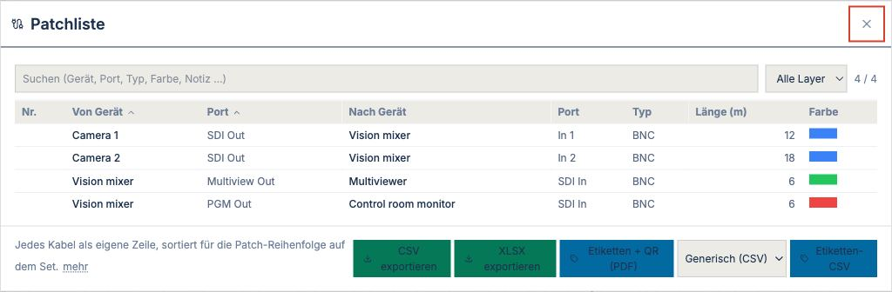

Tabelle aller Kabel im Plan — eine Zeile je Kabel mit Quell- und Zielgerät, Port, Kabeltyp, Länge und Farbe. Speziell für den Techniker im Feld, der jedes einzelne Kabel legen muss, nicht für Planabstraktionen wie Stücklisten.

**Spalten:**
- **Nummer**: Kabelnummer (leer wenn keine vergeben)
- **Quelle** → **Ziel**: Gerätename und Port
- **Typ**, **Länge**: Kabelspezifikation
- **Farbe**: Markierung des Kabels
- **Multicore**: Bündel-Name (wenn Teil einer Schlange/Snake)
- **Faser**: Bei Lichtwellenleitern die Faser-Nummer und -Rolle (TX/RX)
- **Ebene**: Video, Audio, Steuerung, Netzwerk, Strom, Sonstiges

**Filter & Sortierung:**
- Nach Ebene filtern (z. B. nur Video-Kabel zeigen)
- Nach Quell-Gerät, Ziel-Gerät, Kabeltyp, Länge oder Farbe sortieren
- Freitext-Suche über alle Spalten

**Export-Formate:**
- **CSV**: Tabellarisch, zur Bearbeitung in Excel oder als Druckvorlage
- **Etikettenformat**: CSV für Etikett-Drucker-Software (Generic, Brother, Dymo); enthält Angaben wie Quellport, Zielport und Kabellänge in dem Format, das die Drucker-Software erwartet
- **PDF Etiketten + QR**: Kleine Sticker pro Kabel mit QR-Code (zur Verfolgung) und gedruckten Angaben; A4 oder Rollen-Format
- **PDF Patchliste**: Die Tabelle als ein druckbares PDF — eine Seite pro Gerät mit dessen Kabelzuordnungen

### Festinstallation: Doku & Übergabe

*Datei → Werkzeuge → Festinstallation: Doku & Übergabe…*

Doku-Zentrale für Installateure und Betreiber. Jeder Reiter erzeugt ein eigenständiges CSV- oder PDF-Ausgabedokument für einen Aspekt der Festinstallation.

Die Reiter:

**Übersicht** — Checkliste zur Installationsvorbereitung:
- Installer-Listen: Pull-Liste (wer zieht was mit), Termination-Liste (wo werden Stecker aufgelöst), Zeitplan (Reihenfolge der Arbeitsschritte), Kabel-Stückliste (Typ+Länge zusammengefasst)
- Betriebs-Asset-Register: Geräte-Inventar mit Seriennummern und Lagerort
- Änderungsprotokoll: Wer hat wann welche Änderung eingetragen; kann geleert werden

**Handover-Paket** — Markdown-Manifest aller Unterlagen mit Versionsstand und QR zum Nachverfolgung:
- Umfasst automatisch alle Blätter: Installateur-Listen, Technische Doku, Signalwege, …
- Jedes Blatt trägt seinen Stempel (Revision + Datum)

**QR & Asset-IDs** — Markierung der Ausrüstung:
- Auto-Nummern für Geräte und Kabel vergeben (falls noch nicht geschehen)
- QR-Etikett-PDF erzeugen zum Aufkleben

**Bearbeiter-ID** — Name des Installateurs/Technikers (steht in jedem Protokoll-Eintrag als Autor)

### Stage Plot

*Datei → Werkzeuge → Stage Plot (SVG)…*

Draufsicht des Plans als **SVG** (Vektor-Grafik): nur die Geräte, keine Kabel, Vogelperspektive auf die Bühne/den Saal. Ideal zum Ausdrucken oder für technische Zeichnungen.

### Exportieren & Drucken

*Datei → Exportieren & Drucken…*

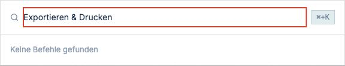

Zentrale Export-Dialog mit sieben Reitern für alle Ausgabe-Formate. Alle Aktionen sind nicht-destruktiv — keine Änderung am Plan selbst.

#### Reiter: Plan

Den Canvas-Plan als **PDF, PNG, JPEG, SVG oder DXF** exportieren.

**PDF (Raster):**
- Klassischer Raster-PDF (JPEG-Snapshot des Plans)
- Mit Titelblock: Projektname, Revision, Änderungs-Fingerprint, QR-Code
- Druckfertig, Text wird bei hohem Zoom unscharf

**PDF (Vektor, Beta):**
- Chromium printToPDF — Text bleibt selektierbar und scharf bei jedem Zoom
- Kleinere Dateigröße
- **Keine Titelblock** — Revision, Fingerprint und QR stehen nur im Raster-PDF

**PNG, JPEG:**
- Bitmap-Formate für E-Mail, Slack, Webseiten
- PNG: transparent möglich, scharf bei kleinen Flächen
- JPEG: komprimiert, kleinere Dateien

**SVG:**
- Vektorgrafik für Web und weitere Bearbeitung; alle Elemente bleiben selektierbar

**DXF:**
- CAD-Format für Plotter und Desktop-Planer
- Geräte, Kabel und Text auf separaten Ebenen

**Optionen:**

- **PDF-Thema**: Dunkel (wie Canvas) oder Hell (empfohlen für Druck)
- **Monochrom-sicher**: Text der Ebene auf jedem Kabel drucken statt Farben — für Schwarzweiß-Drucker, wo Videokabel sonst nicht von Audiokabeln zu unterscheiden sind
- **Render-Mode** (nur Vektor-PDF):
  - Raster (Classic): JPEG-Snapshot, zuverlässig, aber Text unscharf bei Zoom
  - Vektor: Chromium printToPDF, Text scharf, kleinere Datei, aber kein Titelblock
- **Seitengröße** (nur Vektor-PDF): Auto (A0-compat), A4–A0+, Original (volle Canvas-Größe für Plotter)
- **Ebenen**: Welche Kabeltypen (Video, Audio, Steuerung, Netzwerk, Strom, Sonstiges) in die PDF einbezogen werden; Auswahl ist synchron mit der Canvas-Ansicht

#### Reiter: Patch-Sheets

Pro ausgewähltem Gerät eine Port-Belegungs-Liste — ideal zum Aufkleben am Gerät.

- **Geräte auswählen**: Haken neben jedem Gerät setzen oder "Alle wählen"
- **Format wählen**: A4 oder A3 (wird nach dem Klick abgefragt)
- **Aktion**:
  - "PDF herunterladen": alle ausgewählten Geräte in eine PDF
  - "Drucken": sofort an den OS-Drucker
  - "Etikett-CSV": kompakte Tabelle als CSV (eine Zeile pro Gerät statt ganzer Seite)

#### Reiter: Kabel-Stückliste (BOM)

Alle Kabel zusammengefasst nach Typ und Länge — zur Bestellung.

- **Tabelle**: Kabeltyp + Länge, Menge, Rentman-Planung (editierbar)
- **Export**:
  - CSV: für Excel-Bearbeitung
  - PDF: druckfertig mit Rentman-Spalte
- **Rentman-Integration**: Falls die Gerätebibliothek mit Rentman verknüpft ist, können Ausgabemengen und Preise direkt übernommen werden

#### Reiter: Geräte-Stückliste

Was der Plan an Geräten braucht — gedeckt durch Bestand (Lager)?

- **Drei Zustände pro Gerät**:
  - Grün (Gedeckt): Gerät ist im Lager bekannt (über Katalog-Identität)
  - Orange (VORSCHLAG): Namenstreffer — nur die Vermutung, dass es das richtige Gerät ist; wartet auf Bestätigung
  - Rot (Nicht im Lager): Gerät nicht im Bestand
- **Kommissionier-Liste**: nur die grünen Geräte, nach Lagerort sortiert — die Liste, die der Techniker zum Packen mitnimmt

#### Reiter: Racks & Gruppen

Gespeicherte Racks und Gruppen einzeln als PDF exportieren.

- Liste aller Racks und Gruppen im Plan
- **Pro Rack**: eine Patch-Seite je enthaltenem Gerät, zeigt die interne Verkabelung
- Aktion: "PDF herunterladen" oder "Drucken"

#### Reiter: Tally-Karte

Die Kette Rolle (Show-Position) → Gerät (z. B. Kamera) → Mischer-Eingang → UMD-Adresse (Texteinblendung auf dem Multiviewer).

Aus dem Plan abgeleitet und geprüft. Ideal zum gegenlesen oder zur Konfiguration der tally-pi-Hardware.

- **CSV**: zum gegenlesen (Mensch)
- **JSON**: für tally-pi-Konfiguration
  - (Anmerkung: GPIO-Pins der physischen Lampen gehören zur Hardware, nicht zum Plan)

#### Reiter: Unterlagen-Stapel

Mehrere Blätter als ein druckbarer Stapel: eine Seite je Blatt, Spaltenkopf auf jeder Folgeseite, Farbe und Format wählbar.

- **Blätter auswählen**: Haken neben jedem Blatt
- **Format**: A4, A3, A2, A1, A0
- **Farbmodus**: Farbe oder Schwarzweiß (jeder Eintrag bleibt lesbar)
- **Aktion**: "Drucken" oder "PDF herunterladen"
- Jedes Blatt trägt seinen Stempel (Revision + Datum) — später lässt sich ein Stapel gestempelter Blätter gegen den aktuellen Plan halten und überprüfen, ob noch alles gültig ist.

### Cloud & Lese-Link

*Datei → Cloud & Lese-Link…*

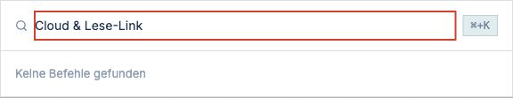

Plan in die Cloud speichern (optional), Revisionen verwalten, Lese-Link zum Öffnen in einem anderen Gerät erzeugen.

**Voraussetzung:** Anmeldung an der Gerätebibliothek (unter *Einstellungen → Gerätebibliothek*).

**Funktionen:**

- **Jetzt speichern**: Der aktuelle Plan wird als neue Revision in die Cloud hochgeladen
- **Revisionen**: Liste aller bisherigen Versionen (mit Änderungs-Fingerprint + Speicherzeitpunkt)
  - Eine Revision kann wiederhergestellt werden (sie wird zur neuen obersten)
  - Download: die Revision als .cp-Datei lokal speichern
- **Lese-Links**: Externe Betrachter öffnen den Plan im Web-Viewer (read-only), ohne sich anzumelden
  - Link erstellen: eigene Adresse eingeben
  - Link kopieren (für E-Mail, Slack, Dokumentation)
  - Link löschen (Zugriff widerrufen)
  - Verfallsdatum setzen (optional)
- **Andere Cloud-Projekte**: Existierende Cloud-Projekte anschauen, öffnen, herunterladen oder von der Cloud löschen

**Datenschutz:**
- Solange niemand „Jetzt speichern" drückt, verbleibt der Plan lokal.
- Der Server fragt die Anmeldung ab — die Dateikennung ist device-spezifisch, nicht datei-spezifisch.

### Export als Viewer-Datei

*Datei → Export als Viewer-Datei…*

Plan in das **`.cpviewer`-Format** exportieren. External Reviewer (Freelancer, andere Teams) können den Plan später im Web-Viewer öffnen, Anmerkungen einzeichnen und die Datei zurückmailen.

(Aktion: direkter Download; kein Dialog)

### Anmerkungen importieren

*Datei → Anmerkungen importieren…*

Eine `.cpviewer`-Datei mit Anmerkungen von einem Reviewer öffnen und die Markierungen / Kommentare in den aktuellen Plan mergen. Das ermöglicht einen Feedback-Workflow ohne direkte Cloud-Anbindung.

(Aktion: Datei-Dialog öffnen; kein Upload an den Server)

### Plan-Stände vergleichen

*Datei → Plan-Stände vergleichen…*

Zwei `.cp`-Dateien gegeneinander halten — z. B. die aktuelle Version gegen die Version von gestern, um Änderungen zu entdecken.

- Gerät hinzugefügt/gelöscht
- Kabel hinzugefügt/gelöscht/umgerouted
- Port-Umbenennung
- etc.

Unterschiede werden visuell hervorgehoben, Details in einer Tabelle.

### Ausgegebene Dokumente

*Datei → Ausgegebene Dokumente…*

Register aller Blätter, die bisher aus diesem Plan exportiert wurden. Warum? Damit sich ein Techniker morgen auf der Baustelle einen alten Ausdruck zu Hand nehmen und prüfen kann, ob er noch aktuell ist — oder ob der Plan seit damals gelaufen hat.

**Spalten:**
- **Zeitstempel**: Wann wurde es ausgegeben
- **Blatt**: Welches Blatt (Patchliste, Plan-PDF, BOM, …)
- **Änderungs-Fingerprint**: Eindeutige Kennung des Planstandes bei der Ausgabe
- **Revision** (wenn Cloud): Revisions-Nummer bei Upload in die Cloud
- **Bearbeiter**: Wer hat es ausgegeben (aus den Einstellungen)

Das Register ist Teil des Projekts und wird mit gespeichert.

---

© 2026 Lars Zumpe Medienproduktion · kostenlos nutzbar, proprietär lizenziert

---

## 8. Werkzeuge: Planen

Die Werkzeug-Dialoge zum Erfassen, Analysieren und Planen einer Anlage — von der Bestandsaufnahme über Funktionsgruppen bis zur Ausspielung.

### Berechnen

Spezialisierte Rechner für Kapazitäten und Ressourcen.

#### Aufzeichnungsspeicher berechnen

*Werkzeuge → Aufzeichnungsspeicher berechnen…*


Berechnet den Speicherbedarf für Video-Aufzeichnung basierend auf Codec, Auflösung, Framerate und Dauer.

- **Eingaben**: Videoformat (HD/4K/8K), Codec (DCI/H.265/ProRes/etc.), Framerate (25/50/60 fps), Dauer der Aufzeichnung.
- **Ausgabe**: Speichergröße in GB/TB.

#### Projektion & Display

*Werkzeuge → Projektion & Display…*


Berechnet Projektions-Parameter für Bildschirme und Beamer.

- **Eingaben**: Displaygröße (Diagonale), Auflösung, Abstand zum Publikum.
- **Ausgabe**: Optimale Projektions-Entfernung und Linsenparameter.

### Prüfen

Analysen zur Kontrolle und Konsistenzprüfung des Plans.

#### Analysen

*Werkzeuge → Analysen (Gewicht/Netzwerk/Redundanz)…*

Ein umfassendes Analyse-Werkzeug mit 14 Reitern zur Kontrolle aller Aspekte der Anlage.

##### Reiter: Gewicht & Wärme


Gesamtgewicht und Wärmelast (BTU/h) pro Gerätegruppe und insgesamt.

- **Tabelle**: Kategorie, Anzahl, Gewicht (kg), Leistung (W), Wärme (BTU/h), optional Wert (€).
- **Fehlend**: Anzeige, wenn Geräte ohne Gewichtsangabe.
- **Download**: CSV-Export für Berechnungsblätter.
- **Link**: Direkter Zugang zum Stromverbrauch-Rechner (s. u.).

##### Reiter: Netzwerk


IP-Adressen, VLANs, Switchports und Netzwerk-Topologie prüfen.

- **Adressplan**: IP-Konflikte und fehlende Zuordnungen.
- **VLAN-Zählung**: Welche VLANs und wie viele Ports je VLAN.
- **Switchport-Belegung**: Welche Geräte-Ports an welchen Switch-Ports.
- **Multicast**: Multicast-Adressen und -Gruppen prüfen.

##### Reiter: Redundanz


Überprüft, wo nur ein Signal oder Stromkreis vorhanden ist.

- **Eingänge**: Wieviele unabhängige Strom- oder Upsream-Verbindungen je Gerät?
- **Befunde**: Rote Flaggen für Geräte mit nur einer Verbindung.

##### Reiter: RF / Funk


Funkstrecken (Mikrofone, Kopfhörer, Kameras) und Spektrum-Konflikte prüfen.

- **Frequenz-Tabelle**: Alle Sender und Empfänger mit Frequenz (MHz), Bandbreite, Leistung.
- **Konflikte**: Zu dicht beieinander liegende Kanäle (< 0,4 MHz Abstand).
- **Spektrum-Scan**: Optional Upload von Spektrum-Messdaten zur Validierung.

##### Reiter: Kabelwege


Überprüft die physischen Verlegungswege und Kabellängen.

- **Befunde**: Zu lange Kabel, unzulässige Verlauf-Komplexität.
- **Weg-Details**: Pro Kabel Länge, Leitungsanzahl, Durchmesser.

##### Reiter: Signalwege


Verfolgt ein Signal durch alle Ebenen — von der Quelle bis zur Ausgabe.

- **Eintrag**: Wähle Quelle und Ziel.
- **Kette**: Zeigt Weg durch Mischer, Router, Player, etc.
- **Konflikte**: Unterbrochene oder mehrdeutige Wege.

##### Reiter: Anschlussliste


Tabellarische Übersicht aller Kabel-Verbindungen.

- **Spalten**: Quellgerät, -port → Zielgerät, -port, Kabeltyp, Länge.
- **Filter**: Nach Gerät, Kabeltyp, oder Statusn (Geplant/Verbaut).
- **Download**: CSV für Patchlisten-Drucke.

##### Reiter: Blatt prüfen


Überprüft, ob alle erforderlichen Geräte-Datenblätter hinterlegt sind.

- **Status**: Welche Geräte haben Links zu PDF-Datenblättern?
- **Befunde**: Fehlende oder veraltete Datenblätter.

##### Reiter: Kunden-Übersicht


Übersicht für Kundenkommunikation und Projektabnahme.

- **Projektname, Anlagensystem**: Standard-Info.
- **Geräteliste**: Kurze Fassung für Angebot.
- **Konfiguration**: Wichtigste Parameter (Kameras, Eingänge, Ausgaben).

##### Reiter: Kosten: Plan gegen Ist


Abweichungen zwischen geplanten und tatsächlichen Kosten.

- **Eingabe**: Gebotene und tatsächliche Preise pro Gerätezeile.
- **Differenz**: Über-/Unterbietung, Prozentsatz.
- **Toleranz**: Schwellenwert für Abweichung eingeben.

##### Reiter: Crew: Stunden & Auslagen


Arbeitsplan: Wer, wann, wie lange, Material-Budget.

- **Positionen**: Techniker, Kameraleute, Ton, etc.
- **Stunden**: Aufbau, Betrieb, Abbau.
- **Stundensatz**: Calculation der Personalkosten.
- **Auslagen**: Reise, Hotel, Mietgeräte.

##### Reiter: Namensregel


Einheitliche Benennung von Geräten, Kabeln und Netzwerk-Ports.

- **Schema**: Wähle aus vorgefertigten Regeln (Kategorie + Nummer, Hersteller + Modell, Custom).
- **Anwendung**: Welche Objekte aktualisieren?
- **Vorschau**: Zeigt, wie die neuen Namen aussehen.

##### Reiter: Dante-Patch


Überprüfung der Dante-Audio-Routing und Geräte-Zertifizierung.

- **Patch-Matrix**: Sender → Empfänger-Zuordnung.
- **Leitungsqualität**: Latenz, Jitter, Redundanz je Leitung.
- **Geräte-Liste**: Dante-Zertifizierung und Firmware-Stand.

##### Reiter: Was ansteht


Zusammenfassung aller Befunde und noch zu erledigenden Aufgaben.

- **Kategorien**: Gewicht, Netzwerk, Redundanz, RF, Kabel, Kosten, etc.
- **Priorität**: Rot (kritisch), Gelb (warnung), Grau (Info).
- **Aktionen**: Was ist zu tun, um den Plan freizugeben?

#### Plan-Prüfung

*Werkzeuge → Plan-Prüfung…*

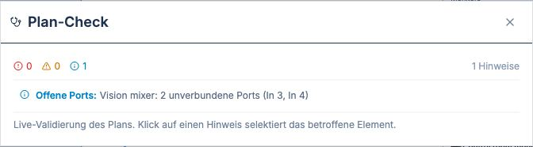

Scannt den gesamten Plan nach häufigen Fehlern und zeigt sie strukturiert.

- **Filter**: Nach Befund-Art (Fehler, Warnung, Hinweis) oder Gerät/Kabel.
- **Befunde**: Unvollständige Verbindungen, ungültige Kombinationen, missing Metadaten.
- **Automatisch**: Läuft bei jedem Speichern im Hintergrund.

#### Plan gegen Vorgefundenes

*Werkzeuge → Plan gegen Vorgefundenes…*

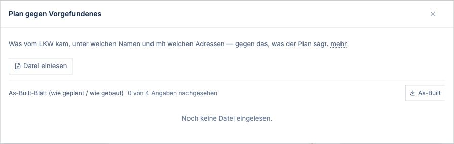

Vergleicht den geplanten Plan mit der erfassten Ist-Situation vor Ort.

- **Bestandsaufnahme laden**: CSV/Excel mit Namen und Positionen.
- **Matching**: Automatischer Abgleich oder manuelle Zuordnung.
- **Differenzen**: Was ist geplant, aber nicht vorhanden? Was steht vor Ort, aber nicht im Plan?
- **Export**: Gegenüberstellung als Bericht.

### Planen

Werkzeuge zum Erfassen, Strukturieren und Detaillieren der Anlage.

#### Bestandsaufnahme (Vorhandenes erfassen)

*Werkzeuge → Bestandsaufnahme…*

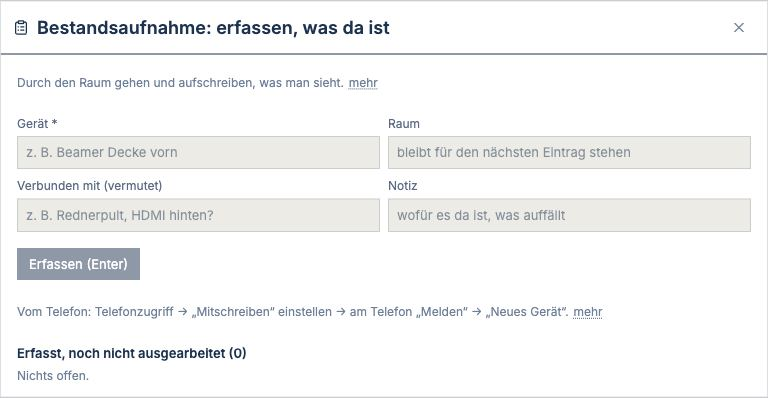

Dokumentiert physisch vorhandene Geräte und deren Position.

- **Geräteeingabe**: Name, Kategorie, angenommener Einsatzort.
- **Raum**: Ablageplatz in der Anlage, oder frei im Raum.
- **Foto**: Schnappschuss des Geräts (optional).
- **Notiz**: Beobachtungen (Zustand, Alternative, abgeklebte Anschlüsse).
- **Anschlüsse raten**: Geräte-Datenblatt suchen und Anschlussgruppen ausfüllen.

#### Drum-Mikrofonierung

*Werkzeuge → Drum-Mikrofonierung…*

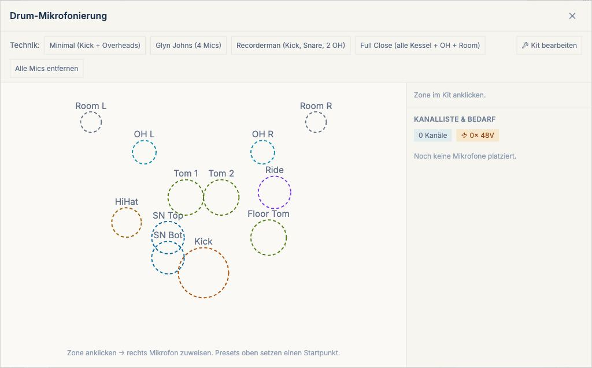

Spezial-Dialog zur Platzierung von Mikrofonen an Schlagzeug-Komponenten.

- **Schlagzeug-Skizze**: Drum-Kit mit Positionen (Kick, Snare, Hi-Hat, Toms, Becken).
- **Mik-Slots**: Drag-and-Drop von Mikro-Typen auf die Positionen.
- **Stecker**: Geräte wählen (Mischpult, Interface) und Eingangsanschlüsse zuordnen.
- **Notizen**: Name und Notizen je Mik (z.B. Kick-Outside, Snare Top).

#### Funkstrecken / Gesang (Spektrum)

*Werkzeuge → Funkstrecken / Gesang…*


Plant Funkfrequenzen für Drahtlos-Mikrofone und Kopfhörer.

- **Bänder**: 2,4 GHz, UHF (600–700 MHz), UHF (900 MHz), IR, SMD24.
- **Geräte**: Sender und Empfänger-Baureihen, teilweise mit Programmable Freqs.
- **Frequenzzuweisung**: Kanäle Eins-zu-Eins zuordnen, oder automatisch Konflikte minimieren.
- **Spektrum-Scan**: Upload von Messdaten (CSV) zur Überprüfung gegen echte Umweltfrequenzen.

#### Ablauf und Kamera-Aufträge

*Werkzeuge → Ablauf und Kamera-Aufträge…*

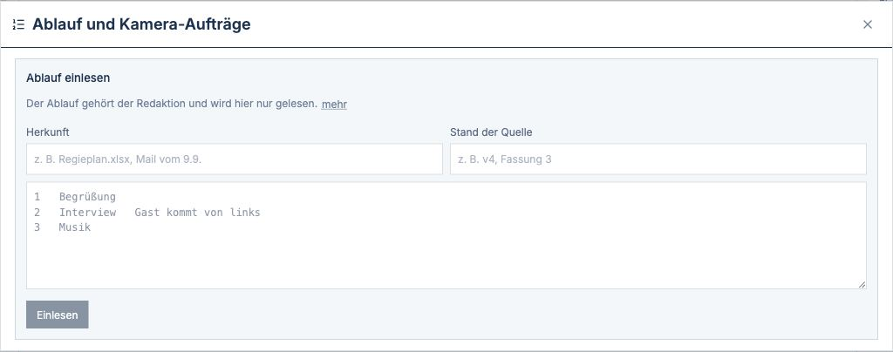

Strukturiert den zeitlichen Ablauf einer Veranstaltung und ordnet Kamera-Aufgaben zu.

- **Segmente importieren**: Einlesen aus TCS-Dateien oder manuel eintragen.
- **Schnitte / Szenen**: Pro Eintrag Name, Dauer, Musik-Timing.
- **Kamera-Anschlüsse**: Pro Kamera-Position (Kamera 1, Kamera 2, …) welcher Schnitt/Shot zeigen?
- **Handover**: Erstellt Befehlskarten für Kamerateam (QR-Code oder Ausdruck).

#### Ausspielung (Streaming-Ziele)

*Werkzeuge → Ausspielung…*

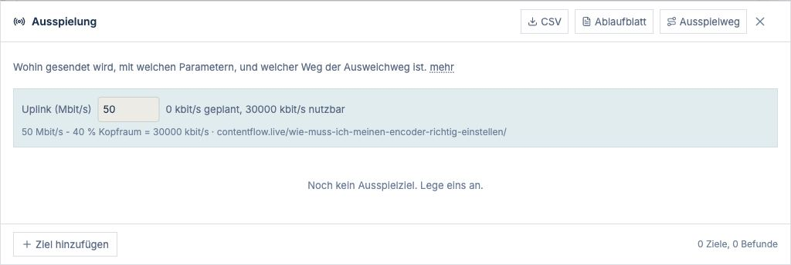

Definiert, wohin das Video/Audio geleitet wird (YouTube Live, Zoom, Recording, etc.).

- **Destinationen**: YouTube Live, Facebook, Twitch, RTMPS-Server, Local Recording, Multiview-Monitor.
- **Parameter**: Bitrate, Codec, Auflösung, Framerate.
- **Credentials**: API-Schlüssel, Stream-URLs (sicher verwahrt, nicht im Projekt-File).
- **Monitoring**: Live-Status, Bps-Verbrauch, Fehlerrate.

#### LED-Wand

*Werkzeuge → LED-Wand…*

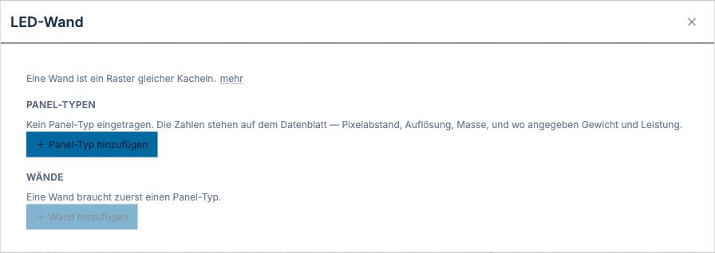

Platz und Leistung von LED-Flächen planen.

- **Panelformat**: Wähle Standard-Größen oder Custom (z.B. 500×250 mm).
- **Auflösung**: Pixel pro Meter (256, 312, 500 ppm).
- **Anordnung**: Breite × Höhe in Paneleinheiten → Gesamt-Größe in Metern.
- **Gewicht & Leistung**: Berechnung aus Panel-Daten.
- **Pixel-Bild**: Export der Koordinaten für Media-Server (Pixel Mapping).

#### Frontplatten-Editor

*Werkzeuge → Frontplatten-Editor…*

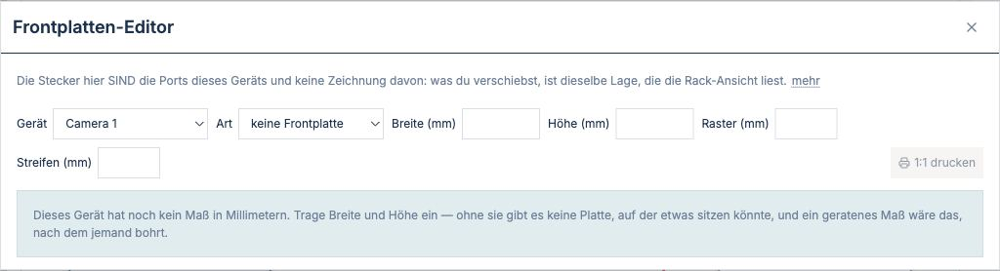

Platziert Anschlüsse auf ebener Fläche (Wandplatte, Patchfeld, Stage Box) und druckt 1:1 zum Ausdruck.

- **Platte**: Wähle Größe und Material (19"-Rack-Blende, Wandplatte, Custom).
- **Anschlüsse**: Drag-and-Drop von Stecker-Gruppen.
- **Positionierung**: Millimeter-genaue Platzierung (Rastergitter).
- **Beschriftung**: Automatisch von Gerätennamen, oder Custom.
- **Druck**: 1:1 auf Drucker für Lochbohrungen und Etikettendruck.

#### Berichts-Editor

*Werkzeuge → Berichts-Editor…*

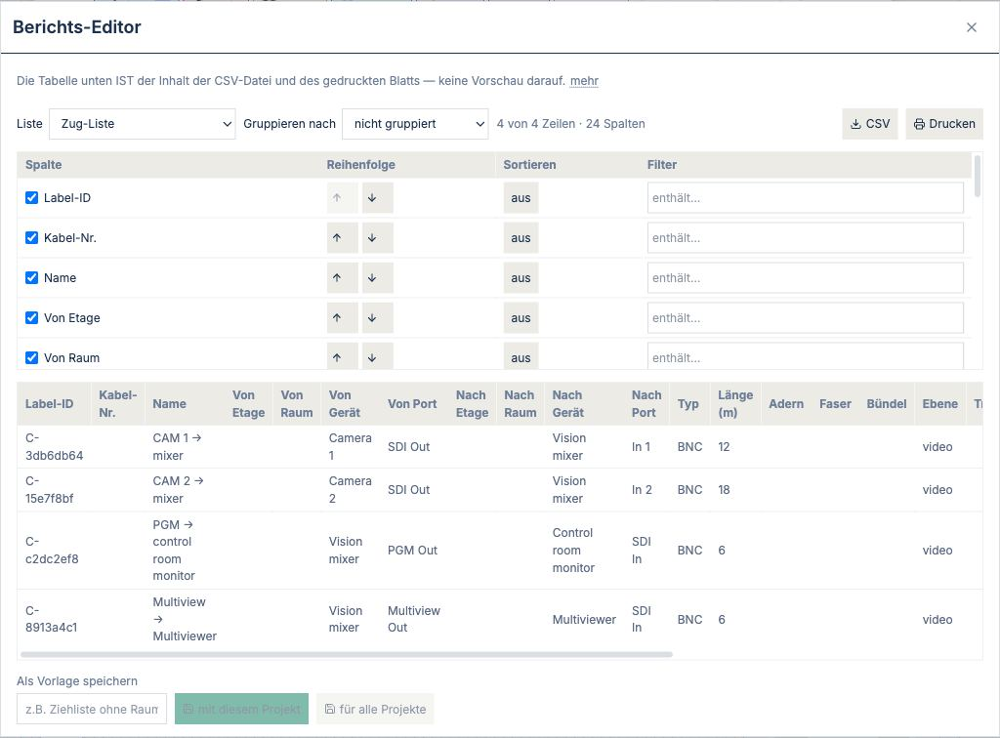

Konfiguriert die Darstellung von Gerät- und Kabel-Listen (Druck & Export).

- **Spalten**: Auswahl, Reihenfolge, Breite.
- **Gruppierung**: Nach Kategorie, Raum, Status, oder Custom.
- **Sortierung**: A→Z, nach Wert, nach Datum.
- **Filter**: Nur Geräte bestimmter Kategorien, Räume, oder Zustände.
- **Vorlagen**: Speichern und Abrufen vorkonfigurierter Layouts.

#### Adern und Farbnormen

*Werkzeuge → Adern und Farbnormen…*

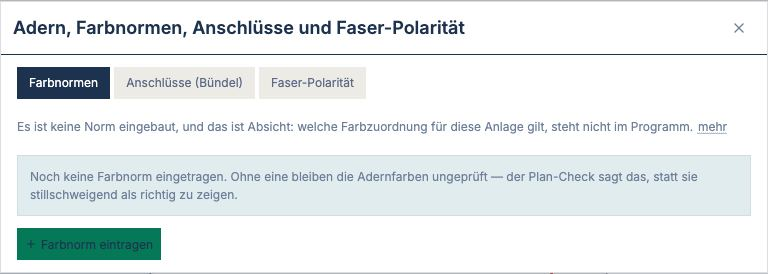

Definiert Leitungs-Farben für Kabel und Anschlussmarker nach IEC oder Custom.

- **Standards**: IEC 60757 (International), EN 50575 (EU), Custom.
- **Sätze**: Vordefinierte Farb-Sequenzen (z.B. Braun/Schwarz/Grau/Weiß für 4×4 XLR).
- **Zuordnung**: Welcher Standard für welche Kabeltypen?
- **Vorschau**: Zeigt tatsächliche Farben der aktuellen Nummern.

#### Empfangene Show-Control-Nachrichten

*Werkzeuge → Empfangene Show-Control-Nachrichten…*

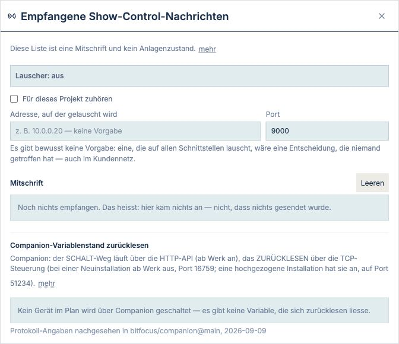

Zeigt ein Protokoll aller Show-Control-Befehle, die die App erhalten hat (OSC, MIDI, HTTP).

- **Eingangsquelle**: IP:Port, Netzwerk-Interface.
- **Datenfluss**: Zeitstempel, Befehl, Parameter, Status (verarbeitet/ignoriert).
- **Fehler**: Ungültige Befehle, Parse-Fehler.
- **Live-Ansicht**: Echtzeit-Monitor während einer Show.

### Erstellen & Verwalten

Werkzeuge zum Aufbau und zur Verwaltung der Anlage.

#### Mehrere Kabel verbinden

*Werkzeuge → Mehrere Kabel verbinden…*

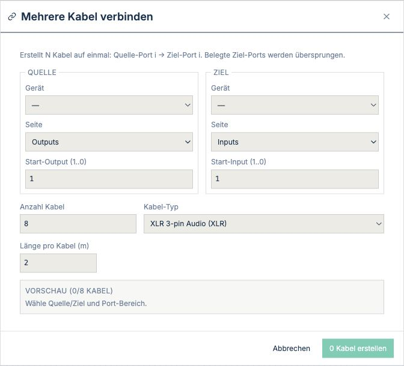

Verbindet viele Kabel auf einmal, statt einzeln zu klicken.

- **Tabelle**: Quelle, Quellen-Port, Ziel, Ziel-Port, Kabeltyp.
- **Paste**: Kopieren-Paste aus Excel oder CSV.
- **Validierung**: Prüft auf Inkompatibilität (z.B. BNC an HDMI).
- **Anwenden**: Alle Zeilen auf einmal verdrahten.

#### Neues Rack erstellen

*Werkzeuge → Neues Rack erstellen…*

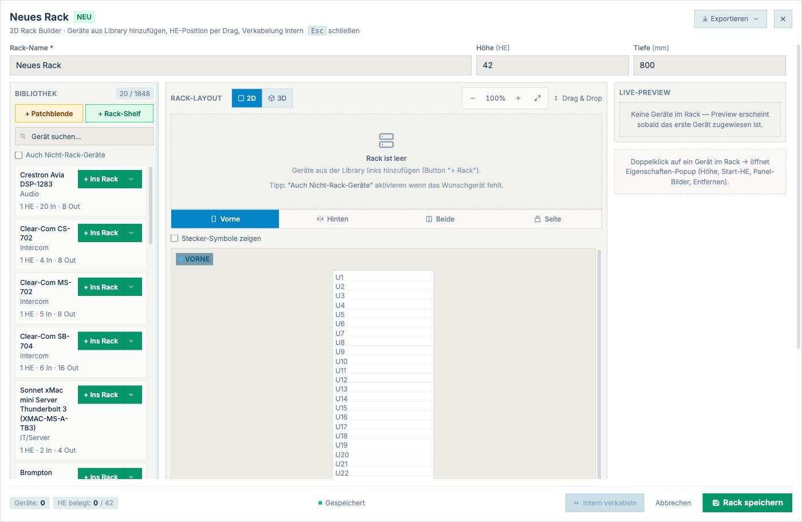

Erstellt einen neuen Rack-Container aus Geräte-Vorlagen.

- **Name**: Bezeichnung (z.B. „Server Rack 1").
- **Höhe**: Rack-Einheiten (RU), meist 42 RU.
- **Vorlage**: Optional aus Standard-Layouts oder leer.
- **Position**: Wo auf dem Canvas platzieren?

#### Rack-Builder

*Werkzeuge → Rack-Builder…*


Populiert einen Rack mit Geräten, ordnet sie und visualisiert in 3D.

- **Vorhandene Racks**: Liste editierbarer Racks.
- **Geräte-Slots**: Höhenangabe (RU) pro Gerät.
- **3D-Ansicht**: Vorderansicht zur Kontrolle von Kabellängen und Verdeckungen.
- **Exportieren**: Rack-Struktur speichern oder auf den Canvas.

#### KI-Planung generieren

*Werkzeuge → KI-Planung generieren…*

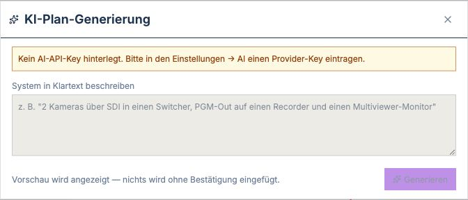

Generiert einen ersten Plan-Entwurf basierend auf einer Text-Beschreibung (KI).

- **Eingabe**: Kurze Beschreibung der Anlage (z.B. „3 Kameras, ATEM-Mischer, 2 Monitore, Streaming auf YouTube").
- **Optionen**: Welche Gerätetypen prioritär, Budget-Grenzen.
- **Entwurf**: KI wählt Geräte aus der Bibliothek und verdrahtet sie.
- **Anpassung**: Generierten Plan editieren.

Erfordert einen KI-API-Schlüssel (OpenAI, Google, Anthropic).

#### Überarbeitungen & Snapshots

*Werkzeuge → Überarbeitungen & Snapshots…*

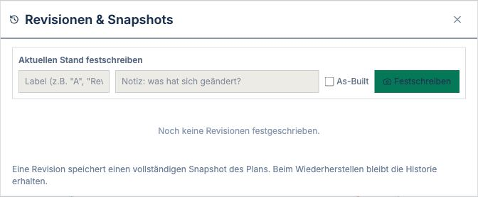

Speichert Zwischen-Versionen eines Plans, um Änderungen nachzuverfolgen.

- **Snapshots**: Zeitstempel, optionale Notiz.
- **Autosave**: Automatische Snapshots nach großen Änderungen.
- **Vergleich**: Zwei Versionen nebeneinander, Unterschiede hervorgehoben.
- **Wiederherstellen**: Zurück zu einer älteren Version.

### Device-Konfiguration

Einrichtung spezialisierter Geräte (falls vorhanden).

#### ATEM Multiviewer Layout

*Werkzeuge → ATEM Multiviewer Layout…*

(Nur wenn ein ATEM-Mischer in der Anlage vorhanden ist.)


Legt fest, welche Quellen in welchen Multiviewer-Fenstern angezeigt werden.

- **Layout**: Welche Fenster-Anzahl und Positionen?
- **Zuordnung**: Quelle → Fenster-Nummer.
- **Größe & Position**: Jedes Fenster einzeln dimensionierbar (bei unterstützten ATEM-Modellen).

#### ATEM Audio Routing

*Werkzeuge → ATEM Audio Routing…*

(Nur wenn ein ATEM-Mischer mit Audio-Eingängen vorhanden ist.)


Richtet Audio-Eingänge (XLR, RCA, Dante) zu Kanal-Fader des Mischers.

- **Eingänge**: Alle Audio-Eingänge des ATEM auflisten.
- **Kanäle**: Welcher Kanal bekommt welchen Input?
- **Empfindlichkeit**: Pegel pro Eingang.

#### ATEM Input Labels

*Werkzeuge → ATEM Input Labels…*

(Nur wenn ein ATEM-Mischer vorhanden ist.)


Benennt die Eingangs-Quellen am ATEM-Mischer (Name auf der Control Surface).

- **Eingänge**: Liste aller ATEM-Eingänge (1–20+).
- **Namen**: Custom-Name pro Eingang (z.B. „Kamera 1", „Graphics").
- **Farbe**: Optional Zuordnung von Marker-Farben.

---

## 9. Werkzeuge

Das Menü *Werkzeuge* enthält Spezialtasks zum Planen und Bauen von Systemen: Kabel verbinden, Racks aufbauen, LED-Wände konfigurieren, Schaltpläne exportieren und Geräte wie ATEM-Mischer und Videohub steuern.

### Patchliste

*Werkzeuge → Patch-Liste…*


Zeigt alle Verbindungen des Plans in tabellarischer Form — jedes Kabel eine Zeile, sortiert für die Patch-Reihenfolge am Set. 

**Spalten:** Nr., Von Gerät, Port, Nach Gerät, Port, Typ, Länge (m), Farbe.

**Layer-Filter:** Über das Dropdown oben wählen Sie, welche Schicht angezeigt wird (z. B. nur Video). Das Feld zeigt, wie viele Kabel insgesamt zu sehen sind.

**Suchfeld:** Filtert nach Gerät, Port, Typ oder Farbe — die Suche läuft in Echtzeit.

**Export-Optionen:**
- **CSV exportieren:** Kommagetrennte Datei für Tabellenkalkulationen.
- **XLSX exportieren:** Excel-Format.
- **Etiketten + QR (PDF):** Druckvorlage für Beschriftung. Wählt man einen Etikett-Typ (Generisch, Brother P-touch, Dymo), wird zusätzlich die entsprechende Exportdatei angeboten.

### Patch-Reihenfolge
Kabel werden nach ihrer Position auf dem Set sortiert — zuerst die Quellen (oben), dann die Ziele (unten). Das erlaubt, die Patchliste am Mischpult auszudrucken und Zeile für Zeile abzuarbeiten.

---

### LED-Wand

*Werkzeuge → LED-Wand…*

Definiert Panels, Auflösung, Gewicht und Leistung einer LED-Wand und generiert die Pixel-Map für den Media-Server.

**Felder:**
- **Panel-Typ:** Hersteller und Modell (z. B. Barco E22 Full HD, Unilumin LED-Panel).
- **Auflösung:** Breite × Höhe in Pixeln.
- **Panel-Größe:** Physische Abmessungen in mm (wird vom Datenblatt vorgegeben).
- **Anzahl Panels:** Horizontal × Vertikal (errechnet Gesamtgewicht und Leistung).
- **Helligkeit:** Nits (für die Planung der Kühlanlage relevant).
- **Blickwinkel:** Horizontal und vertikal, in Grad.

**Pixel-Map:** Nach dem Speichern können Sie die Pixel-Map im CSV- oder JSON-Format exportieren — für die Media-Server-Konfiguration (vPro, Notch, …).

---

### Frontplatten-Editor

*Werkzeuge → Frontplatten-Editor…*

Positioniert Buchsen auf einer Frontplatte (Wandfeld, Bühnenkiste) im Millimeter-Raster und druckt 1:1-Streifen zum Anbringen oder Fräsen.

**Arbeitsweise:**
1. Wählen Sie das Equipment (z. B. eine Wandplatte).
2. Positionieren Sie Buchsen per Drag & Drop oder durch Eingabe der (X, Y)-Koordinaten.
3. Definieren Sie Beschriftungen, Zonen und Farbcodes.
4. Drucken Sie den Streifen in voller Größe — zum Aufkleben, als Fräsvorlage oder für die Überprüfung am Set.

**Reiter/Funktionen:**
- **Layout:** Übersicht und Positionierung der Buchsen.
- **Beschriftung:** Labels und Legende.
- **Druck:** 1:1-Druckvorschau, Papierformat, Ränder.

---

### Berichts-Editor

*Werkzeuge → Berichts-Editor…*

Passt jede exportierbare Liste an (Kabel-BOM, Geräte, Lager): Spalten wählen oder verbergen, Gruppierung, Sortierung, Filter, und speichern als Vorlage für spätere Exporte.

**Reiter:**
- **Spalten:** Aktivieren/Deaktivieren der Spalten — die Liste wird mit den gewählten Spalten exportiert oder ausgedruckt.
- **Gruppieren:** Nach Feld sortieren (z. B. Nach Gerättyp).
- **Sortieren:** Primäre und sekundäre Sortierreihenfolge.
- **Filter:** Zeigen nur Zeilen, die eine Bedingung erfüllen (z. B. nur Kabel > 50 m).

Nach dem Speichern bleibt die Vorlage erhalten — der nächste Kabel-Export nutzt diese Einstellung.

---

### Adern und Farbnormen

*Werkzeuge → Adern und Farbnormen…*

Zeigt Steckerbelegungen und Farbcodes für alle unterstützten Stecker (XLR, HDMI, DB25, DMX, …) — zum Nachschlagen, für das Anlöten von Kabeln und zur Dokumentation.

**Struktur:**
- **Stecker auswählen:** Dropdown mit allen Typen (Cinch, XLR, BNC, Klinke, Speakon, …).
- **Belegung:** Grafik oder Tabelle mit Kontakt-Nummer, Name, Farbe und Funktion.
- **Standard:** Zur Information (z. B. IEC 60268-12 für XLR Audio).

Nutzen Sie dieses Werkzeug, um Kabel anzulöten oder um Verwechslungen bei der Wartung zu vermeiden.

---

### Empfangene Show-Control-Nachrichten

*Werkzeuge → Empfangene Show-Control-Nachrichten…*

Protokolliert alle OSC-, MIDI- und andere Show-Control-Botschaften, die die Planner-App empfangen hat (aus einem Ablauf-System, einer Kamera-Fernbedienung, etc.). Eine Lesart, keine System-Konfiguration — zeigt, was kam, aber speichert es nicht.

**Spalten:** Uhrzeit, Befehl, Quelle, Parameter, Status.

**Nutzung:** Zum Testen von Integrationen oder zum Verfolgen von Fernsteuerungs-Vorgängen während einer Probenaufzeichnung.

---

### Mehrere Kabel verbinden

*Werkzeuge → Mehrere Kabel verbinden…*

Erstellt N Kabel auf einmal — Quelle-Port i → Ziel-Port i. Belegte Ziel-Ports werden übersprungen.

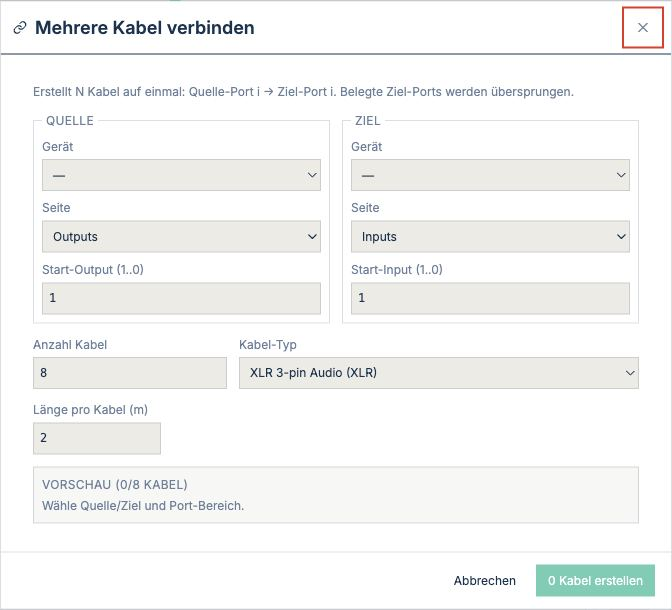

**Felder:**
- **QUELLE:** Gerät und Seite (Outputs/Inputs) + Start-Port-Nummer.
- **ZIEL:** Gerät und Seite (Inputs/Outputs) + Start-Port-Nummer.
- **Anzahl Kabel:** Wie viele Verbindungen erstellt werden.
- **Kabel-Typ:** Aus einer Dropdown (XLR Audio, SDI 3G, HDMI, Dante, DMX, Power, …).
- **Länge pro Kabel (m):** Wird auf alle Kabel übernommen (später einzeln änderbar).

**Vorschau:** Zeigt, welche Kabel entstehen, bevor Sie bestätigen. Belegte Ziele werden übersprungen — bei „0 Kabel erstellen" sind alle Ziel-Ports bereits belegt.

---

### Neues Rack erstellen

*Werkzeuge → Neues Rack erstellen…*

Startet einen Assistent zum Aufbau eines neuen Racks oder einer Regalanlage. Sie definieren:

1. **Racktyp:** 19" Standard, Grundriss-Feld oder Freistellung (z. B. Standregal).
2. **Größe:** Höhe in HE, Tiefe in mm.
3. **Material & Farbe:** Gehäuse, Seitenwand.
4. **Position im Plan:** Raum und Koordinaten.

Das neue Rack wird im Plan eingefügt und kann sofort mit Geräten gefüllt werden.

---

### Rack-Builder

*Werkzeuge → Rack-Builder…*

Populiert und bearbeitet Racks — platziert Geräte im Gehäuse, definiert Kabelwege und exportiert STL/3D-Modelle zum Visualisieren oder Fräsen.

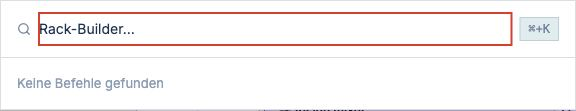

**Arbeitsweise:**
1. Wählen Sie ein Rack aus dem Plan (oder erstellen Sie eines über „Neues Rack erstellen").
2. Ziehen Sie Geräte aus der Gerätebibliothek in freie HE-Positionen.
3. Verbinden Sie Rückseiten (A/B) und definieren Sie Kabelwege.
4. Speichern — das 3D-Modell wird aktualisiert.

**Reiter:**
- **Übersicht:** Rack mit eingebauten Geräten (Vorder- und Rückseite wählbar).
- **3D-Ansicht:** Perspektivisches Modell zum Visualisieren von Kabelwegen und Platzbedarf.
- **Kabelwege:** Liste der Verbindungen im Rack mit Längen und Wegen.
- **Export:** STL für 3D-Druck, PDF für technische Zeichnungen.

---

### KI-Plan generieren

*Werkzeuge → KI-Plan generieren…*

Generiert einen Entwurf für einen Kabelprojekt anhand einer Textbeschreibung — z. B. „Live-Konzert, 3 Kameras, ATEM 2 M/E, Multiviewer, Ton auf Dante". Die KI erstellt Geräte, Verbindungen und Grundriss basierend auf Standardvorlagen.

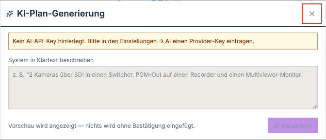

**Voraussetzung:** Ein API-Key für einen KI-Anbieter (OpenAI, Anthropic, …) in den Einstellungen → AI hinterlegt.

**Arbeitsweise:**
1. Beschreiben Sie das System in Klartext.
2. Klicken Sie „Generieren".
3. Eine Vorschau wird angezeigt.
4. Bestätigen Sie, um sie in den Plan einzufügen.

Das Ergebnis ist ein erster Entwurf — keine vollständige Planung. Sie ergänzen Geräte, ändern Verbindungen und gleichen mit der Realität ab, wie üblich.

---

### Revisionen & Snapshots

*Werkzeuge → Revisionen & Snapshots…*

Speichert Snapshots des Plans — zum Dokumentieren von As-Built-Ständen, zum Vergleich mit früheren Versionen oder zum Archivieren.

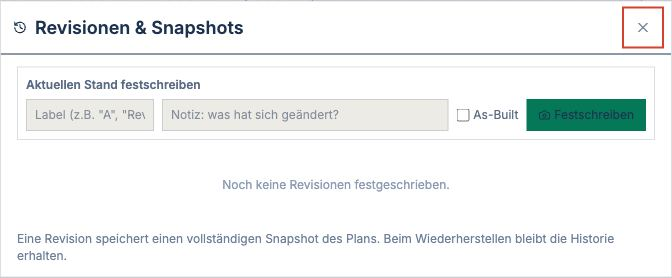

**Arbeitsweise:**
1. Geben Sie einen Namen ein (z. B. „As-Built", „Technische Abnahme").
2. Klicken Sie „Festschreiben" — ein kompletter Snapshot wird gespeichert.
3. Revisionen sind unveränderlich — Sie können Sie nicht später bearbeiten.
4. Zum Wiederherstellen: Wählen Sie eine Revision und klicken „Wiederherstellen".

**Unterschied zu Undo:** Revisionen sind absichtlich aufbewahrte Meilensteine. Undo ist ein temporärer Puffer für die aktuelle Arbeitssitzung.

**Reiter:**
- **Snapshots:** Liste aller Revisionen mit Datum, Benutzer und Beschreibung.
- **Vergleich:** Zeigt die Unterschiede zwischen zwei Revisionen (neuen Geräten, geänderten Kabeln, …).

---

### Lager / Bestand

*Werkzeuge → Lager / Bestand…* (nur mit aktiviertem Rental-Modul)

Verwaltet die Lagerhaltung — verfügbare Geräte, Verbrauchtes, Beschädigtes — wenn Ihre Firma Geräte vermietet oder lagert.

**Reiter:**
- **Bestand:** Aktuelle Menge jedes Geräts (verfügbar, vermietet, Wartung).
- **Transaktionen:** Zu- und Abgänge mit Datum und Grund.
- **Verfügbarkeit:** Zeigt, ob alle Geräte des Plans lagern (zum Reclassify zur Verfügung stellen oder nachbestellen).

Dieses Werkzeug ist optional und wird durch ein Modul aktiviert, das Sie in Einstellungen → Module einschalten müssen.

---

### ATEM Multiviewer-Layout

*Werkzeuge → ATEM Multiviewer-Layout…* (nur wenn ein ATEM-Mischer im Plan)

Konfiguriert, welche Quellen auf dem Multiviewer angezeigt werden — Position, Größe und Ausreißer (z. B. Lautstärke-Meter).

**Vorbedingung:** Der Plan muss einen Blackmagic ATEM Mischer enthalten. Das Werkzeug zeigt seinen aktuellen Multiviewer-Zustand und erlaubt, ihn zu ändern — Reiter, Layouts, Eingänge.

**Nutzen:** Zum Visualisieren, wie der Operator die Quellen sieht, und zum Export der Konfiguration in das Mischer-Skript.

---

### ATEM Audio-Routing

*Werkzeuge → ATEM Audio-Routing…* (nur wenn ein ATEM-Mischer im Plan)

Definiert Audio-Eingänge, Mixing und Ausgänge des ATEM-Mischers — Dante-In zu welchen Kanälen, Mic-Input-Verstärkung, welche Master-Ausgabe wohin.

**Struktur:**
- **Eingänge:** Dante, AES/EBU, Mikro mit Verstärkung.
- **Mixing:** Kanalmute, Fader, Pan.
- **Ausgänge:** Monitor, Multiviewer, Codec, etc.

Dieses Werkzeug exportiert ein ATEM-Konfigurationsskript, das der Operator am Mischer laden kann — wenn die Hardware diesen Weg unterstützt.

---

### ATEM Input-Labels

*Werkzeuge → ATEM Input-Labels…* (nur wenn ein ATEM-Mischer im Plan)

Beschriftet die Eingänge des ATEM-Mischers — Name, Anzeige-Optionen, Ausreißer (z. B. nur Sicherungs-Feed zeigen).

**Verfahren:**
1. Ordnen Sie jeden ATEM-Eingang einem Gerät zu (z. B. Eingang 3 ← „Kamera 1 HD").
2. Geben Sie einen angezeigten Namen ein (max. 20 Zeichen für die ATEM-Anzeige).
3. Wählen Sie Optionen (Farbe, Symbole, …).

Die Beschriftung wird beim Export in die ATEM-Konfiguration übernommen.

---

### Videohub-Routing / Labels

*Werkzeuge → Videohub-Routing / Labels…* (nur wenn ein Blackmagic Videohub im Plan)

Konfiguriert den Videohub — Eingangs- und Ausgangs-Konfiguration, Routing, Labels.

**Reiter:**
- **Routing:** Zeigt alle Crosspoints (Eingang X → Ausgang Y).
- **Labels:** Beschriftet Ein- und Ausgänge.
- **Sicherung:** Optionen für Rekonfiguration unter Last.

Dieses Werkzeug exportiert eine Konfiguration im Videohub-Export-Format (CSV/JSON), die in das Gerät hochgeladen wird — z. B. nach einer Änderung vor Ort.

---

### GreenGo-Intercom

*Werkzeuge → GreenGo-Intercom…* (nur wenn eine GreenGo-Anlage im Plan)

Zeigt die Intercom-Konfiguration der GreenGo-Headset-Anlage — Kanäle, Matrix, Prio, Routing. Ein reines Anzeige-Werkzeug — Änderungen müssen in der GreenGo-Netzwerk-Konfiguration vorgenommen werden.

**Ansicht:**
- **Kanäle:** Name, Netzwerk-Adressen, Gruppenteilnahme.
- **Kopfhörer:** Assigned Channels pro Ohr.
- **Paging & Gates:** Sprechgruppen mit Prioritäten.

Nutzen Sie dieses Werkzeug zur Dokumentation und zur Überprüfung, dass die Routing-Logik mit dem Kabelprojekt übereinstimmt.

---

### Hinweise

- Viele dieser Werkzeuge (ATEM, Videohub, GreenGo, LED-Wand) erscheinen nur im Menü, wenn die entsprechenden Geräte im aktuellen Plan vorhanden sind. Leere Menüpunkte sind absichtlich — es gibt in diesem Plan nichts zu konfigurieren.
- Alle Exporte (PDF, CSV, STL, JSON) folgen dem Projekt-Dateinamen, um Verwechslungen zu vermeiden.
- Einige Werkzeuge speichern Vorlagen (z. B. Bericht-Editor, Rack-Vorlagen) — diese bleiben über Projekte hinweg erhalten.

---

## 10. Einstellungen

Die Einstellungen-Dialog enthält 15 Reiter zur Konfiguration aller Aspekte der Anwendung. Sie öffnen den Dialog über die Befehlspalette (*Strg+K*, dann „Settings…" eingeben) oder über das Menü.

### Projekt

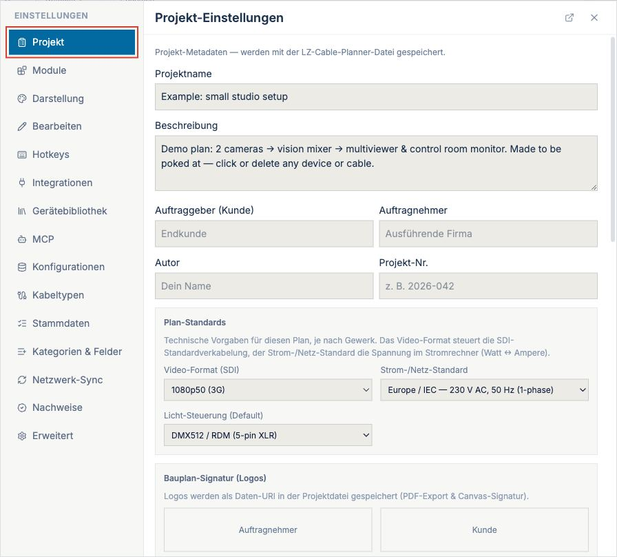

Im Projekt-Tab konfigurieren Sie projekt-spezifische Einstellungen:

#### Gerätebibliothek: Export / Import

Sichern Sie Ihre eigenen Gerätevorlagen und Gruppierungen als JSON-Datei. Beim Import werden bestehende Einträge mit denselben Namen NICHT überschrieben (Merge-by-name).

| Option | Wirkung |
|--------|---------|
| **Gerätebibliothek exportieren** | Speichert alle Gerätevorlagen, Gruppen und Rack-Presets als JSON-Datei |
| **Gerätebibliothek importieren…** | Lädt eine zuvor exportierte Datei. Nur neue Einträge werden hinzugefügt |

#### Kabelnummerierung

Automatische, kollisionsfreie Kabel-IDs nach einem festen Schema. Die Nummern werden auf dem Canvas, in der Patch-Liste und auf Etiketten angezeigt.

| Option | Wirkung |
|--------|---------|
| **Automatische Nummerierung für neue Kabel aktivieren** | Weist neuen Kabeln automatisch die nächste Nummer zu |
| **Präfix** | Zeichenfolge vor der Nummer (z.B. „C") |
| **Trennzeichen** | Zeichen zwischen Präfix und Nummer (z.B. „-") |
| **Ziffern** | Anzahl der Stellen für die Nummer (1-6) |
| **Startnummer** | Erste Nummer im Schema |
| **Separater Zähler pro Ebene (V/A/N/P…)** | Nummern werden pro Signaltyp gezählt statt durchgehend |
| **Alle Kabel neu nummerieren** | Wendet das aktuelle Schema auf alle vorhandenen Kabel an |

Beispiel: Mit Präfix „C", Trennzeichen „-" und 3 Ziffern entsteht „C-001", „C-002" usw.

#### Kabellängen schätzen

Schätzt Kabellängen aus der Canvas-Entfernung zwischen Geräten (Luftlinie × Maßstab + Sicherheit). Überschreibt vorhandene Längen.

| Option | Wirkung |
|--------|---------|
| **Meter pro 100 Pixel** | Skalierungsfaktor (z.B. 2 = 2 m pro 100 Bildschirmpixel) |
| **Slack-Faktor** | Zusätzliche Länge für Sicherheit (1,2 = 20% Zuschlag) |
| **Alle Kabellängen schätzen** | Berechnet Längen für alle vorhandenen Kabel |

### Darstellung

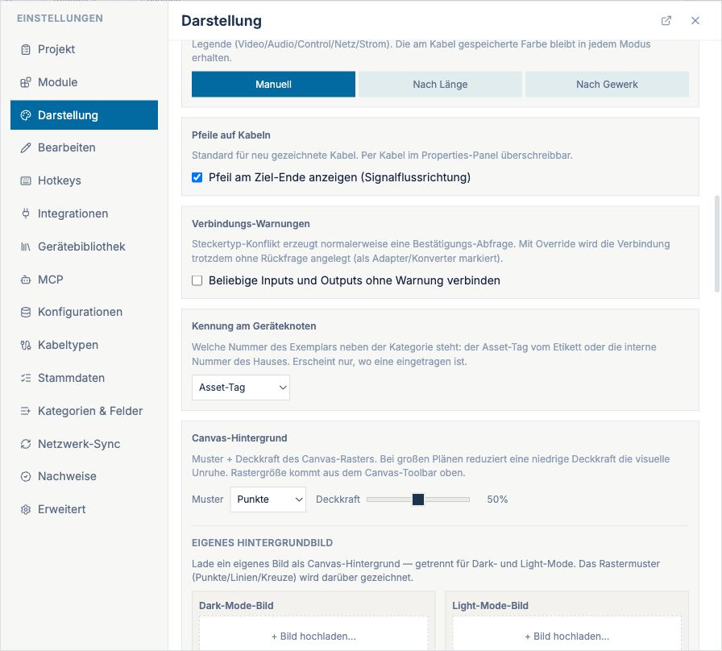

Konfigurieren Sie das visuelle Erscheinungsbild:

#### Sprache und Theme

| Option | Wirkung |
|--------|---------|
| **Sprache** | Wähle zwischen Deutsch, Englisch und anderen unterstützten Sprachen |
| **Canvas-Theme** | Hell oder Dunkel für die Arbeitsfläche |

#### Anschlussfarben

| Option | Wirkung |
|--------|---------|
| **Anschlüsse nach Typ färben** | Färbt SDI, Audio, Power usw. unterschiedlich |
| **Farben für Anschlusstypen** | Wählen Sie individuelle Farben für jeden Typ |
| **Farben für Gerätkategorien** | Wählen Sie Farben für Kamera, Mischer, Monitor usw. |

#### Kabeldarstellung

| Option | Wirkung |
|--------|---------|
| **Kabelfarben** | Manual, nach Länge oder nach Layer (V/A/N/P) |
| **Pfeile anzeigen** | Kleine Pfeile zeigen die Signalrichtung |
| **Kabelbrücken** | Hügel an Kreuzungspunkten für visuelle Klarheit |
| **Port-Label-Größe** | Größe der Anschlussbezeichnungen |

#### Custom Palette

Farben für Canvas-Hintergrund und Raster-Linien (überschreibt Theme-Defaults):

| Option | Wirkung |
|--------|---------|
| **Custom Palette aktivieren** | Eigene Farben verwenden |
| **Hintergrund** | Canvas-Hintergrundfarbe |
| **Gitter-Strich** | Farbe der Raster-Linien |

### Bearbeiten

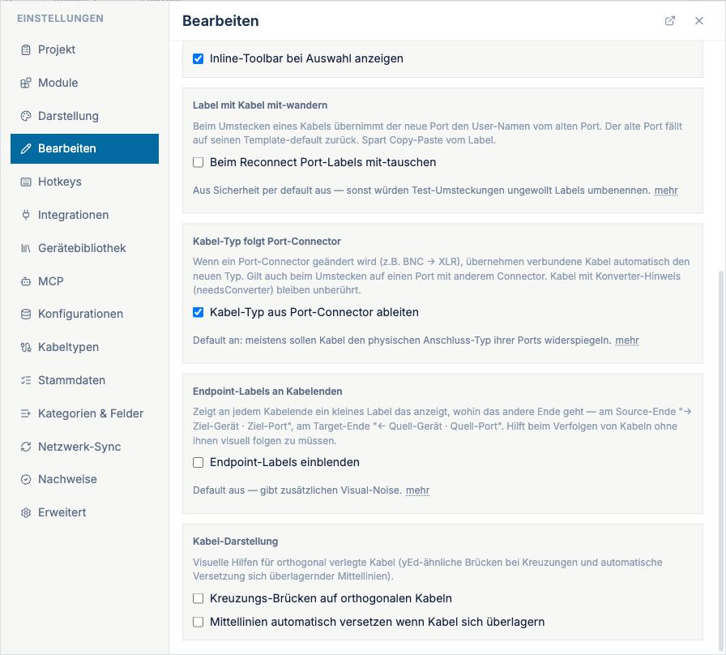

Standard-Verhaltensweisen beim Bearbeiten von Kabeln und Geräten:

#### Standard-Kabelverlauf

| Option | Wirkung |
|--------|---------|
| **Orthogonal** | Rechtwinklige, gitterartige Kabel |
| **Straight** | Gerade Linien |
| **Curved** | Sanfte Kurven |

#### Endpoint-Labels

Kleine Labels an jedem Kabelende, die zeigen, wohin die andere Seite führt.

| Option | Wirkung |
|--------|---------|
| **Endpoint-Labels anzeigen** | Am Quellende „→ Zielgeräte · Zielport", am Zielende „← Quellgeräte · Quellport" |

#### Kabeltyp folgt Anschlusstyp

| Option | Wirkung |
|--------|---------|
| **Kabeltyp vom Anschlusstyp ableiten** | Wenn ein Anschlusstyp geändert wird (z.B. BNC → XLR), passen verbundene Kabel automatisch an |

#### Raster

| Option | Wirkung |
|--------|---------|
| **Raster-Spacing** | Größe des Snap-Rasters in Pixeln |
| **Zum Raster ausrichten** | Geräte rasten beim Verschieben ein |

#### Verbindungs-Warnungen

| Option | Wirkung |
|--------|---------|
| **Warnungen bei ungültigen Verbindungen anzeigen** | Zeigt Warnungen, wenn inkompatible Geräte verbunden werden |

### Kabeltypen

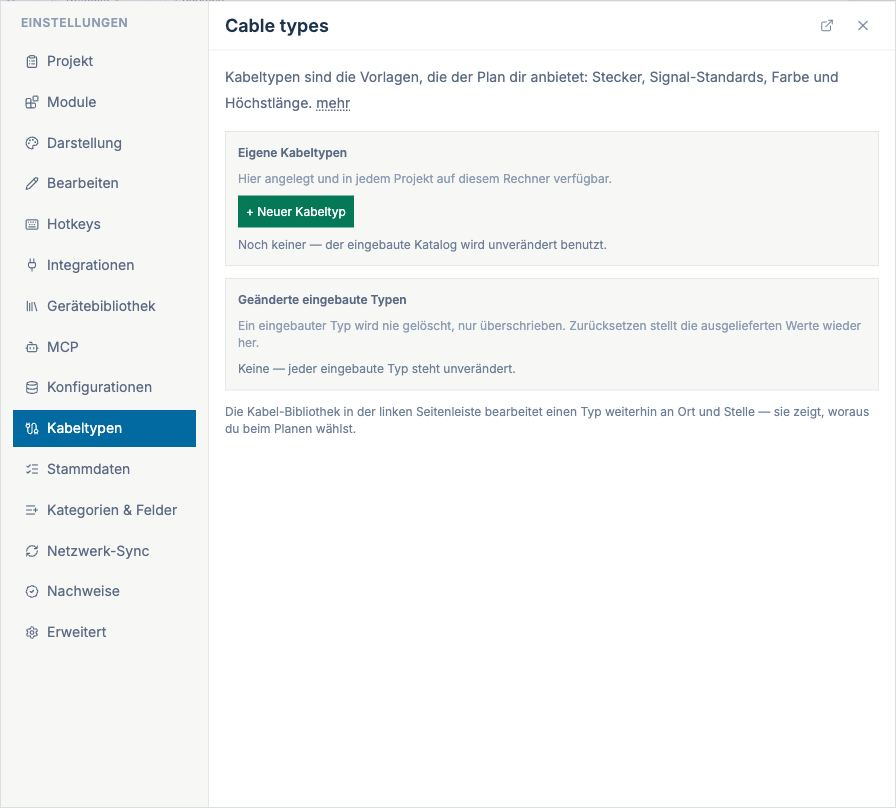

Definieren und verwalten Sie Kabeltypen:

| Option | Wirkung |
|--------|---------|
| **Neuer Kabeltyp** | Erstellt einen neuen Kabeltyp |
| **Kabeltyp bearbeiten** | Ändert Name, Farbe oder Standard-Länge |
| **Kabeltyp löschen** | Entfernt einen nicht verwendeten Kabeltyp |

Jeder Kabeltyp hat:
- Ein eindeutiger Name (z.B. "SDI-Kabel")
- Eine Farbe für die Canvas-Anzeige
- Optional: Standard-Länge und Beschreibung

### Stammdaten

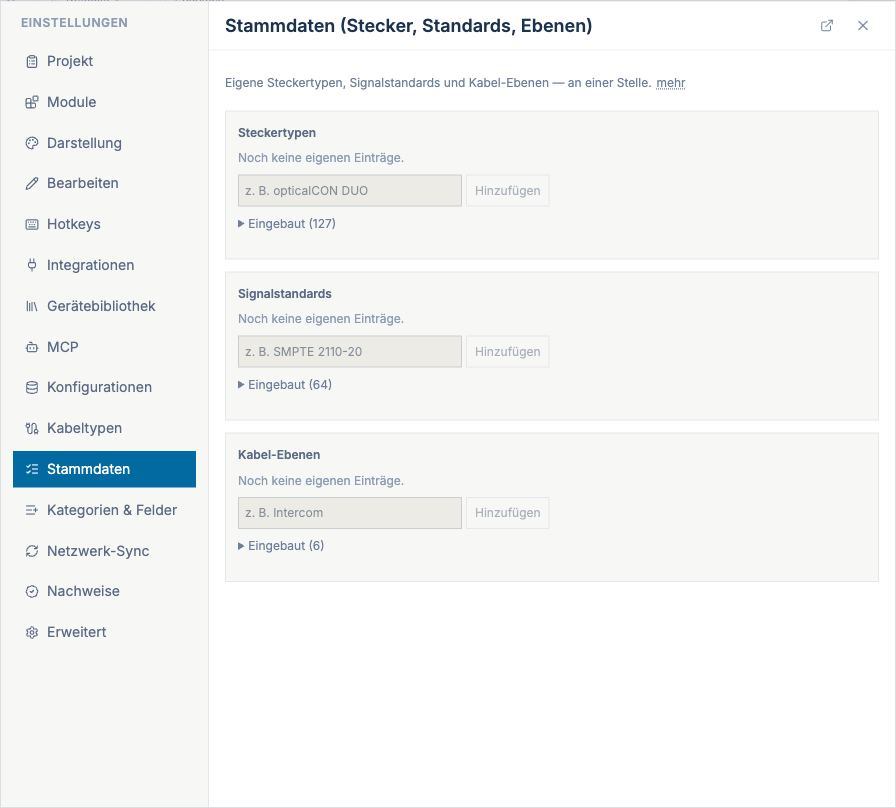

Verwaltung von Steckertypen, Standards und Ebenen:

#### Steckertypen

| Option | Wirkung |
|--------|---------|
| **Neuer Steckertyp** | Erstellt einen neuen Steckertyp (z.B. 3G-SDI, MADI) |
| **Steckertyp bearbeiten** | Ändert Name oder Display-Name |

#### Standards

| Option | Wirkung |
|--------|---------|
| **Video-Standard** | PAL, NTSC, SDI, HDMI usw. |
| **Power-Standard** | IEC, USA, EU etc. |

#### Ebenen

Signaltypen für die Farbkodierung:

| Option | Wirkung |
|--------|---------|
| **Video (V)** | Videoströme |
| **Audio (A)** | Audioströme |
| **Netzwerk (N)** | Datenverbindungen |
| **Power (P)** | Stromversorgung |

### Konfigurationen

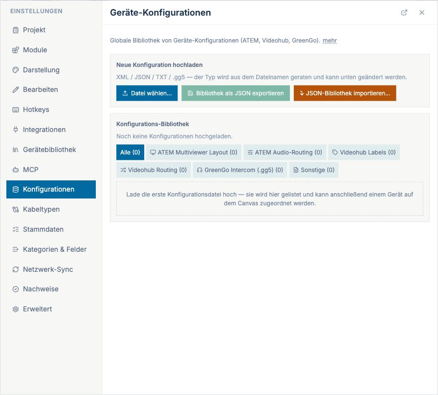

Gespeicherte Geräte-Konfigurationen (z.B. verschiedene Firmware-Versionen oder Einstellungen):

| Option | Wirkung |
|--------|---------|
| **Neue Konfiguration** | Erstellt eine benannte Konfiguration |
| **Konfiguration anwenden** | Wendet eine gespeicherte Konfiguration auf ein Gerät an |
| **Konfiguration löschen** | Entfernt eine nicht verwendete Konfiguration |

### Gerätebibliothek

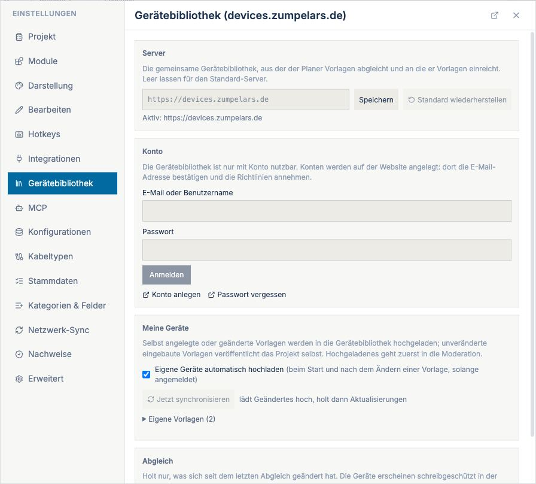

Verbindung zur Geräte-Online-Datenbank (devices.zumpelars.de):

| Option | Wirkung |
|--------|---------|
| **Anmelden…** | Registrieren oder anmelden mit Benutzerkonto |
| **Geräte hochladen** | Sendet Ihre eigenen Gerätevorlagen an die Datenbank |
| **Hochgeladene Geräte** | Zeigt, welche Geräte Sie bereits geteilt haben |

**Hinweis:** Diese Einstellungen sind nur im Desktop-Client verfügbar. Der Browser-Modus unterstützt keine Anmeldung.

### Integrationen

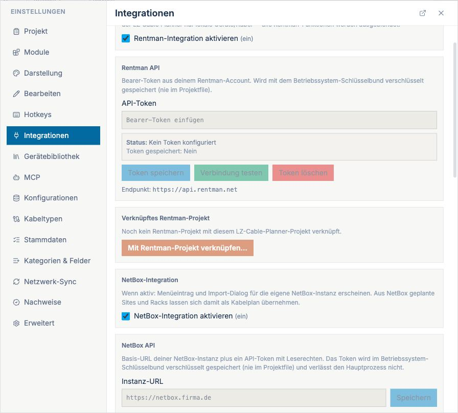

Externe Dienste und KI-Anbieter:

#### Ausfüll-Quelle

Bestimmt, woher der „Ausfüllen"-Knopf Gerätinformationen bezieht:

| Option | Wirkung |
|--------|---------|
| **Web-Suche** | Sucht auf Wikipedia und DuckDuckGo (kein API-Key nötig) |
| **KI-Modell** | Verwendet ein KI-Modell (erfordert API-Key) |

#### KI-Anbieter

| Option | Wirkung |
|--------|---------|
| **Anbieter** | Wählen Sie zwischen Claude, OpenAI, Google Gemini |
| **API-Key** | Geben Sie den API-Schlüssel des Anbieters ein |
| **Schlüssel anzeigen / verbergen** | Toggles die Sichtbarkeit des Schlüssels |

#### Rentman-Integration

| Option | Wirkung |
|--------|---------|
| **Rentman-API-Token** | Token für die Rentman-Schnittstelle |
| **Projekt verlinken** | Verbindet das aktuelle Projekt mit einem Rentman-Projekt |

#### GreenGo-Presets

| Option | Wirkung |
|--------|---------|
| **Preset speichern** | Speichert die aktuelle Planung als GreenGo-Konfiguration |
| **Preset laden** | Lädt eine zuvor gespeicherte GreenGo-Konfiguration |
| **Preset löschen** | Entfernt ein gespeichertes Preset |

### MCP

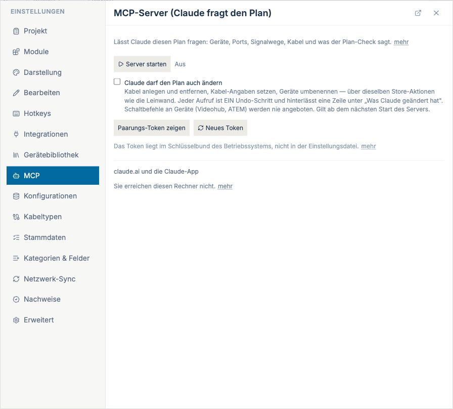

MCP-Server-Konfiguration (Claude fragt den Plan):

| Option | Wirkung |
|--------|---------|
| **MCP-Server aktivieren** | Schaltet die Verbindung zu MCP-Servern ein |
| **Server-Adresse** | URL oder Pfad zum MCP-Server |
| **Authentifizierung** | Benutzername und Passwort (falls nötig) |

**Hinweis:** MCP-Server im Browser-Modus nicht verfügbar.

### Module

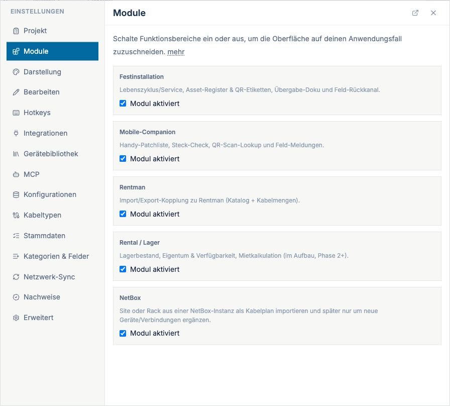

Installierte und verfügbare Module:

| Modul | Status | Wirkung |
|-------|--------|---------|
| **ATEM-Steuerung** | Enabled/Disabled | Steuert Blackmagic ATEM-Mischer |
| **Videohub** | Enabled/Disabled | Verbindung zu Blackmagic Videohub |
| **Rentman** | Enabled/Disabled | Rentman-Integration |
| **Mobile Share** | Enabled/Disabled | Smartphone-Ansicht freigeben |

Jedes Modul kann aktiviert oder deaktiviert werden.

### Nachweise

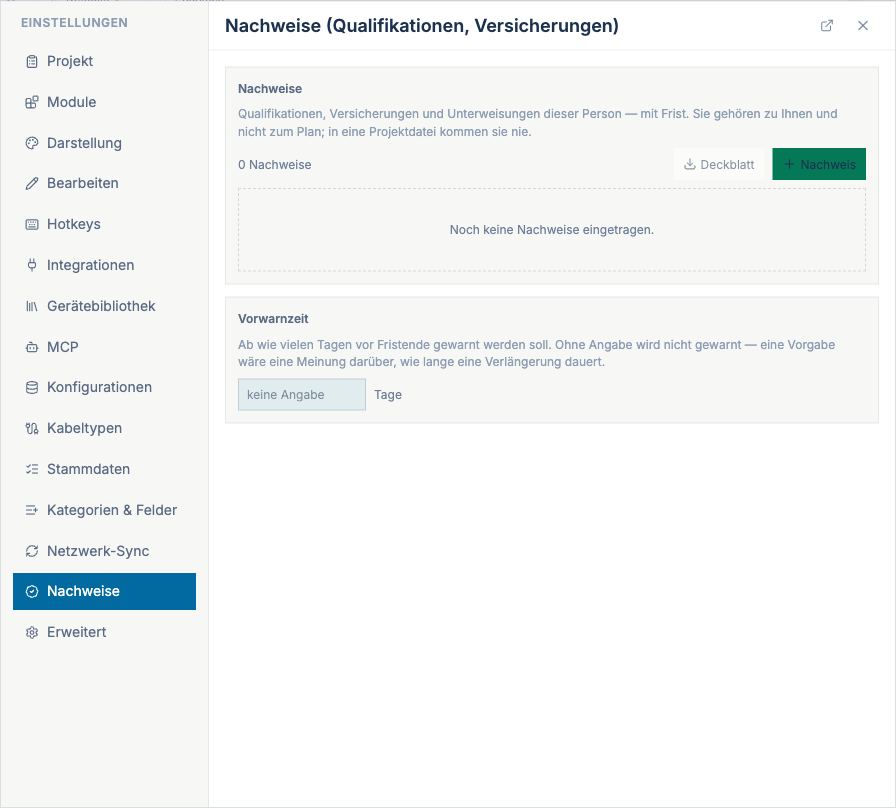

Verwaltung von Qualifikationen und Versicherungen:

| Option | Wirkung |
|--------|---------|
| **Neuer Nachweis** | Erstellt einen neuen Qualifikations-/Versicherungs-Nachweis |
| **Nachweis bearbeiten** | Ändert Name, Gültigkeitsdatum oder Beschreibung |
| **Nachweis löschen** | Entfernt einen Nachweis |

Nachweise können an Personen oder Geräte angehängt werden.

### Schema-Builder

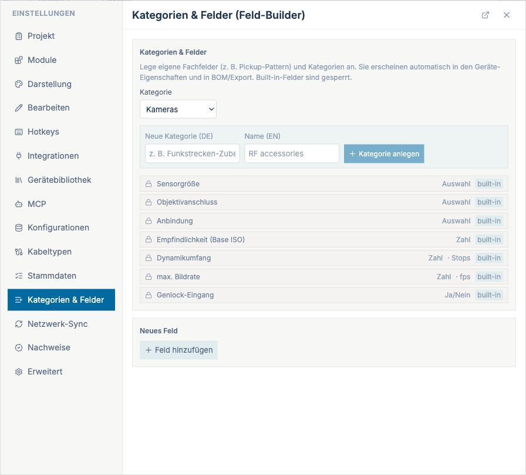

Definieren Sie benutzerdefinierte Kategorien und Felder für Geräte:

#### Kategorien

| Option | Wirkung |
|--------|---------|
| **Neue Kategorie** | Erstellt eine neue Geräte-Kategorie (z.B. „Spezialkameras") |
| **Kategorie umbenennen** | Ändert den Namen |
| **Kategorie löschen** | Entfernt eine nicht verwendete Kategorie |

#### Felder

| Option | Wirkung |
|--------|---------|
| **Neues Feld** | Erstellt ein neues Attribut (Text, Zahl, Dropdown usw.) |
| **Feld bearbeiten** | Ändert Typ, Validierung oder Standard-Wert |
| **Feld löschen** | Entfernt ein Feld aus allen Geräten |

### Sync

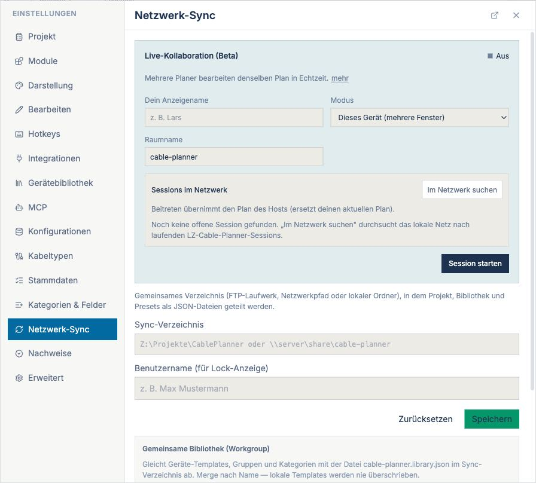

Netzwerk-Synchronisation für Zusammenarbeit:

| Option | Wirkung |
|--------|---------|
| **Sync aktivieren** | Erlaubt anderen, Änderungen live zu sehen |
| **Relay-Server** | Adresse des Signaling-Servers |
| **Raum-Code** | Eindeutiger Code für diesen Plan (für Kollegen freigeben) |

Andere Nutzer können sich mit Ihrem Plan verbinden, wenn sie den Raum-Code haben.

### Tastenkürzel

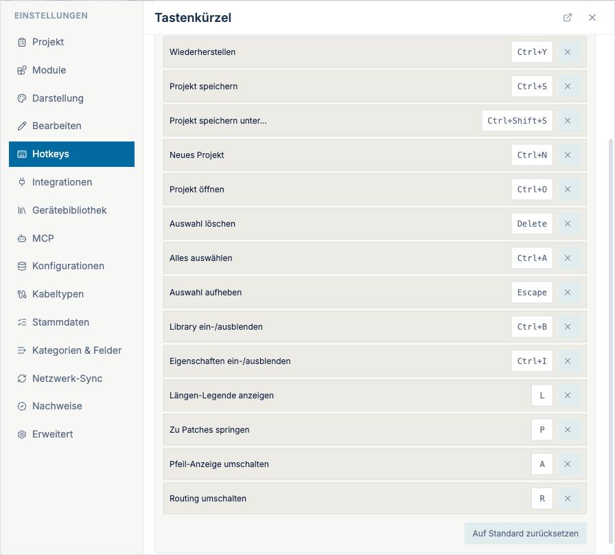

Anpassen der Tastatur-Shortcuts:

| Aktion | Standard-Shortcut | Wirkung |
|--------|-------------------|---------|
| **Neues Projekt** | Strg+N | Erstellt ein leeres Projekt |
| **Projekt öffnen** | Strg+O | Öffnet eine Datei |
| **Projekt speichern** | Strg+S | Speichert die Änderungen |
| **Befehlspalette** | Strg+K | Öffnet die Suche und Navigation |
| **Einstellungen** | (Strg+,) | Öffnet diesen Dialog |

Alle Shortcuts können angepasst werden. Klicken Sie auf eine Aktion, um den neuen Shortcut zu definieren.

### Erweitert

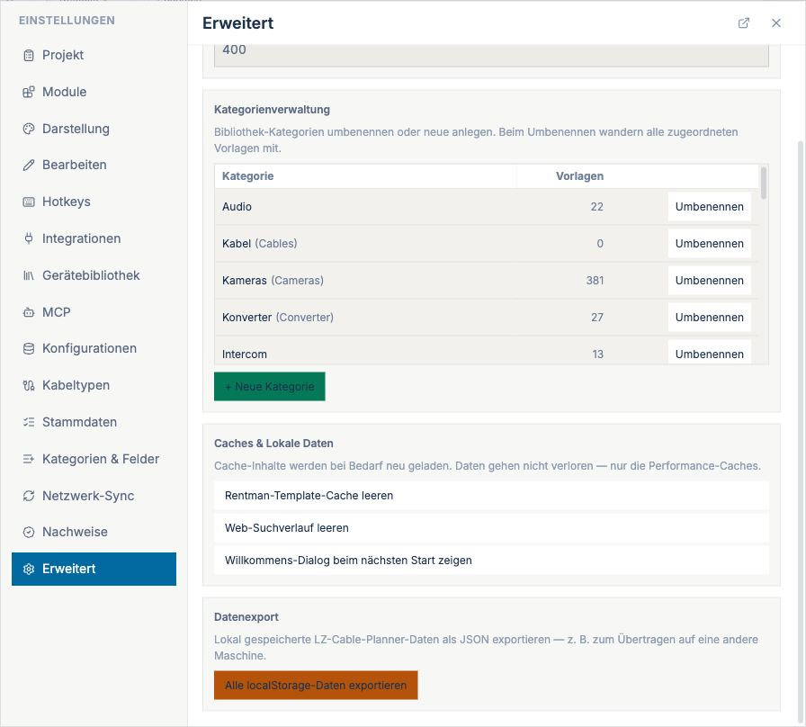

Fortgeschrittene Optionen für Entwickler und Poweruser:

| Option | Wirkung |
|--------|---------|
| **Datenexport** | Exportiert projekt- und Anwendungsdaten als ZIP-Datei |
| **Datenbank zurücksetzen** | Löscht alle lokalen Daten (nicht rückgängig zu machen) |
| **Logging aktivieren** | Schreibt detaillierte Logs für Debugging |
| **Log-Datei anzeigen** | Öffnet die aktuelle Log-Datei |
| **Cache leeren** | Löscht den lokalen Bildschirm-Cache |
| **DevTools öffnen** | Öffnet die Browser-Entwicklerwerkzeuge |

Verwenden Sie diese Optionen nur, wenn Sie wissen, was Sie tun. Sie können Ihr Projekt beschädigen.

---

## 11. Claude (MCP)

Claude beantwortet Fragen zum offenen Plan — Geräte, Anschlüsse, Signalwege,
Kabel und Plan-Check.

**Auf diesem Rechner**

1. *Einstellungen → MCP* → einschalten. Der Server hört nur auf `127.0.0.1` und
   nutzt ein Kopplungs-Token aus dem Schlüsselbund.
2. Den dort angezeigten Befehl kopieren, zum Beispiel:

   ```
   claude mcp add --transport http cable-planner http://127.0.0.1:<port>/mcp --header "Authorization: Bearer <token>"
   ```

3. Standard ist Lesen. **Schreiben** ist ein zweiter Schalter: Claude kann dann
   Kabel verbinden und entfernen, Kabelangaben setzen und Geräte umbenennen.
   Jeder Aufruf ist ein Rückgängig-Schritt und steht unter **Was Claude
   geändert hat**.

**Von claude.ai, vom Telefon oder einem anderen Rechner**

1. Projekt in die Cloud legen (*Datei → Cloud & Lese-Link…*).
2. In claude.ai: *Settings → Connectors → Add custom connector* mit
   `https://devices.zumpelars.de/mcp`, dann mit dem Konto der
   Gerätebibliothek anmelden.
3. Nur lesend, nur über die eigenen Cloud-Projekte. Trennen unter *Konto →
   Sicherheit → Verbundene Apps* auf devices.zumpelars.de.

Schaltbefehle für ATEM oder Videohub werden nie angeboten.

---

## 12. Web-Ausgabe und Tablet

- **https://larszu.github.io/cable-planner/** öffnen und zum Home-Bildschirm
  hinzufügen; sie läuft dann im Vollbild mit eigenem Symbol.
- Touch: Spreizen zoomt den Plan, zwei Finger verschieben, **lange drücken**
  öffnet das Kontextmenü.
- Im Browser nicht verfügbar (kein Socket, kein offener Port, kein
  Schlüsselbund): ATEM, Videohub, NetBox, LAN-Abgleich, Telefonzugang,
  MCP-Server, Show-Control, Schalten, Tally-Pi, Rentman-Export,
  Update-Prüfung. *Einstellungen → Integrationen* listet sie mit Grund.

---

## 13. Daten, Sicherheit und Fehlerbehebung

- **Projekte**: lokale JSON-Dateien, atomar geschrieben mit Sicherungskopie.
- **App-Daten** (Bibliothek, letzte Projekte, Einstellungen) liegen im
  App-Datenordner `Cable Planner`.
- **Geheimnisse** (API-Schlüssel, Stream-Zugangsdaten, Anmeldung der
  Gerätebibliothek) liegen im Schlüsselbund des Betriebssystems. Die
  Web-Ausgabe hält die Anmeldung der Gerätebibliothek im Browserspeicher.
- **„Keine Sicherungskopie"** in der Statusleiste: Projekt in eine Datei
  speichern.
- **Keine Standbild-Vorschau**: ffmpeg installieren und prüfen, ob das Gerät im
  lokalen Netz ist.
- **Gerätebibliothek nicht erreichbar**: die App arbeitet mit den Geräten des
  letzten Abgleichs weiter.

Fragen und Fehlermeldungen:
[GitHub Issues](https://github.com/larszu/cable-planner/issues).


© 2026 Lars Zumpe Medienproduktion · kostenlos nutzbar, proprietär lizenziert
