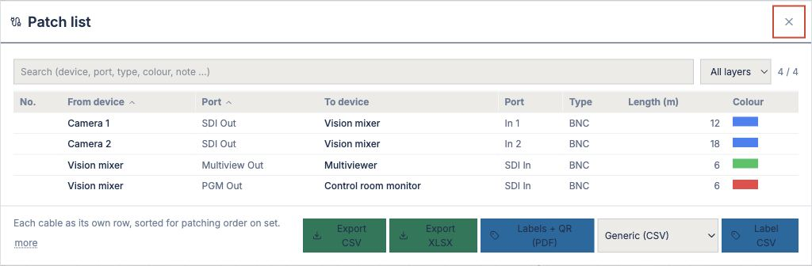
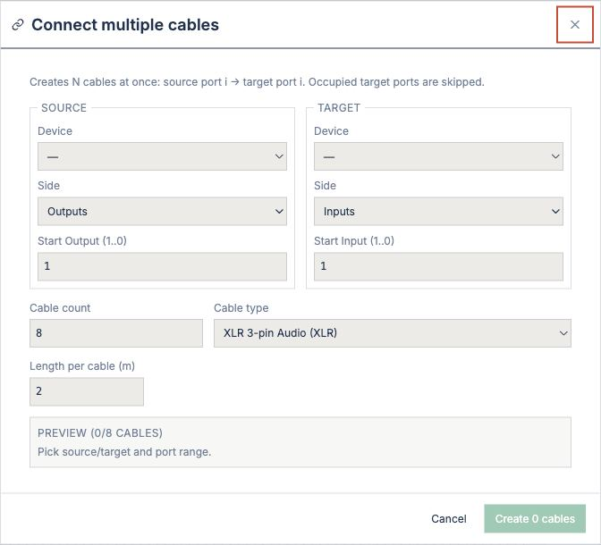
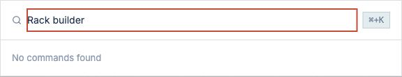
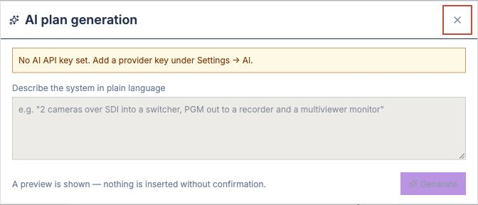
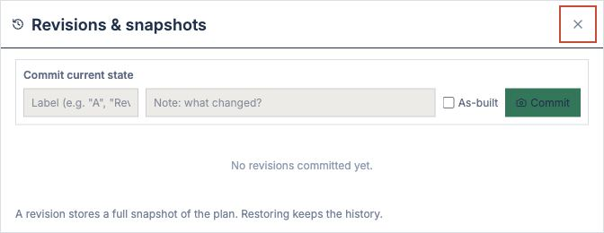

## Tools

The *Tools* menu contains specialised tasks for planning and building systems: connecting cables, building racks, configuring LED walls, exporting schematics and controlling devices such as ATEM switchers and Videohub.

### Patch list

*Tools → Patch list…*

Shows all connections of the plan as a table — one row per cable, sorted for the patching order on site.

**Columns:** No., From device, Port, To device, Port, Type, Length (m), Colour.

**Layer filter:** The dropdown at the top selects which layer is shown (e.g. video only). The field shows how many cables are visible in total.

**Search field:** Filters by device, port, type or colour — the search runs as you type.

**Export options:**
- **Export CSV:** Comma-separated file for spreadsheets.
- **Export XLSX:** Excel format.
- **Labels + QR (PDF):** Print template for labelling. If you pick a label type (Generic, Brother P-touch, Dymo), the matching export file is offered as well.

### Patching order
Cables are sorted by their position on the set — sources first (top), then targets (bottom). This lets you print the patch list at the desk and work through it line by line.

---

### LED wall

*Tools → LED wall…*

Defines panels, resolution, weight and power of an LED wall and generates the pixel map for the media server.

**Fields:**
- **Panel type:** Manufacturer and model (e.g. Barco E22 Full HD, Unilumin LED panel).
- **Resolution:** Width × height in pixels.
- **Panel size:** Physical dimensions in mm (taken from the datasheet).
- **Number of panels:** Horizontal × vertical (calculates total weight and power).
- **Brightness:** Nits (relevant for planning the cooling).
- **Viewing angle:** Horizontal and vertical, in degrees.

**Pixel map:** After saving you can export the pixel map as CSV or JSON — for the media server configuration (vPro, Notch, …).

---

### Faceplate editor

*Tools → Faceplate editor…*

Places connectors on a faceplate (wall panel, stage box) on a millimetre grid and prints 1:1 strips to attach or to use for milling.

**Workflow:**
1. Choose the equipment (e.g. a wall plate).
2. Place connectors by drag & drop or by entering (X, Y) coordinates.
3. Define labels, zones and colour codes.
4. Print the strip at full size — to stick on, as a milling template or for checking on site.

**Tabs/functions:**
- **Layout:** Overview and placement of the connectors.
- **Labelling:** Labels and legend.
- **Print:** 1:1 print preview, paper size, margins.

---

### Report editor

*Tools → Report editor…*

Adjusts every exportable list (cable BOM, equipment, inventory): show or hide columns, grouping, sorting, filters, and save as a template for later exports.

**Tabs:**
- **Columns:** Turn columns on or off — the list is exported or printed with the selected columns.
- **Group:** Group by a field (e.g. by device type).
- **Sort:** Primary and secondary sort order.
- **Filter:** Show only rows that meet a condition (e.g. only cables > 50 m).

After saving, the template is kept — the next cable export uses these settings.

---

### Conductors and colour standards

*Tools → Conductors and colour standards…*

Shows pin assignments and colour codes for all supported connectors (XLR, HDMI, DB25, DMX, …) — for reference, for soldering cables and for documentation.

**Structure:**
- **Select connector:** Dropdown with all types (RCA, XLR, BNC, jack, Speakon, …).
- **Pinout:** Graphic or table with contact number, name, colour and function.
- **Standard:** For information (e.g. IEC 60268-12 for XLR audio).

Use this tool when soldering cables or to avoid mix-ups during maintenance.

---

### Received show-control messages

*Tools → Received show-control messages…*

Logs all OSC, MIDI and other show-control messages the planner app has received (from a cue system, a camera remote, etc.). It is a read-out, not a system configuration — it shows what arrived but does not store it.

**Columns:** Time, command, source, parameters, status.

**Use:** For testing integrations or for following remote-control actions while recording a rehearsal.

---

### Connect multiple cables

*Tools → Connect multiple cables…*

Creates N cables at once — source port i → target port i. Occupied target ports are skipped.

**Fields:**
- **SOURCE:** Device and side (Outputs/Inputs) + start port number.
- **TARGET:** Device and side (Inputs/Outputs) + start port number.
- **Cable count:** How many connections are created.
- **Cable type:** From a dropdown (XLR Audio, SDI 3G, HDMI, Dante, DMX, Power, …).
- **Length per cable (m):** Applied to all cables (can be changed individually later).

**Preview:** Shows which cables will be created before you confirm. Occupied targets are skipped — "Create 0 cables" means all target ports are already in use.

---

### Create new rack

*Tools → Create new rack…*

Starts a wizard for building a new rack or shelving unit. You define:

1. **Rack type:** 19" standard, floor-plan field or free-standing (e.g. standing shelf).
2. **Size:** Height in RU, depth in mm.
3. **Material & colour:** Housing, side panel.
4. **Position in the plan:** Room and coordinates.

The new rack is inserted into the plan and can be filled with equipment right away.

---

### Rack builder

*Tools → Rack builder…*

Populates and edits racks — places devices in the housing, defines cable routes and exports STL/3D models for visualisation or milling.

**Workflow:**
1. Select a rack from the plan (or create one via "Create new rack").
2. Drag devices from the equipment library into free RU positions.
3. Connect rear sides (A/B) and define cable routes.
4. Save — the 3D model is updated.

**Tabs:**
- **Overview:** Rack with installed devices (front and rear selectable).
- **3D view:** Perspective model for visualising cable routes and space requirements.
- **Cable routes:** List of connections in the rack with lengths and routes.
- **Export:** STL for 3D printing, PDF for technical drawings.

---

### Generate AI plan

*Tools → Generate AI plan…*

Generates a draft cable project from a text description — e.g. "Live concert, 3 cameras, ATEM 2 M/E, multiviewer, audio on Dante". The AI creates devices, connections and floor plan based on standard templates.

**Requirement:** An API key for an AI provider (OpenAI, Anthropic, …) stored under Settings → AI.

**Workflow:**
1. Describe the system in plain text.
2. Click "Generate".
3. A preview is shown.
4. Confirm to insert it into the plan.

The result is a first draft — not a complete plan. You add devices, change connections and check against reality as usual.

---

### Revisions & snapshots

*Tools → Revisions & snapshots…*

Saves snapshots of the plan — to document as-built states, to compare with earlier versions or for archiving.

**Workflow:**
1. Enter a name (e.g. "As-built", "Technical acceptance").
2. Click "Commit" — a complete snapshot is saved.
3. Revisions cannot be changed — you cannot edit them later.
4. To restore: select a revision and click "Restore".

**Difference from undo:** Revisions are milestones kept on purpose. Undo is a temporary buffer for the current working session.

**Tabs:**
- **Snapshots:** List of all revisions with date, user and description.
- **Compare:** Shows the differences between two revisions (new devices, changed cables, …).

---

### Inventory / stock

*Tools → Inventory / stock…* (only with the rental module enabled)

Manages stock — available devices, consumables, damaged items — if your company rents out or stores equipment.

**Tabs:**
- **Stock:** Current quantity of each device (available, rented out, maintenance).
- **Transactions:** Incoming and outgoing items with date and reason.
- **Availability:** Shows whether all devices of the plan are in stock (to make them available or to reorder).

This tool is optional and is enabled by a module that you switch on under Settings → Modules.

---

### ATEM multiviewer layout

*Tools → ATEM multiviewer layout…* (only if an ATEM switcher is in the plan)

Configures which sources are shown on the multiviewer — position, size and extras (e.g. audio meters).

**Prerequisite:** The plan must contain a Blackmagic ATEM switcher. The tool shows its current multiviewer state and lets you change it — tabs, layouts, inputs.

**Use:** To see how the operator sees the sources, and to export the configuration to the switcher script.

---

### ATEM audio routing

*Tools → ATEM audio routing…* (only if an ATEM switcher is in the plan)

Defines audio inputs, mixing and outputs of the ATEM switcher — which Dante input goes to which channels, mic input gain, which master output goes where.

**Structure:**
- **Inputs:** Dante, AES/EBU, microphone with gain.
- **Mixing:** Channel mute, fader, pan.
- **Outputs:** Monitor, multiviewer, codec, etc.

This tool exports an ATEM configuration script that the operator can load on the switcher — if the hardware supports this.

---

### ATEM input labels

*Tools → ATEM input labels…* (only if an ATEM switcher is in the plan)

Labels the inputs of the ATEM switcher — name, display options, extras (e.g. show only the backup feed).

**Procedure:**
1. Assign each ATEM input to a device (e.g. input 3 ← "Camera 1 HD").
2. Enter a display name (max. 20 characters for the ATEM display).
3. Choose options (colour, symbols, …).

The labels are included in the ATEM configuration on export.

---

### Videohub routing / labels

*Tools → Videohub routing / labels…* (only if a Blackmagic Videohub is in the plan)

Configures the Videohub — input and output configuration, routing, labels.

**Tabs:**
- **Routing:** Shows all crosspoints (input X → output Y).
- **Labels:** Labels inputs and outputs.
- **Backup:** Options for reconfiguration under load.

This tool exports a configuration in the Videohub export format (CSV/JSON) that is uploaded to the device — e.g. after a change on site.

---

### GreenGo intercom

*Tools → GreenGo intercom…* (only if a GreenGo system is in the plan)

Shows the intercom configuration of the GreenGo headset system — channels, matrix, priority, routing. It is a display-only tool — changes have to be made in the GreenGo network configuration.

**View:**
- **Channels:** Name, network addresses, group membership.
- **Headsets:** Assigned channels per ear.
- **Paging & gates:** Talk groups with priorities.

Use this tool for documentation and to check that the routing logic matches the cable project.

---

### Notes

- Many of these tools (ATEM, Videohub, GreenGo, LED wall) only appear in the menu if the corresponding devices are in the current plan. Empty menu entries are intentional — there is nothing to configure in this plan.
- All exports (PDF, CSV, STL, JSON) use the project file name to avoid mix-ups.
- Some tools save templates (e.g. report editor, rack templates) — these are kept across projects.
