## Tools: Plan

Tool dialogs for capturing, analyzing, and planning a facility — from site survey through function groups to delivery.

### Calculate

Specialized calculators for capacity and resource planning.

#### Recording storage calculator

*Tools → Calculate recording storage…*

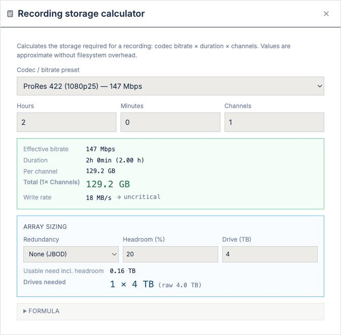

Calculates storage requirements for video recording based on codec, resolution, framerate, and duration.

- **Inputs**: Video format (HD/4K/8K), codec (DCI/H.265/ProRes/etc.), framerate (25/50/60 fps), recording duration.
- **Output**: Storage size in GB/TB.

#### Projection & display

*Tools → Projection & display…*

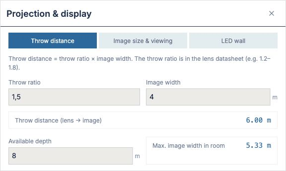

Calculates projection parameters for displays and projectors.

- **Inputs**: Display size (diagonal), resolution, distance to audience.
- **Output**: Optimal projection distance and lens parameters.

### Check

Analysis tools for validation and consistency checking of the plan.

#### Analyses

*Tools → Analyses (weight/network/redundancy)…*

A comprehensive analysis tool with 14 tabs for checking all aspects of the facility.

##### Tab: Weight & Heat

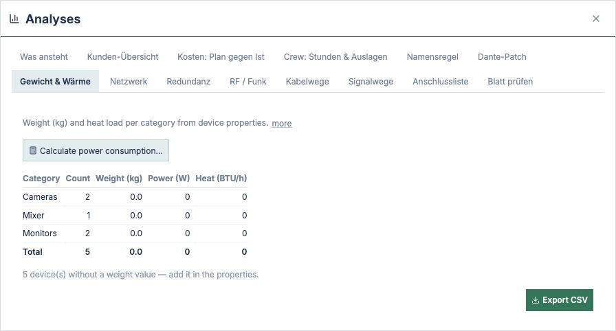

Total weight and heat load (BTU/h) per equipment group and overall.

- **Table**: Category, count, weight (kg), power (W), heat (BTU/h), optional value (€).
- **Missing**: Display of equipment without weight values.
- **Download**: CSV export for calculations.
- **Link**: Direct access to power consumption calculator (see below).

##### Tab: Network

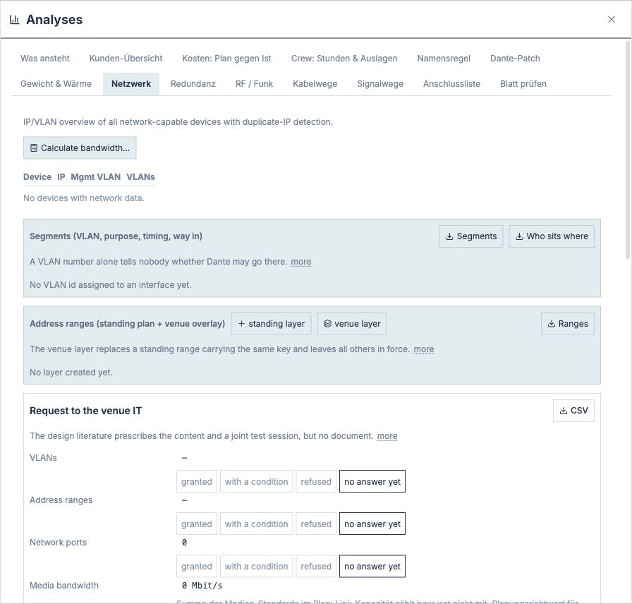

Check IP addresses, VLANs, switch ports, and network topology.

- **Address plan**: IP conflicts and missing assignments.
- **VLAN counting**: Which VLANs and how many ports per VLAN.
- **Switch port allocation**: Which device ports at which switch ports.
- **Multicast**: Multicast addresses and groups.

##### Tab: Redundancy

Checks where only one signal or power circuit exists.

- **Connections**: How many independent power or upstream connections per device?
- **Findings**: Red flags for devices with single connections only.

##### Tab: RF / Wireless

Check wireless frequencies (microphones, headphones, cameras) and spectrum conflicts.

- **Frequency table**: All transmitters and receivers with frequency (MHz), bandwidth, power.
- **Conflicts**: Channels too close together (< 0.4 MHz spacing).
- **Spectrum scan**: Optional upload of spectrum measurement data for validation.

##### Tab: Cable Runs

Checks physical routing paths and cable lengths.

- **Findings**: Cables too long, invalid routing complexity.
- **Route details**: Per cable length, conductor count, diameter.

##### Tab: Signal Chain

Traces a signal through all layers — from source to output.

- **Entry**: Choose source and destination.
- **Chain**: Shows path through mixers, routers, players, etc.
- **Conflicts**: Broken or ambiguous paths.

##### Tab: Patch List

Tabular overview of all cable connections.

- **Columns**: Source device, source port → destination device, destination port, cable type, length.
- **Filter**: By device, cable type, or status (planned/installed).
- **Download**: CSV for patch list printouts.

##### Tab: Check Sheet

Verifies that all required device datasheets are attached.

- **Status**: Which devices have PDF datasheet links?
- **Findings**: Missing or outdated datasheets.

##### Tab: Client Summary

Summary for customer communication and project acceptance.

- **Project name, system**: Standard info.
- **Equipment list**: Short version for quotes.
- **Configuration**: Key parameters (cameras, inputs, outputs).

##### Tab: Costs: Plan vs. Actual

Deviations between planned and actual costs.

- **Input**: Quoted and actual prices per equipment line.
- **Variance**: Over-/under-budget, percentage.
- **Tolerance**: Threshold for deviation.

##### Tab: Crew: Hours & Expenses

Work plan: who, when, how long, material budget.

- **Positions**: Technicians, camera operators, audio, etc.
- **Hours**: Setup, operation, teardown.
- **Hourly rate**: Personnel cost calculation.
- **Expenses**: Travel, accommodation, rental equipment.

##### Tab: Naming Scheme

Consistent naming of devices, cables, and network ports.

- **Schema**: Choose from predefined rules (category + number, manufacturer + model, custom).
- **Application**: Which objects to update?
- **Preview**: Shows what new names will look like.

##### Tab: Dante Patch

Validation of Dante audio routing and device certification.

- **Patch matrix**: Transmitter → receiver assignment.
- **Line quality**: Latency, jitter, redundancy per line.
- **Device list**: Dante certification and firmware version.

##### Tab: To Do

Summary of all findings and tasks to complete.

- **Categories**: Weight, network, redundancy, RF, cables, costs, etc.
- **Priority**: Red (critical), yellow (warning), gray (info).
- **Actions**: What needs to be done to release the plan?

#### Plan check

*Tools → Plan check…*

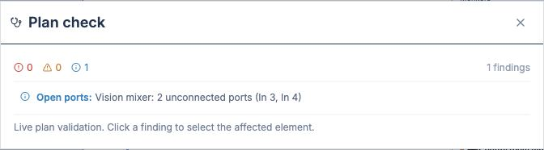

Scans the entire plan for common errors and displays them structured.

- **Filter**: By finding type (error, warning, info) or device/cable.
- **Findings**: Incomplete connections, invalid combinations, missing metadata.
- **Automatic**: Runs in background when saving.

#### Plan vs. found

*Tools → Plan vs. found…*

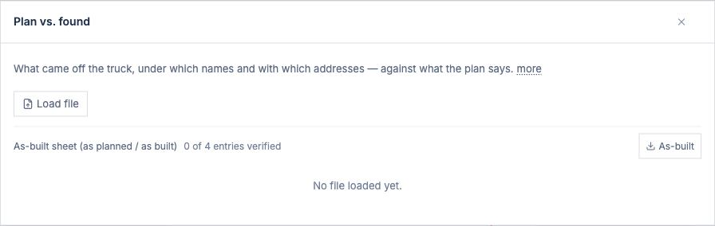

Compares the planned layout with the captured as-found situation on site.

- **Load survey**: CSV/Excel with names and positions.
- **Matching**: Automatic alignment or manual assignment.
- **Differences**: What's planned but not present? What's on site but not in the plan?
- **Export**: Side-by-side comparison report.

### Plan

Tools for capturing, structuring, and detailing the facility.

#### Survey (capture existing)

*Tools → Survey (capture existing)…*

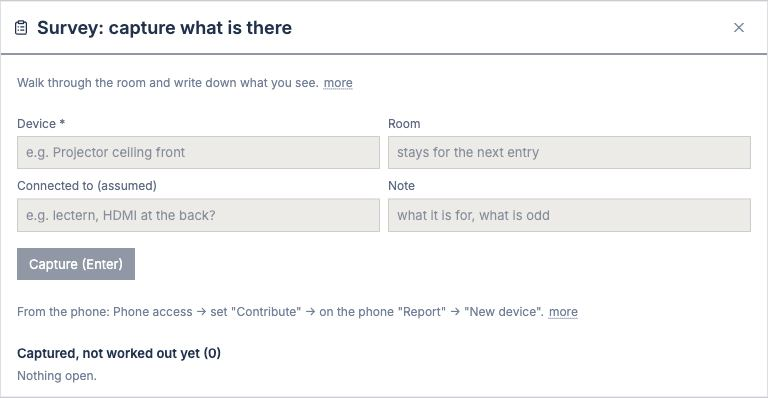

Documents physically present equipment and their location.

- **Equipment input**: Name, category, assumed location.
- **Room**: Storage location in facility, or free-standing.
- **Photo**: Snapshot of equipment (optional).
- **Notes**: Observations (condition, alternatives, blocked connectors).
- **Guess connectors**: Search device datasheet and fill in connector groups.

#### Drum micing

*Tools → Drum micing…*

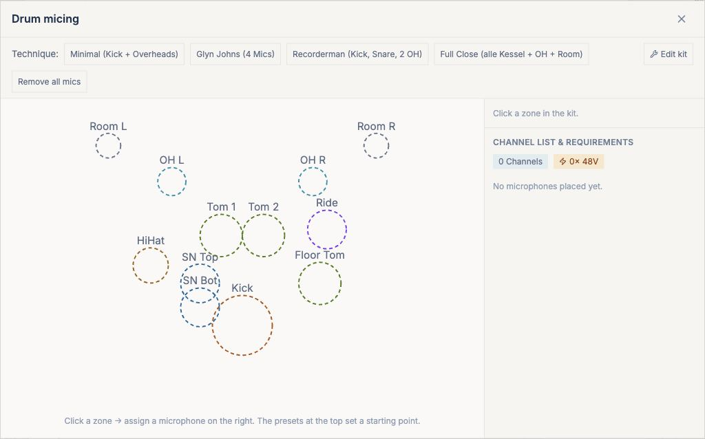

Specialized dialog for placing microphones on drum kit components.

- **Drum kit sketch**: Kit with positions (kick, snare, hi-hat, toms, cymbals).
- **Mic slots**: Drag-and-drop mic types to positions.
- **Connectors**: Select devices (mixer, interface) and assign input connectors.
- **Notes**: Name and notes per mic (e.g., kick-outside, snare top).

#### Wireless / vocals (spectrum)

*Tools → Wireless / vocals…*

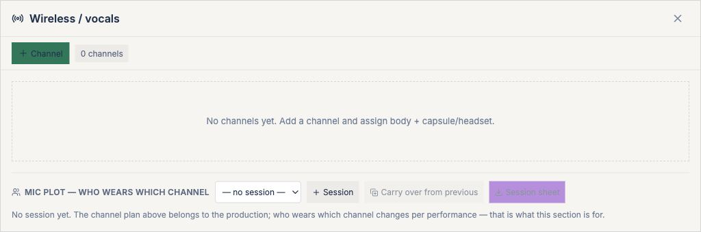

Plans radio frequencies for wireless microphones and headphones.

- **Bands**: 2.4 GHz, UHF (600–700 MHz), UHF (900 MHz), IR, SMD24.
- **Devices**: Transmitter and receiver models, some with programmable frequencies.
- **Frequency assignment**: Assign channels one-to-one, or automatically minimize conflicts.
- **Spectrum scan**: Upload measurement data (CSV) to validate against real environmental frequencies.

#### Rundown and camera assignments

*Tools → Rundown and camera assignments…*

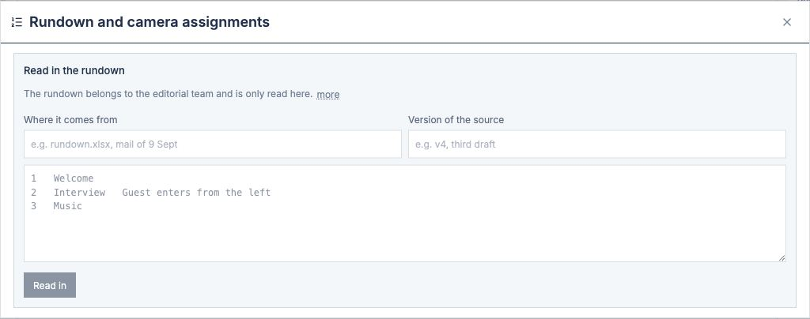

Structures the timeline of an event and assigns camera tasks.

- **Import segments**: Read from TCS files or enter manually.
- **Cuts / scenes**: Per entry: name, duration, music timing.
- **Camera assignment**: Per camera position (camera 1, camera 2, …) which cut/shot to show?
- **Handover**: Creates instruction cards for camera crew (QR code or printout).

#### Delivery (streaming destinations)

*Tools → Delivery…*

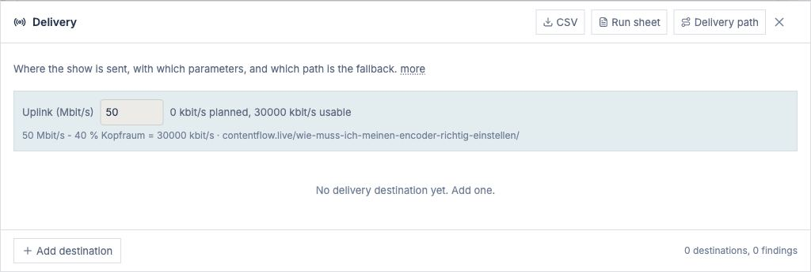

Defines where video/audio is routed (YouTube Live, Zoom, recording, etc.).

- **Destinations**: YouTube Live, Facebook, Twitch, RTMPS server, local recording, multiview monitor.
- **Parameters**: Bitrate, codec, resolution, framerate.
- **Credentials**: API keys, stream URLs (securely stored, not in project file).
- **Monitoring**: Live status, Mbps usage, error rate.

#### LED wall

*Tools → LED wall…*

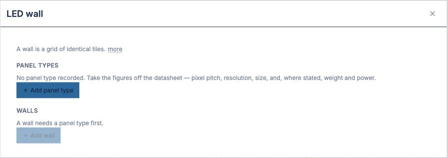

Plan space and power for LED surfaces.

- **Panel format**: Choose standard sizes or custom (e.g., 500×250 mm).
- **Resolution**: Pixels per meter (256, 312, 500 ppm).
- **Layout**: Width × height in panel units → total size in meters.
- **Weight & power**: Calculated from panel data.
- **Pixel map**: Export coordinates for media server (pixel mapping).

#### Faceplate editor

*Tools → Faceplate editor…*

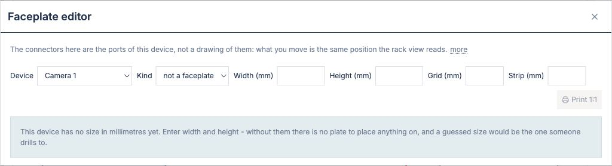

Places connectors on flat surfaces (wall plate, patchfield, stage box) and prints 1:1 for drilling.

- **Plate**: Choose size and material (19" rack blank, wall plate, custom).
- **Connectors**: Drag-and-drop connector groups.
- **Positioning**: Millimeter-precise placement (grid-based).
- **Labeling**: Automatic from device names, or custom.
- **Print**: 1:1 to printer for hole drilling and label printing.

#### Report editor

*Tools → Report editor…*

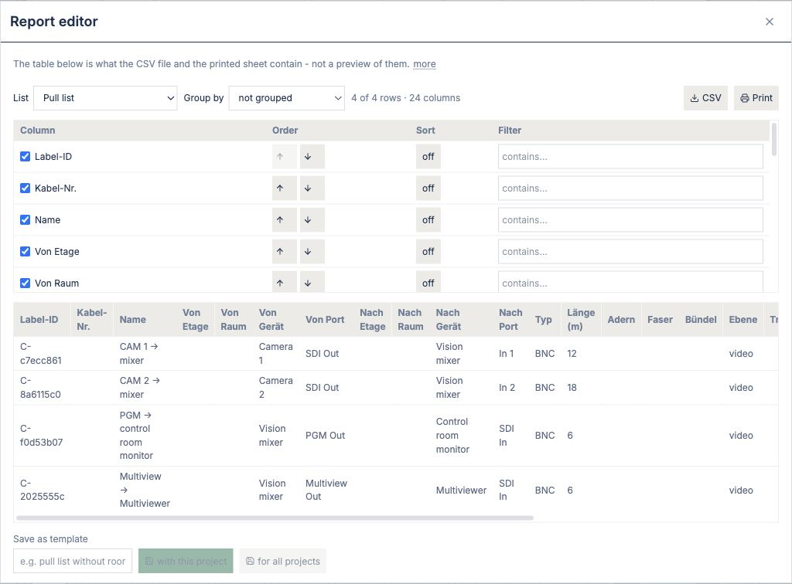

Configures display of equipment and cable lists (print & export).

- **Columns**: Selection, order, width.
- **Grouping**: By category, room, status, or custom.
- **Sorting**: A→Z, by value, by date.
- **Filter**: Only devices of certain categories, rooms, or status.
- **Templates**: Save and recall preconfigured layouts.

#### Conductors and colour standards

*Tools → Conductors and colour standards…*

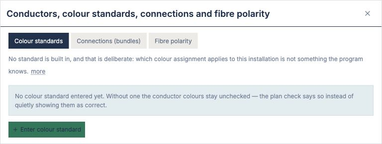

Defines wire colors for cables and connector markers per IEC or custom.

- **Standards**: IEC 60757 (International), EN 50575 (EU), custom.
- **Sets**: Predefined color sequences (e.g., brown/black/gray/white for 4×4 XLR).
- **Assignment**: Which standard for which cable types?
- **Preview**: Shows actual colors of current numbers.

#### Received show-control messages

*Tools → Received show-control messages…*

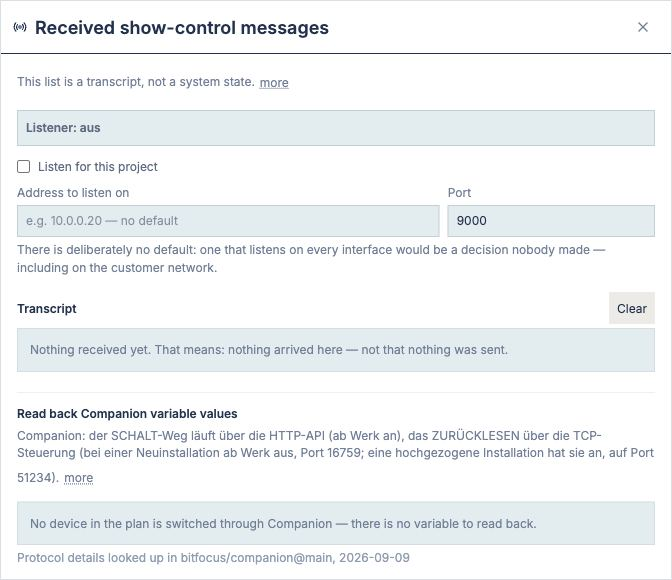

Shows a log of all show-control commands received by the app (OSC, MIDI, HTTP).

- **Input source**: IP:port, network interface.
- **Data flow**: Timestamp, command, parameters, status (processed/ignored).
- **Errors**: Invalid commands, parse errors.
- **Live view**: Real-time monitor during a show.

### Create & Manage

Tools for building and managing the facility.

#### Connect multiple cables

*Tools → Connect multiple cables…*

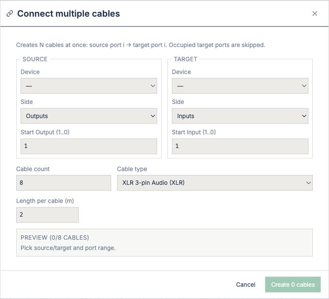

Connects many cables at once instead of clicking individually.

- **Table**: Source, source port, destination, destination port, cable type.
- **Paste**: Copy-paste from Excel or CSV.
- **Validation**: Checks for incompatibility (e.g., BNC to HDMI).
- **Apply**: Wire all rows at once.

#### Create new rack

*Tools → Create new rack…*

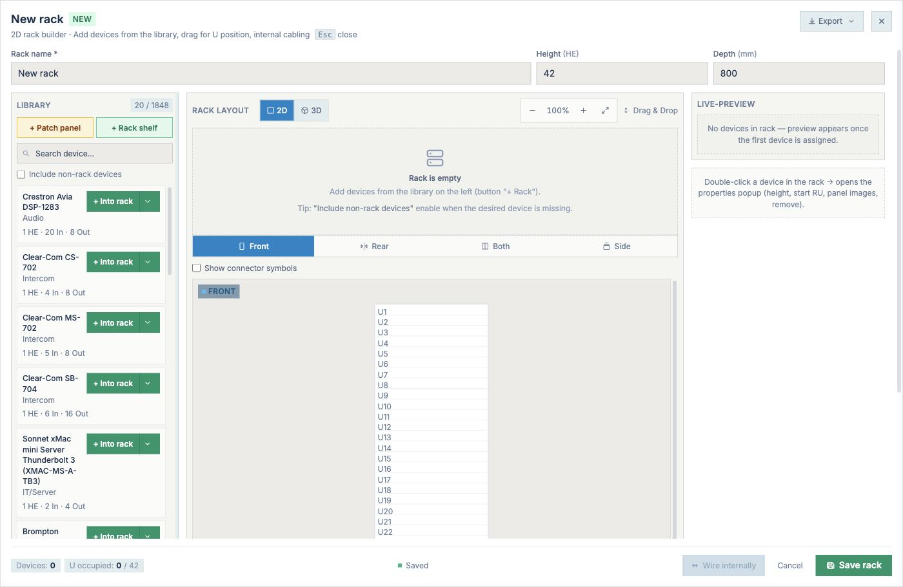

Creates a new rack container from device templates.

- **Name**: Label (e.g., "Server Rack 1").
- **Height**: Rack units (RU), usually 42 RU.
- **Template**: Optional from standard layouts or empty.
- **Position**: Where to place on canvas?

#### Rack builder

*Tools → Rack builder…*

Populates a rack with devices, arranges them, and visualizes in 3D.

- **Existing racks**: List of editable racks.
- **Device slots**: Height (RU) per device.
- **3D view**: Front view for checking cable lengths and obstructions.
- **Export**: Save rack structure or place on canvas.

#### Generate AI plan

*Tools → Generate AI plan…*

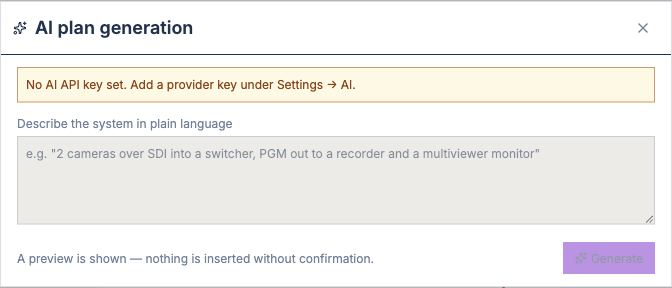

Generates initial plan draft based on text description (AI).

- **Input**: Brief description of facility (e.g., "3 cameras, ATEM mixer, 2 monitors, streaming to YouTube").
- **Options**: Preferred equipment types, budget limits.
- **Draft**: AI selects devices from library and wires them.
- **Adjust**: Edit generated plan.

Requires an AI API key (OpenAI, Google, Anthropic).

#### Revisions & snapshots

*Tools → Revisions & snapshots…*

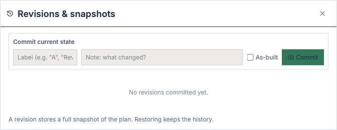

Saves intermediate versions of a plan to track changes.

- **Snapshots**: Timestamp, optional note.
- **Autosave**: Automatic snapshots after major changes.
- **Comparison**: Two versions side-by-side, differences highlighted.
- **Restore**: Return to an earlier version.

### Device Configuration

Setup of specialized devices (if present).

#### ATEM multiviewer layout

*Tools → ATEM multiviewer layout…*

(Only if an ATEM mixer is present in the facility.)

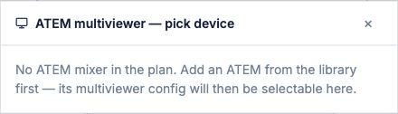

Sets which sources appear in which multiviewer windows.

- **Layout**: How many windows and positions?
- **Assignment**: Source → window number.
- **Size & position**: Each window individually resizable (if supported by ATEM model).

#### ATEM audio routing

*Tools → ATEM audio routing…*

(Only if an ATEM mixer with audio inputs is present.)

Routes audio inputs (XLR, RCA, Dante) to mixer channel faders.

- **Inputs**: List all audio inputs of the ATEM.
- **Channels**: Which channel gets which input?
- **Sensitivity**: Level per input.

#### ATEM input labels

*Tools → ATEM input labels…*

(Only if an ATEM mixer is present.)

Names the input sources on the ATEM mixer (name on control surface).

- **Inputs**: List all ATEM inputs (1–20+).
- **Names**: Custom name per input (e.g., "Camera 1", "Graphics").
- **Color**: Optional marker color assignment.
