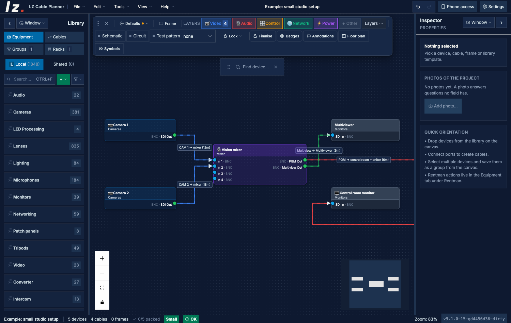
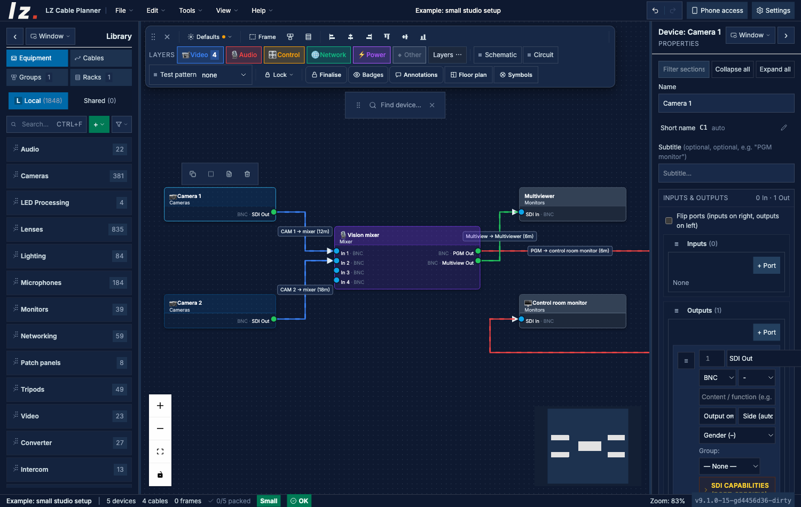
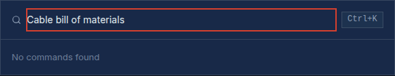
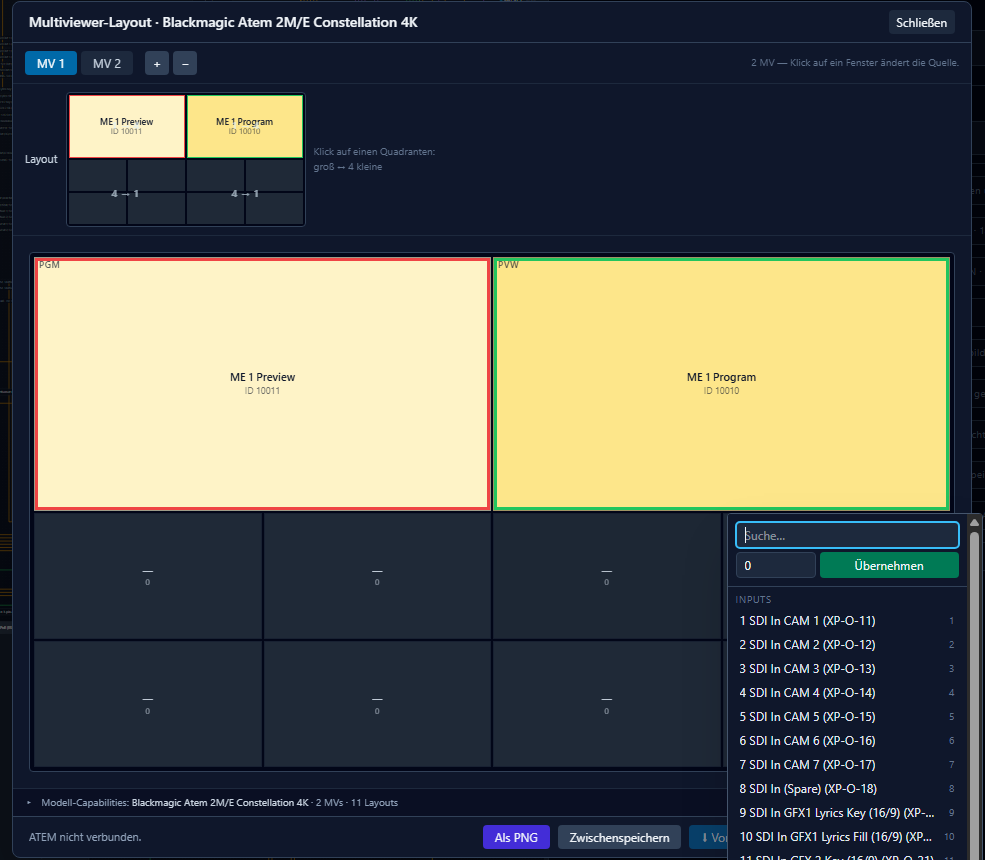
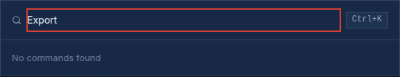
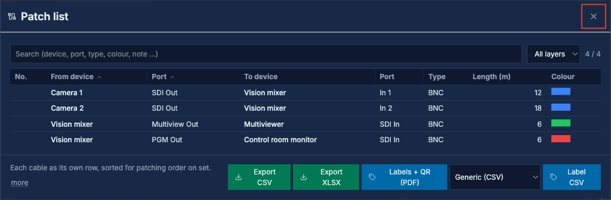

# LZ Cable Planner — User Manual

Plan, document and hand over broadcast and AV cabling: signal flow, rooms and
floors, cable lengths, patch lists and the paperwork for the build day.

Deutsche Fassung: [handbuch.de.md](handbuch.de.md)

## Contents

1. Installation
2. First project
3. The canvas
4. Devices
5. Cables
6. Rooms, floors and 3D
7. Floor plan and real cable lengths
8. Symbols
9. Adapters, gender changers, converters
10. Faceplates
11. Fibre breakouts and polarity
12. LED walls
13. ATEM and Videohub
14. Lists and the report editor
15. Export and handover documents
16. On site: phone, survey, labels
17. Working together: live session and cloud
18. Device library
19. Import and exchange
20. Claude (MCP)
21. Web edition and tablet
22. Data, safety and troubleshooting

---

## 1. Installation

Download the installer from the
[latest release](https://github.com/larszu/cable-planner/releases/latest):

- **macOS**: `.dmg` for Apple Silicon and Intel
- **Windows**: `.exe`

The app runs fully offline. An internet connection is only needed for the
device library, the cloud copy and live sessions across networks.

Without installing anything, the web edition runs at
**https://larszu.github.io/cable-planner/** (see chapter 21 for what it cannot
do).

## 2. First project

- **File → New** starts an empty plan. **Open**, **Save** and **Save As** work
  as usual; the recent projects list fills itself.
- A project is a single JSON file (`.cableplan`). It can be versioned with git
  and diffed like text.
- While you work, the plan is auto-saved into a recovery copy every few hundred
  milliseconds. If the project grows beyond what that store holds (about
  5 MB), the status bar shows **"No recovery copy"** with the project size —
  then save to a file. The plan itself is unaffected.
- Undo and redo cover the last 100 steps.



## 3. The canvas

- Drag devices from the **Library** onto the canvas. Zoom, pan and the minimap
  work with mouse, trackpad or touch.
- Drag from a port to a port to draw a cable. Bend points and segments follow
  the pointer for the whole drag.
- Right-click a device (long press on a touch screen) for its context menu.
- Right-click an empty spot → **New device here …** creates a device for this
  project only.
- **Show signal path** (in a cable's properties) highlights the whole chain the
  cable belongs to — through plates, house runs, converters and routers — and
  lists every station with floor, room, device and port. **Esc** or the chip in
  the toolbar ends it.

## 4. Devices

### Properties panel



The top of the panel is fixed: **name**, **short name**, **subtitle**, then
**inputs & outputs**, then the **note** (web UI, firmware, location, owner).
The short name is derived from the name and shown as one line; the pencil
opens it for editing, *auto* returns to the derived form. The two port lists
can be dragged past each other; that swaps them and mirrors the ports on the
canvas node, exactly like the *Flip ports* box. All other sections can be
dragged into any order. The filter field finds a section by title; **Collapse all** /
**Expand all** in one click. Open sections are remembered.

### Creating your own device

- **Library → Create your own device** needs only a name. Ports, manufacturer
  and datasheet can follow later. Drop a cable end onto the body of such a
  device and it gets a matching port.
- **Place in project only** keeps the device out of the template library — for
  loan gear, a client's box or a placeholder.
- **Ports from a photo**: pick, drop or paste photos of the connector side (on a
  phone: *Take photo*). The AI provider chosen under *Settings → Integrations →
  AI* reads the connectors and the rating plate. You get an editable suggestion
  list; unsure rows are unticked, nothing is applied until you confirm. If the
  model exists in the built-in catalogue, that entry is offered instead.

### Catalogue link

Devices created by hand, imported or loaded from older projects are linked to
their catalogue model automatically when the name matches exactly one entry.
Several matches are never guessed; the section *Catalogue & source* offers
them. Catalogue entries carry a **manufacturer link** to the datasheet.

Entries whose sockets are not known are marked *ports unknown*. The plan check
asks for the datasheet; the mark disappears as soon as you add real ports.

### Network and streams

- **Network & access**: IP, mask, gateway, MAC and **VLAN**. The device card
  shows `10.0.0.5 /24 · VLAN 30`. The same section holds the three
  identifiers of the unit: **serial number**, **asset tag** (the label) and
  **internal number** (the house's own numbering). *Settings → Appearance*
  chooses which of the two numbers appears next to the category on the
  device card. Both are searchable, both travel in the asset register CSV,
  and CSV import and NetBox import fill them.
- **Streams**: what a device sends or receives (RTSP, SRT, RTMP, NDI, HLS,
  MJPEG, WebRTC, ST 2110, Dante, AES67 …) with address, port, codec and
  format.
- **Credentials never enter the plan.** A user name, password or token typed
  into a stream address is removed when leaving the field. The desktop app
  keeps it in the computer's keychain.
- **Still image preview** under a device: from the camera's snapshot URL or —
  for an RTSP/RTMP/SRT/HLS/MJPEG stream — one frame via **ffmpeg** (install it
  separately: `brew install ffmpeg` or `ffmpeg.exe` on the PATH). Desktop app
  only, local network only, refreshed every 10 s. A preview starts only after
  you click **Start preview**.

### Master data

*Settings → Master data* holds your own connector types, signal standards and
cable layers next to the built-in ones. Renaming carries the new name onto all
ports, cables and templates of the open project.

## 5. Cables

- Every cable has type, length, colour, label and notes.
- The cable's properties, the pull list and the cable schedule show both ends
  as *floor · room · device · port*.
- **Stock lengths**: enter the drums you own under *Settings → Project →
  Available stock lengths*. The bill of materials then splits a 137 m run into
  100 + 50 with one coupler — fewest couplers first, least excess second — and
  names what the stock does not cover.



## 6. Rooms, floors and 3D

- A **frame** on the canvas is a room. It picks its floor from the project's
  floor list (*Floors* in the frame's properties, bottom to top, with the level
  in metres).
- **Rooms ▾** in the toolbar hides floors or single rooms. A cable into a
  hidden room remains as a stub that names its target; exports always stay
  complete.
- **3D** shows the building: every room at its floor height, the devices
  inside, the connections between rooms as one line per room pair or as single
  cables.
- Tick **Riser** on a frame to make it a shaft through all floors. Cables
  between floors then run via the nearest riser.

## 7. Floor plan and real cable lengths

Toolbar → **Floor plan**.

1. Load or drop an image (PNG, JPG, WebP, GIF, BMP, AVIF) — or import the venue
   from the MultiCam or Light Planner. PDF plans: export the page as PNG or JPG
   first.
2. Set the scale:
   - **Two points** on a plan drawn from above: click both ends of a known
     distance.
   - **Four corners** on a photo or an isometric drawing: click the corners of a
     floor area of known width and depth.
3. After calibration the plan locks and lies under everything.

Cable lengths then follow the drawn route, socket to socket, through every bend
point. A length is marked **out of date** as soon as a device moves, a cable is
re-routed or the plan is re-calibrated.

## 8. Symbols

Toolbar → **Symbols**: electrical, intrusion and fire alarm, voice alarm, IT,
automation and AV, drawn after DIN EN 60617 and DIN 14034-6.

- A symbol is a label on the plan, not a device: no ports, no checks.
- Import your own as SVG, PNG, JPG or WebP; they travel inside the project
  file.
- With an AI key under *Settings → AI*, a symbol can be generated from a
  description.
- The symbol list exports as CSV.

## 9. Adapters, gender changers, converters

- **Adapter** — changes the plug shape (BNC to RCA).
- **Gender changer** — changes pin or socket only.
- **Converter** — changes the signal (SDI to HDMI).

Adapters and gender changers can be inserted with one click on a selected
cable; one undo takes the insertion back. Converters are **named**, not
inserted: model, bandwidth and price are your decision. Inserted parts stay as
an *open point* in the plan check until you have checked them.

## 10. Faceplates

*Tools → Faceplate editor…* — wall panels, stage boxes and rack plates.

- Place each connector in **millimetres**; the connectors are the device's own
  ports.
- Enter the cutout diameter from the manufacturer's document — it is never
  guessed. Without it, holes are not checked against each other, and the
  report says so.
- Checks: holes over the edge, overlapping holes (with the overlap in mm),
  connectors without a position.
- Print the **label strip** (one per row) and the **drilling sheet** at 1:1.
- A plate passes the signal through — socket *n* at the back to socket *n* at
  the front. Untick **Patch panel** for a stagebox with a converter inside.
  **On the plate** chooses which side is drilled.

## 11. Fibre breakouts and polarity

- A socket can carry a **breakout**: each fibre with position, `TX`/`RX`/*not
  stated* and its own tail connector.
- Each cable end names the fibre it uses; patch and pull lists show it.
- The plan check finds partly patched breakouts, two cables on one fibre and
  fibres the socket does not have.
- **Polarity** is checked only against the method you choose (TIA-568 A, B or
  C). Without a method it is reported as *unchecked*.

## 12. LED walls

*Tools → LED wall…*

- Panel types with pixel pitch, resolution, size and — where stated — weight
  and power (average and peak).
- Enter the opening in millimetres: you get the grid and the leftover.
- Totals for panel count, resolution, size, weight and load; sending card ports
  needed against available.
- The wall is fed from a building outlet: its continuous load joins that
  outlet, its peak gets a finding of its own.
- **Pixel map** as PNG in the wall's native resolution, tiles numbered from the
  top left.

## 13. ATEM and Videohub



- **ATEM multiviewer** (*Tools → ATEM multiviewer layout…*): visual layout editor, program/preview and camera
  assignment, exportable configuration. For Television Studio, Constellation
  and M/E models.
- **Videohub** (*Tools → Videohub routing / labels…*): source → destination mapping, router configuration, routing
  overview and export.

The planner reads switchers and routers. It never sends switching commands
from the AI interface.

## 14. Lists and the report editor

Every list — pull list, termination list, cable schedule, asset register,
network sheet, spectrum plan, delivery, tally map, handover, signal paths,
house run occupancy, crossings, defects, maintenance, configuration,
attachments, faceplates — opens in one editor (*Tools → Report editor…*):

- show, hide and reorder **columns**
- **group**, **sort** by several columns, **filter** per column
- save **templates** for this project or for all projects

The preview is the export: screen, CSV and print come from the same result.

**Patch list** (*Tools → Patch list…*): one row per network interface, from
the device port through every patch panel (with both port numbers) to the
switch port, with IP, subnet, gateway, MAC and VLAN. Where a path does not
reach a switch, the row says why.

## 15. Export and handover documents



- **File → Export & Print…**: PDF, PNG, JPEG, SVG with layer filter.
- **Per-device patch sheets** with location and the far end of each cable.



**Tools → Fixed install: docs & handover…**:

| Document | Format |
|---|---|
| Pull list, termination list, cable schedule, BOM with reserve, asset register | CSV / PDF |
| Signal paths, house run occupancy | CSV |
| Route plan per floor | HTML, A4 landscape |
| Crossings (fire protection) | CSV |
| Acceptance record with defects, open items and signature block | HTML |
| Maintenance schedule | CSV |
| Configuration settings per interface | CSV |
| Device cards, operator overview, camera positions | HTML |
| Attachment index with checksums | CSV |
| QR labels for cables and devices | print |

**Device datasheet** (device properties → *Print / documentation*): one A4 page
per device with photo and the properties you tick. For several devices:
*Export → Patch sheets → Datasheets*.

**Attachments** (desktop app): test reports, manuals and configuration backups,
attached to a cable, a device or the installation. Files are copied into the
folder `Anhaenge` next to the project.

Every exported CSV ends with a column glossary.

## 16. On site: phone, survey, labels

- **Phone access**: scan the QR code on the build day — no install, no
  account. Choose **Read only** or **Contribute**. Contributing phones tick off
  work, add pulled cables, file change requests and send photos; everything
  comes back into the plan. Requires the desktop app on the same network.
- **Photos** point at a device, a cable or the project and travel inside the
  plan file.
- **Survey** (*Tools → Survey (capture existing)…*): walk through an existing installation and type
  device, room, connection and note — Enter, next. Each entry becomes an
  unfinished device; the plan check asks for the missing details.
- **Label sheets and QR labels** for cables and devices.
- **Read-only web viewer** for people who do not run the app.

## 17. Working together: live session and cloud

### Live session

- Real-time co-editing over WebRTC; no server holds your plan.
- Join by **invite link** or find sessions on the LAN.
- Set a **room password** — it encrypts the session end to end.
- Across networks the default relay `wss://relay.zumpelars.de` connects the
  peers; you can run your own relay and STUN/TURN servers
  ([self-hosted relay](../self-hosted-relay.md)) or use **local-only** mode.
- Undo takes back your own edits, not those of others.

### Cloud copy with revisions

*File → Cloud & share link…* (requires a device library account, see chapter 18).

- Your file stays the master copy; the cloud keeps a copy with history.
- Every save is a revision — automatically 30 s after the last change, or with
  **Save to cloud now**. Any revision can be restored.
- Parallel changes from another device are merged, never overwritten.
- Credentials stay on the computer. **Delete from cloud** removes the project
  with all revisions.

## 18. Device library

The shared device catalogue of the planner suite:
**[devices.zumpelars.de](https://devices.zumpelars.de)**.

1. Create an account on the website, confirm your email and accept the
   guidelines.
2. Sign in under *Settings → Device library* (email or user name, password,
   two-factor code if enabled).
3. **Update from device library** fetches what changed since the last sync. The
   devices stay available offline.
4. Your own templates are uploaded automatically while you are signed in
   (*Upload my own devices automatically*), or with **Sync now**.
   *My devices* shows the state of each: not uploaded, waiting for moderation,
   live, blocked with reasons.

**Submitting templates**: *Library → + → Submit templates…* checks your
templates first. Required: a datasheet link, and a connector type and label on
every port. Power draw is optional. Templates that fail are listed with the
reason and not sent.

## 19. Import and exchange

| Source | What comes in |
|---|---|
| **Rentman** | projects, equipment, categories (selective) |
| **NetBox** | racks, devices, cable paths |
| **GraphML** | diagrams, with preview |
| **MultiCam Planner** (`.cameras.json`) | cameras with ports, lens, focal length, position and PTZ presets; importing again reconciles instead of duplicating |
| **`.avplan`** | shared exchange format of the planner suite |
| **Venue** (`venue-exchange`) | floor plan with scale, from MultiCam / Light Planner |
| **Building statement** (`.avfacility`) | outlets, cable routes, floors, house runs and control addresses from the Facility Planner |
| **Green-GO** | intercom export `.gg5` plus a vendor-neutral intercom file |
| **Racks for the warehouse** | `rack-belegung.json` for the Inventory Planner |

API tokens are stored in the operating system's credential store (macOS
Keychain, Windows Credential Manager, libsecret), never in the project file.

**Inventory & stock** (*Tools → Inventory / stock…*): warehouse stock with locations, serial numbers and
quantities, checked against the plan's demand.

## 20. Claude (MCP)

Claude can answer questions about the open plan — devices, ports, signal paths,
cables and the plan check.

**On this computer**

1. *Settings → MCP* → switch on. The server listens on `127.0.0.1` only and
   uses a pairing token from the keychain.
2. Copy the command shown there, for example:

   ```
   claude mcp add --transport http cable-planner http://127.0.0.1:<port>/mcp --header "Authorization: Bearer <token>"
   ```

3. Reading is the default. **Writing** is a second switch: Claude can then
   connect and remove cables, set cable details and rename devices. Each call
   is one undo step and is listed under *What Claude changed*.

**From claude.ai, the phone or another machine**

1. Put the project into the cloud (*File → Cloud & share link…*).
2. In claude.ai: *Settings → Connectors → Add custom connector* with
   `https://devices.zumpelars.de/mcp` and sign in with your device library
   account.
3. Read-only, over your own cloud projects. Disconnect under *Account →
   Security → Connected apps* on devices.zumpelars.de.

Switching commands for ATEM or Videohub are never offered.

## 21. Web edition and tablet

- Open **https://larszu.github.io/cable-planner/** and add it to the home
  screen; it runs full-screen with its own icon.
- Touch: pinch zooms the plan, two fingers pan, a **long press** opens the
  context menu.
- Not available in the browser (no socket, listening port or keychain): ATEM,
  Videohub, NetBox, LAN sync, phone access, MCP server, show control,
  switching, Tally-Pi, Rentman export, update check. *Settings → Integrations*
  lists them with the reason.

## 22. Data, safety and troubleshooting

- **Projects**: local JSON files. The app writes them atomically with a backup
  copy.
- **App data** (library, recent projects, settings) lives in the app-data
  folder `Cable Planner`.
- **Secrets** (API tokens, stream credentials, device library sign-in) live in
  the operating system's keychain. The web edition keeps the device library
  sign-in in the browser's storage.
- **"No recovery copy"** in the status bar: save the project to a file.
- **No still image preview**: install ffmpeg, and check the device is in the
  local network.
- **Device library unreachable**: the app keeps working with the devices from
  the last sync.

Questions and bug reports:
[GitHub Issues](https://github.com/larszu/cable-planner/issues).

---

© 2026 Lars Zumpe Medienproduktion · free to use, proprietary licence
