# LZ Cable Planner — User Manual

Plan, document and hand over broadcast and AV cabling: signal flow, rooms and
floors, cable lengths, patch lists and the paperwork for the build day.

Deutsche Fassung: [handbuch.de.md](handbuch.de.md)

---

## Contents

1. [Getting started](#1-getting-started)
   - [Installation](#installation)
   - [First project](#first-project)
2. [The interface](#2-the-interface)
   - [Edit Menu](#edit-menu)
   - [View Menu](#view-menu)
   - [Help Menu](#help-menu)
   - [Command Palette](#command-palette)
   - [Status Bar](#status-bar)
   - [Theme Settings](#theme-settings)
   - [Canvas Visibility Options](#canvas-visibility-options)
   - [Information and Help](#information-and-help)
   - [Uncaptured Functions](#uncaptured-functions)
3. [Canvas](#3-canvas)
   - [Toolbar](#toolbar)
   - [Settings: Defaults (Default behaviour for new cables)](#settings-defaults-default-behaviour-for-new-cables)
   - [Location Frames (Frames)](#location-frames-frames)
   - [Selection and bulk connect](#selection-and-bulk-connect)
   - [Alignment and arrangement](#alignment-and-arrangement)
   - [Arrange equipment in 2D rack builder](#arrange-equipment-in-2d-rack-builder)
   - [Context menus (right-click)](#context-menus-right-click)
   - [Layer visibility (Video, Audio, Control, Network, Power)](#layer-visibility-video-audio-control-network-power)
   - [Signal flow display (Flow Mode)](#signal-flow-display-flow-mode)
   - [Floor plan](#floor-plan)
   - [Symbols (Electrical, Alarm, PA, IT, AV)](#symbols-electrical-alarm-pa-it-av)
   - [Room visibility (Rooms)](#room-visibility-rooms)
   - [3D building view](#3d-building-view)
   - [Show signal path](#show-signal-path)
   - [Equipment search (Ctrl+F / Cmd+F)](#equipment-search-ctrlf--cmdf)
   - [Inline selection toolbar (Multiple selection)](#inline-selection-toolbar-multiple-selection)
   - [Lock](#lock)
   - [Finalize (Plan lock)](#finalize-plan-lock)
   - [Annotations](#annotations)
   - [Zoom and navigation](#zoom-and-navigation)
   - [3D rack view](#3d-rack-view)
   - [Cable details](#cable-details)
   - [Stream preview](#stream-preview)
   - [Canvas keyboard shortcuts](#canvas-keyboard-shortcuts)
4. [Library](#4-library)
   - [Equipment](#equipment)
   - [Cables](#cables)
   - [Groups](#groups)
   - [Racks](#racks)
   - [Common Settings](#common-settings)
5. [Inspector](#5-inspector)
   - [Nothing Selected](#nothing-selected)
   - [Device Properties](#device-properties)
   - [Sections in Detail](#sections-in-detail)
   - [Cable Properties](#cable-properties)
   - [Frame Properties](#frame-properties)
   - [Multiple Selection](#multiple-selection)
6. [File and Import](#6-file-and-import)
   - [New Project](#new-project)
   - [New from Template](#new-from-template)
   - [Open](#open)
   - [Save](#save)
   - [Save As](#save-as)
   - [Import yEd / GraphML](#import-yed--graphml)
   - [Import MultiCam Cameras](#import-multicam-cameras)
   - [Import Equipment from CSV](#import-equipment-from-csv)
   - [Rentman Import](#rentman-import)
   - [NetBox Import](#netbox-import)
   - [Export Whole Project](#export-whole-project)
   - [Import Whole Project](#import-whole-project)
   - [Export Identity Map](#export-identity-map)
   - [Import Identity Map](#import-identity-map)
   - [View Linked Venue Plan](#view-linked-venue-plan)
   - [Project File Format: `.cableplan`](#project-file-format-cableplan)
   - [Backup Status in the Status Bar](#backup-status-in-the-status-bar)
7. [Tools: Plan](#7-tools-plan)
   - [Calculate](#calculate)
   - [Check](#check)
   - [Plan](#plan)
   - [Create & Manage](#create--manage)
   - [Device Configuration](#device-configuration)
8. [Tools](#8-tools)
   - [Patch list](#patch-list)
   - [Patching order](#patching-order)
   - [LED wall](#led-wall)
   - [Faceplate editor](#faceplate-editor)
   - [Report editor](#report-editor)
   - [Conductors and colour standards](#conductors-and-colour-standards)
   - [Received show-control messages](#received-show-control-messages)
   - [Connect multiple cables](#connect-multiple-cables)
   - [Create new rack](#create-new-rack)
   - [Rack builder](#rack-builder)
   - [Generate AI plan](#generate-ai-plan)
   - [Revisions & snapshots](#revisions--snapshots)
   - [Inventory / stock](#inventory--stock)
   - [ATEM multiviewer layout](#atem-multiviewer-layout)
   - [ATEM audio routing](#atem-audio-routing)
   - [ATEM input labels](#atem-input-labels)
   - [Videohub routing / labels](#videohub-routing--labels)
   - [GreenGo intercom](#greengo-intercom)
   - [Notes](#notes)
9. [Export & Print](#9-export--print)
   - [Patch List](#patch-list)
   - [Fixed Installation: Docs & Handover](#fixed-installation-docs--handover)
   - [Stage Plot](#stage-plot)
   - [Export & Print](#export--print)
   - [Cloud & Share Link](#cloud--share-link)
   - [Export as Viewer File](#export-as-viewer-file)
   - [Import Annotations](#import-annotations)
   - [Compare Plan Revisions](#compare-plan-revisions)
   - [Documents Handed Out](#documents-handed-out)
10. [Settings](#10-settings)
   - [Project](#project)
   - [Appearance](#appearance)
   - [Editing](#editing)
   - [Cable Types](#cable-types)
   - [Master Data](#master-data)
   - [Configurations](#configurations)
   - [Device Library](#device-library)
   - [Integrations](#integrations)
   - [MCP](#mcp)
   - [Modules](#modules)
   - [Certificates](#certificates)
   - [Schema Builder](#schema-builder)
   - [Sync](#sync)
   - [Keyboard Shortcuts](#keyboard-shortcuts)
   - [Advanced](#advanced)
11. [Claude (MCP)](#11-claude-mcp)
12. [Web edition and tablet](#12-web-edition-and-tablet)
13. [Data, safety and troubleshooting](#13-data-safety-and-troubleshooting)

---

## 1. Getting started

### Installation

Download the installer from the
[latest release](https://github.com/larszu/cable-planner/releases/latest):

- **macOS**: `.dmg` for Apple Silicon and Intel
- **Windows**: `.exe`

The app runs fully offline. An internet connection is only needed for the
device library, the cloud copy and live sessions across networks.

Without installing anything, the web edition runs at
**https://larszu.github.io/cable-planner/** (see chapter 21 for what it cannot
do).

### First project

- **File → New** starts an empty plan. **Open**, **Save** and **Save As** work
  as usual; the recent projects list fills itself.
- A project is a single JSON file (`.cableplan`). It can be versioned with git
  and diffed like text.
- While you work, the plan is auto-saved into a recovery copy every few hundred
  milliseconds. If the project grows beyond what that store holds (about
  5 MB), the status bar shows **"No recovery copy"** with the project size —
  then save to a file. The plan itself is unaffected.
- Undo and redo cover the last 100 steps.


---

## 2. The interface


The interface of LZ Cable Planner consists of four main areas: the menu bar at the top, the library sidebar on the left, the canvas in the center, and the inspector panel on the right. The status bar is located at the bottom of the window.

### Edit Menu


The Edit menu contains functions for modifying selections on the canvas.

| Function | Keyboard Shortcut | Description |
|---|---|---|
| Undo | Ctrl+Z | Undo the last action |
| Redo | Ctrl+Y | Redo the last undone action |
| Duplicate | Ctrl+D | Duplicate selected equipment or cables |
| Delete selection | Delete | Delete selected elements |
| Select all | Ctrl+A | Select all equipment and cables in the plan |
| Clear selection | Esc | Deselect all elements |

### View Menu


The View menu provides functions to affect the canvas view and control the display of various panels.

#### Zoom and Fitting

| Function | Description |
|---|---|
| Fit to view | Zoom the canvas so all elements are visible |
| Zoom 100 % | Reset zoom to 100 % |
| Zoom in | Increase canvas zoom level |
| Zoom out | Decrease canvas zoom level |

#### Theme and Appearance

| Function | Description |
|---|---|
| Light theme | Switch between light and dark design |
| Follow system theme | Use the operating system's theme setting |
| Fullscreen | Display the app in fullscreen mode |

#### Cables and Labels

| Function | Description |
|---|---|
| Snap to grid | Align equipment to a grid |
| Hide cable labels | Hide cable designations on the canvas |
| Show off-page names | Display names of equipment outside the plan area |
| Color cables by length | Colorize cables based on their physical length |
| Color cables by discipline | Colorize cables based on their discipline/domain |

#### Panels and Tools

| Function | Description |
|---|---|
| Find device | Show or hide the canvas search field |
| Canvas toolbar | Show or hide the canvas toolbar |
| Annotations panel | Show or hide the annotations panel |

### Help Menu


The Help menu provides access to documentation and information about the application.

| Function | Keyboard Shortcut | Description |
|---|---|---|
| Command palette… | Ctrl+K | Quick access to commands via search |
| Keyboard shortcuts… | | Display a list of all keyboard shortcuts |
| Getting-started tour… | | Launch an interactive introduction to the app |
| Check for updates… | | Search for new application versions |
| About LZ Cable Planner… | | Display version information and credits |

### Command Palette


The command palette is a quick way to access the most important functions. It is opened with **Ctrl+K** or via *Help → Command palette…*. It allows you to search for and execute commands via text search.

The command palette contains:
- **Edit**: Undo, Redo, Duplicate, Select all
- **View**: Fit to view, Zoom in, Zoom out, Reset zoom
- **Tools**: Plan check, Patch list, Analyses, Bulk connect, Revisions, AI plan generation, CSV import, and more functions

The command palette is especially useful when you don't remember the exact menu paths or when you want to quickly execute a function without navigating through the menus. Simply type the first letters of the command you're looking for to filter the list.

### Status Bar


The status bar at the bottom of the window displays important information about the current project:

| Element | Description |
|---|---|
| Project name | Name of the currently open project |
| Equipment | Number of equipment elements |
| Cables | Number of cable connections |
| Locations | Number of rack locations |
| Packed | Status and count of packed equipment |
| File size | Size of the project file |
| Plan check | Status of plan verification (green OK, red problems) |
| Zoom | Current zoom level in percent |
| Version | Installed app version |

Additionally, the following badges may be displayed:
- **Live collaboration**: indicates when live collaboration is active
- **MCP server**: indicates if the MCP server is running and Claude is reading the plan
- **Action items**: indicates when there are overdue tasks

### Theme Settings

#### Light Theme


The app design can be switched between a light and dark theme. In light theme, the app has a white/light background, while in dark theme (default) it has a dark background. The color palette is automatically adjusted.

You can also set the app to use the operating system's theme, which automatically switches between light and dark design based on the system setting.

### Canvas Visibility Options

#### Snap to Grid


With the "Snap to grid" option enabled, equipment that you move on the canvas automatically aligns to a grid. This makes arrangement easier and produces a neat layout result. You can enable or disable this option in the View menu.

#### Hide Cable Labels


Cables can carry labels (such as port numbers). With "Hide cable labels" in the View menu, these can be hidden. This is useful when the canvas appears crowded or when you want to see only the connection structure.

#### Cable Colors

##### Color by Length


This option colorizes cables based on their physical length. Short cables receive one color, long cables another. This helps you see at a glance which cables are particularly long and may therefore be costly or difficult to route.

##### Color by Discipline


This option colorizes cables according to their discipline/domain (e.g., video, audio, data, power). This makes it easier to distinguish between different cable types on a complex plan.

### Information and Help

#### About the Application


The About dialog displays the current version of LZ Cable Planner along with information about the publisher and the licences of the bundled third-party libraries. It can be accessed via *Help → About LZ Cable Planner…*.

Here you will find:
- The current version number
- The build date and time
- The author (Lars Zumpe)
- The GitHub repository (github.com/larszu/cable-planner)
- Technologies used (Electron, React, ReactFlow, Vite, Tailwind)
- Notice to report issues and feature requests directly on GitHub

### Uncaptured Functions

The following elements could not be fully documented:

- **Phone Access Dialog**: The button to start phone access may not be available in the test environment or was not successfully activated by the capture script.
- **Collaboration Panel**: The Sync panel could not be successfully opened by the test script.
- **Keyboard Shortcuts Dialog**: The dialog could not be successfully activated.

These functions are all present in the code and functional. The documentation focuses on the main menus and important settings for configuring the user interface.

---

## 3. Canvas

The canvas is the heart of Cable Planner. Here you plan your wiring system, visualise signal flow and manage the arrangement of all equipment. The floating toolbar in the top left provides direct access to all functions.

### Toolbar

The toolbar is a floating panel in the top left of the canvas. It contains all important functions and can be moved by dragging the handle.

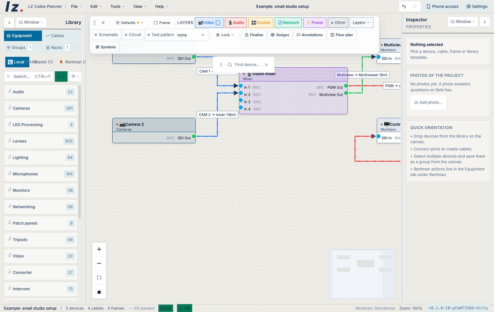

#### Close and reopen toolbar

The **X** button next to the drag handle hides the toolbar. You can reopen it via *View* → *Canvas Toolbar* menu. This is useful on small screens or for uncluttered plans.

### Settings: Defaults (Default behaviour for new cables)

The *Defaults* menu combines all standard behaviour settings that apply when creating new cables. Click the Defaults button (gear icon) to open the menu.

#### Routing (Cable path)

Determines the default shape of new cables:

- **Orthogonal** (grid pattern): Cables run horizontally and vertically
- **Straight** (direct): Straight lines between connectors
- **Curved** (smooth): Smooth curves

#### Arrows (Signal direction)

Activates small arrows on cables to show signal direction.

#### Cable Bumps

Shows small humps at cable crossings so cables visually pass over each other instead of intersecting.

#### Colour ports by type

Colours connectors by type (e.g. SDI, audio, power) differently.

#### Cable colours

Choose the colouring logic for cables:

- **Manual**: You select the colour for each cable individually
- **By length**: Automatic colouring based on cable length (with colour legends)
- **By layer**: Automatic colouring based on signal type (video, audio, control, network, power)

### Location Frames (Frames)

Frames are coloured rectangles to group equipment — for example all cameras, all mixers or all switch components.

**Add a new frame:**
1. Click the **Frame** button in the toolbar
2. An empty frame is created at the viewport centre
3. Drag the frame and edges to resize it
4. Right-click on a frame to open the context menu for editing

**Frame around selected equipment:**
1. Select one or more pieces of equipment
2. The **Frame** button now shows "Frame around the X devices"
3. Click it — a new frame will automatically be drawn around all equipment

### Selection and bulk connect

#### Select one piece of equipment

Click on equipment. It is marked with a blue outline. The alignment buttons now appear in the toolbar.

#### Select multiple pieces of equipment

Hold **Ctrl** (Windows/Linux) or **Cmd** (Mac) and click on more equipment. You can also drag a rectangle to select multiple pieces of equipment at once.

#### Bulk connect (Multiple cables at once)

When exactly **two pieces of equipment** are selected, the **Connect cables** button appears in the toolbar.

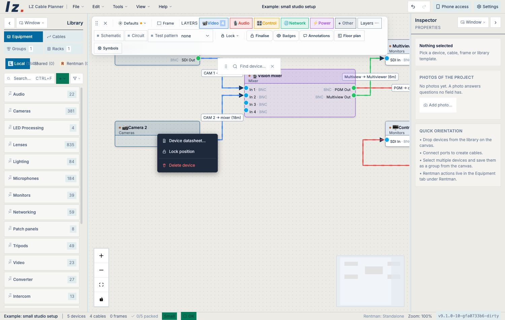

In the dialog you can create multiple connections at once:
- Select output ports of the first piece of equipment
- Select input ports of the second piece of equipment
- Select cable type and colour
- Click "Connect" to create all connections at once

### Alignment and arrangement

The alignment buttons appear only when at least one piece of equipment is selected.


| Button | Function |
|--------|----------|
| **Left** | 1 item: align to left viewport edge; multiple: align left edges |
| **Centre horizontal** | 1 item: centre horizontally in viewport; multiple: centre horizontally to each other |
| **Right** | 1 item: align to right viewport edge; multiple: align right edges |
| **Top** | 1 item: align to top viewport edge; multiple: align top edges |
| **Centre vertical** | 1 item: centre vertically in viewport; multiple: centre vertically to each other |
| **Bottom** | 1 item: align to bottom viewport edge; multiple: align bottom edges |
| **Distribute horizontal** | (3+ items only) Equal spacing horizontally |
| **Distribute vertical** | (3+ items only) Equal spacing vertically |

#### Save equipment groups

Select one or more pieces of equipment and click the **Save group** button (3 rectangles). An input field appears. Enter a name and click the green **Save** button.

Groups can later be dragged from the library onto the canvas and the arrangement will be preserved.

### Arrange equipment in 2D rack builder

If you have selected one or more regular equipment, you can move them with the toolbar's **Rack** button or via right-click → **Arrange in rack builder** to the 2D rack builder to arrange them in rows (e.g. to simulate a rack cabinet). If the selection contains a rack, neither is offered: racks cannot be packed into racks.

If you select an existing rack (black and white black-box), an **Edit** button appears instead to open the rack builder for that specific rack.

### Context menus (right-click)

#### Equipment context menu

Right-click on equipment. A menu appears with these options:

- **Rename equipment**: Change the label
- **Change colour**: Edit frame and background colour of the equipment
- **Duplicate equipment**: Copy equipment with all connections
- **Delete equipment**: Remove equipment and all its cables
- **Hide label**: Show only the symbol without name
- **Hide connectors**: Show only the equipment symbol without port dots
- **Arrange in rack builder**: Open the rack builder with the device or the whole selection (like the toolbar's Rack button)

#### Cable context menu

Right-click on a cable. The following options are available:

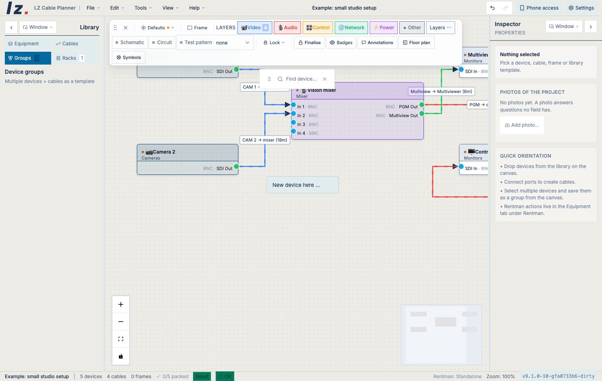

- **Rename cable**: Change the label
- **Switch cable type**: Reassign port types (e.g. SDI ↔ optical)
- **Change colour**: Override cable colour
- **Change length**: Enter cable length in metres
- **Check connection**: Validates cable connection if available
- **Show waypoints**: Display intermediate points to change routing
- **Insert adapter**: Dialog to add a gender changer (e.g. XLR M↔F)
- **Off-page connector**: Route cable out via an off-page connector and back in
- **Delete cable**: Remove connection

#### Canvas context menu (empty area)

Right-click on an empty area:

- **New equipment here…**: Opens the equipment library filtered for quick selection at click point
- **Add frame**: Creates a new frame at cursor
- **Paste**: If you have copied equipment, it is pasted here

### Layer visibility (Video, Audio, Control, Network, Power)


The coloured **chips** after the signal path button filter which cables are visible. They only hide cables — equipment remains always visible.

Click on a **Video**, **Audio**, **Control**, **Network** or **Power** chip to toggle visibility. An **X** in the chip means that layer is hidden.

For custom layers (e.g. "RF", "Intercom") that you have created, additional chips appear.

### Signal flow display (Flow Mode)

The **Flow Mode** chip determines how cables are displayed:

- **Linear**: Direct connections without additional visualisation
- **Schematic**: Graphical display with signal flow visualisation (arrows and colours show signal direction)
- **Circuit**: Electrical circuit diagram view (if available)

### Floor plan

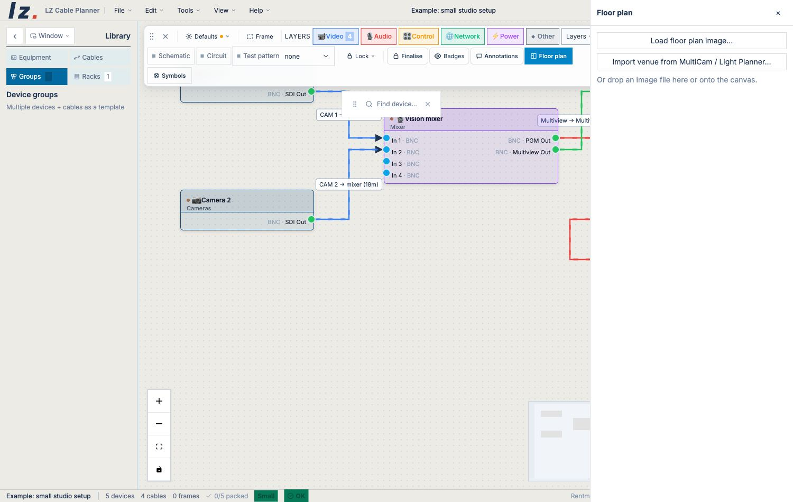

The **Floor plan** button shows or hides a floor plan beneath the canvas to display spatial positions.

**In the floor plan panel you can:**
- Upload a floor plan (JPG/PNG) or select from file library
- Adjust scale / calibration
- **Two-point calibration**: Mark two points on the plan and enter their real distance in metres
- **Four-corner calibration**: Map a floor plan rectangle to canvas coordinates

### Symbols (Electrical, Alarm, PA, IT, AV)

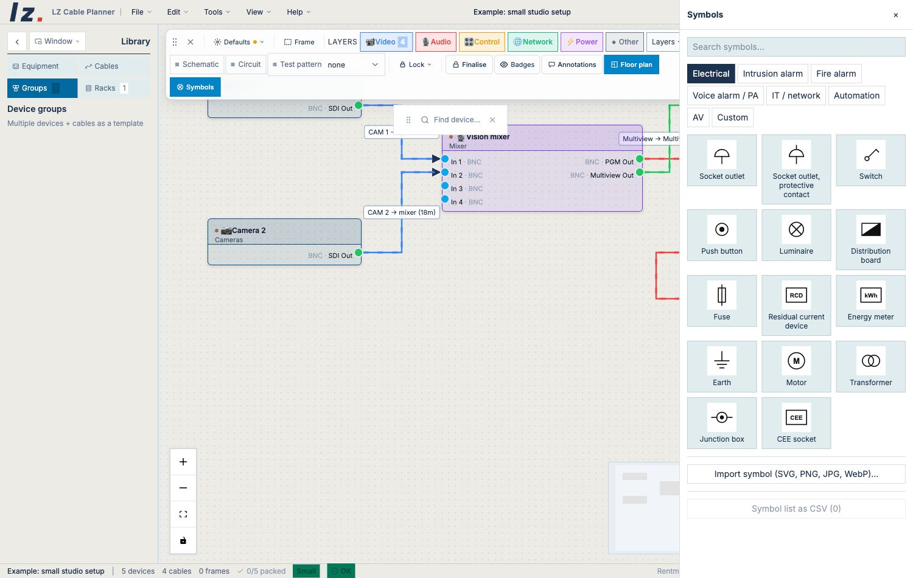

The **Symbols** button opens a panel with plan symbols:

- **Categories**: Electrical, Alarm, PA, IT, Automation, AV
- **Drag symbol**: Select a symbol and drag it onto the canvas
- **Import**: Upload external SVG symbols
- **AI generation**: Create new symbols using description
- **CSV import**: Import large symbol sets from file

### Room visibility (Rooms)

The **Rooms** ▾ button shows all rooms defined in the project. Click a room to see only equipment in that room. This is useful for larger projects with multiple rooms.

### 3D building view

The **3D** button opens a three-dimensional building view. Here you see the positions of all equipment spatially — useful for visualising cable routes and room layout.

Use the mouse to rotate and zoom the view.

### Show signal path

When equipment is selected, all cables that transport a signal to or from that equipment are highlighted. This quickly shows the complete signal flow.

### Equipment search (Ctrl+F / Cmd+F)

Press **Ctrl+F** (Windows/Linux) or **Cmd+F** (Mac) or click the magnifying glass. A search field appears above the canvas.

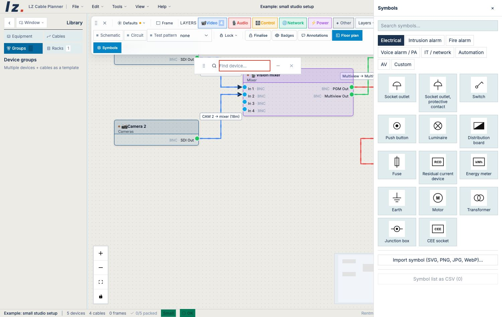

Type the name of equipment. Found equipment is highlighted and the canvas zooms in.

### Inline selection toolbar (Multiple selection)

When you select multiple pieces of equipment, a small toolbar appears above the selection with quick options:

- **Colour**: Changes the colour of all selected equipment
- **Delete**: Removes all selected equipment
- **More options**: Menu for all actions

### Lock

The **Lock** button combines three protection measures:

| Area | Effect |
|------|--------|
| **Lock frames** | Frames cannot be moved or deleted |
| **Lock equipment** | Equipment cannot be moved or deleted |
| **Lock cables** | Cables cannot be moved, changed or deleted |

The button label shows the number of active locks. If all three are active, the button is greyed out and shows "Lock: 3".

### Finalize (Plan lock)

The **Finalize** button on the right side of the toolbar locks the entire plan:


- **Editing** (default): You can make all changes
- **Finalised**: No moving, no new connections, no deletions. A confirmation dialog warns before changes
- **Viewer**: Read-only file (`.cpviewer`), cannot be edited

Clicking it toggles between Editing and Finalised. The plan remains in this state in the file.

### Annotations


**Badges** show/hide the coloured circle markers on the canvas without deleting annotations.

**Annotations** opens the annotations panel with a list of all markings. Here you can add notes, change colours and manage annotations.

In **Viewer mode** the annotations button is purple and shows "Viewer" to encourage reviewers to give feedback.

### Zoom and navigation


Bottom left of the canvas:

- **+** and **−** to zoom
- **1:1** to reset to original size
- **Fit** to make all equipment visible
- **Minimap** shows a bird's eye view, click on it to jump

You can also **zoom with the mouse wheel** or use the right mouse button (not on equipment!) to pan.

### 3D rack view

When you open a rack or call the rack builder from the canvas, a 3D view of all rack units is displayed. Here you can assign equipment to individual units and see the spatial arrangement.

The 3D view can be rotated and zoomed with the mouse.

### Cable details

Double-click on a cable or open its context menu to edit details:

- **Name/Label**: Description (appears on the cable)
- **Length**: In metres (used for cable planning and colour coding)
- **Type**: Port type (SDI, optical, audio, power, etc.)
- **Colour**: Cable colour (only for manual colouring)
- **Waypoints**: Bend points to control routing

### Stream preview

When you enable stream output of equipment, a small preview tile can be shown on the canvas (e.g. ATEM multiviewer or Videohub output). This displays the live signal.

### Canvas keyboard shortcuts

| Shortcut | Function |
|----------|----------|
| **Click** | Select equipment/cable |
| **Ctrl+Click** (Cmd+Click) | Add to selection |
| **Drag** | Move equipment or cable |
| **Right-click** | Context menu |
| **Ctrl+F** (Cmd+F) | Equipment search |
| **Ctrl+D** (Cmd+D) | Duplicate selection |
| **Delete** | Delete selection |
| **Ctrl+Z** (Cmd+Z) | Undo |
| **Ctrl+Y** (Cmd+Y) | Redo |
| **Mouse wheel** | Zoom |
| **Right button + Drag** | Pan canvas |

---

## 4. Library

The library panel on the left organizes device templates, cable types, device groups, and racks
for saving, loading, and reusing designs.

### Equipment

The equipment tab shows local templates and external sources.

#### Local Library


The local library contains 150+ built-in devices and all custom templates you create.

- *Search*: Search field with `Ctrl+F` shortcut. Filters by name or category in real time.
- *Filter Menu*: Sort order (Manual, A→Z, Z→A), show hidden devices, show only owned material.
- *Categories*: Expand/collapse, edit button to rename.
- *Entries*: One entry per device. Hover to show actions.

##### Create Your Own Device

Create new devices with ports and optional photos:

*Library → +* (green button) *→ New device…*


The fields:

- **Name**: What the device is called.
- **Category**: E.g., Cameras, Mixers, Monitors. Appears as a folder in the library. New categories are created here.
- **Is a rack device**: Checkbox. If yes, enter the height in rack units (RU).

###### Tab: Ports


Group ports together ("4x BNC In", "2x HDMI Out"):

- **+Input group** or **+Output group**: Add a new group.
- *For each group*:
  - *Direction*: Input or Output.
  - *Count*: How many ports of this type.
  - *Label*: E.g., "SDI In" or "Ethernet Out".
  - *Connector*: BNC, HDMI, DisplayPort, USB, Ethernet, XLR, Power, etc., or Custom.

Groups are expanded into individual ports when saved (e.g., "SDI In 1", "SDI In 2", …).

###### Tab: Photo


Automatically recognize ports from a device datasheet or photo:

- **Upload photos**: Drag-and-drop or button.
- **Recognize**: Detects connector type and count.
  - If multiple models match: shows the best match.
  - Results as a table with checkboxes (uncertain entries are unchecked).
- **Keep photos**: Checkbox — images are saved with the template.

Recognition requires an API key for the device library or AI (Settings → AI Providers).

###### Port Guessing

Guess ports from the device name:

*"Guess the ports from the device name"* — button **Fill in** (using source from Settings):
- **AI** (Claude API, OpenAI GPT, Google Gemini): Sends name and optional description to AI.
- **Web Search**: Searches public datasheets and manufacturer websites.
- **Heuristic**: Simple rules based on name (e.g., "ATEM 4 Pro": expects 4 inputs).

AI provider and API key are set in *Settings → AI Providers*.

###### Save

Bottom three buttons:

- **Place only**: Add device to canvas, don't save a template.
- **Save to library**: Save template only, no device on canvas.
- **Save and place**: Both.

#### Submit Templates

Contribute custom devices to the device library:

*Library → +* *→ Submit templates*


- Select which local templates to send.
- Enter manufacturer and model, optionally datasheet link.
- Template is uploaded and verified by other users (voting).

The device library is a community resource. Verified devices take precedence over local versions.

#### NetBox Import

Import network infrastructure from NetBox:

*Library → +* *→ Import file …* or via NetBox integration


- **Search field**: E.g., "Cisco Catalyst". Searches NetBox device types.
- **Choose category**: Where the imported template is filed.
- **Import**: Device is added to your local library.

#### Device Library

Public device database with 500+ verified templates:


- Load devices from the database (requires sign-in).
- See verification status: how many users have verified the device.
- Reconcile with local versions and merge if needed.

#### Rentman

Sync Rentman projects with device inventory (if Rentman module is active):


- **Linked Project**: Fetch the Rentman project.
- **Imported**: Which Rentman devices are already imported.
- **Catalog**: Browse more devices to import.
- **Reconcile**: Show differences between plan and Rentman project.

### Cables

Available cable types and their configurations:


- **Cable types** (SDI, HDMI, DisplayPort, Ethernet, Fiber, Audio/XLR, USB, Power, Custom):
  One group per cable type.
- *Per cable*:
  - Display name (e.g., "SDI 75 Ω" or "HDMI 2.1").
  - Connectors on both ends.
  - Maximum length (optional).
  - Signal standards.
  - **Installed** / **Planned**: Count of currently routed / planned cables in the design.

The cable library is predefined; custom types are "Custom".

#### Manage Cable Types

Define new cable types or edit existing ones:

*Library → Cables tab → "Manage cable types…"*


- New group: e.g., "Satellite" with custom connector pair and standards.
- Edit cable: name, length, color, signals, status (Recommended/Custom/Modified).

### Groups

Save multiple devices + cables together and reuse later:


*Creating a group*:

1. Arrange devices on the canvas and wire them together.
2. Select the devices + cables (multi-select on canvas).
3. *Canvas Toolbar → "Save as group"*.
4. Enter a name → group appears in the library.

*Using a saved group*:

- Drag from library onto canvas → all devices + cables are placed at that location.
- Saved with position data, so they land in the right place.

*Operations on groups*:

- **Rename** (pencil icon)
- **Export** → `.cpgroup` file
- **Delete**

### Racks

Save 2D rack layout: which devices, at what height, stacked:


#### Rack Builder

Edit an empty or existing rack:

*Library → Racks tab → "+" → New rack*


- **Rack name**: E.g., "Server Rack 1".
- **Rack height**: Total height in rack units (typically 42 RU).
- **Add devices**: Add from the list on the right.
- **Slot editor**: Each device gets a starting position (topmost free slot).
- **Stack devices**: Multiple devices in the same rack.

After saving:

- The rack becomes a template (like a group).
- Drag onto canvas → all devices in the rack are placed.
- In Canvas Toolbar: **Edit rack** opens the builder for an already-placed rack.

#### Export for the Warehouse

Export rack inventory for warehouse system:

*Library → Racks tab → "For the warehouse"*


Generates `rack-belegung.json` for your warehouse inventory system (e.g., Inventory Planner).

### Common Settings

**Port-guessing source** (automatic port recognition):
- *Settings → AI Providers* → choose OpenAI, Claude, or Google Gemini.
- Enter your API key.
- Heuristics (name analysis) run without a key.

**Manage categories**:
- New categories appear when you create or rename a device.
- Category names are bilingual (German + English).
- From the filter menu: **Expand all** / **Collapse all** toggles all categories at once.

**Search and filters**:
- Search field = real-time filtering by name or category.
- **Only owned**: Show only devices listed in your warehouse inventory.
- **Show hidden**: Devices you've collapsed from view.

---

## 5. Inspector

The Inspector is the right sidebar of the application. It displays properties of the currently selected object — a device, cable, frame, or library template. When nothing is selected, the Inspector shows the current state of the plan: photos that belong to the plan and quick orientation tips.


### Nothing Selected

When you have not selected any object on the canvas, the Inspector displays three things:

- **Hint**: A quick orientation — drag devices from the library onto the canvas, connect ports to create cables.
- **Plan photos**: The *Project photos* section contains all images you have attached to the plan without a target device. These belong to the plan as a whole, not to a single device.

### Device Properties

When you click a device on the canvas, the Inspector shows all properties of that device in collapsible and reorderable sections.

#### Structure and Reordering

The Inspector organizes device properties in approximately 30 expandable sections. Each section can:

- **Expand/collapse** by clicking the header. The state is remembered.
- **Reorder**: The ⠿ grip symbol on the left allows drag-and-drop to change the order. The new order is saved per device and applies to all devices of the same type (e.g., all cameras).


#### Filter Sections

At the top of the Inspector is a search field labeled *Search sections*. Enter a name or keyword:

- The filter searches in the **section ID** (e.g., `network-config`), the **title** (e.g., "Network"), and the **subtitle** (e.g., "3 in · 2 out").
- All sections that do not match are hidden.
- A matching section automatically expands.

#### Expand All / Collapse All

Next to the search field are two buttons:

- **All open** — expands all sections.
- **All close** — collapses all sections.

### Sections in Detail

#### Name and Note (top, not reorderable)

- **Name**: Unique identifier for the device (e.g., "ATEM 1", "Camera Main").
- **Note**: Free-text field for anything that does not fit another field (e.g., web UI, firmware version, location, owner).
- **Short name**: Automatically generated from the name (e.g., "ATEM" instead of "ATEM Constellation 8K"). Used in space-constrained contexts like port labels. You can override the auto-suggestion with your own word or reset it using the refresh button (↻).

#### Inputs & Outputs (top, default position)


Connectors are placed directly under name and note — at the top of the panel, since the entire application centers on cabling.

- **Inputs**: List of input connectors with type (e.g., SDI, HDMI, Fiber).
- **Outputs**: List of output connectors.
- Depending on the device, you can add, edit, or delete connectors.
- Each connector displays its name (e.g., "SDI 1") and its type.

#### Category

Select the device type (e.g., "Camera", "Mixer", "Monitor", "Inventory"). The category determines which other fields are visible in the Inspector (e.g., "Optics/Lens" appears only for cameras).

#### Photos

Upload images of the device. They are displayed in the gallery below the properties.

- **Add**: Click the plus icon or drag images directly into the field.
- **Delete**: Click the X icon on an image.

#### Device Kind Information

If the device has special support (e.g., ATEM, Videohub, GreenGo Intercom), this section shows a button to open a device information dialog or to export (e.g., ATEM patch export).

#### Catalog and Source

- **Catalog type**: The manufacturer and model number from the device library (e.g., "Blackmagic Design: ATEM Constellation 8K").
- **Source**: Shows where the port information comes from (e.g., from datasheet, manually entered, from Rentman).
- **Save to library**: Stores the device as a template for faster placement later.

#### Network and Access

- **IP address**: The network address of the device (e.g., `192.168.1.10`).
- **Username, password**: Login credentials for the device's web UI or API.
- These credentials are stored in the operating system credential store — not in the project file.

#### Streams and Playout Destinations

If the device sends live video feeds:

- **Stream URL**: The HTTP(S) or RTMP endpoint of the device.
- **Stream keys / Access credentials**: Securely stored in the credential store.

#### Optics and Lens Data (cameras only)


For cameras, this section displays:

- **Lens model**: E.g., "Canon CN7x7", "Fujinon HA22x7.6".
- **Focuser type**: Manual or motorized (e.g., "Canon R-FS").
- **Control method**: Serial control, ESP32 bridge, simulator (for testing).

#### Power Consumption and Circuit

- **Power consumption**: Typical power draw in watts (e.g., 150 W).
- **Circuit type**: Mains frequency and operating mode (e.g., "230 V AC, 16 A Cooler" or "12 V DC Battery").
- **Connection points**: A table shows which connectors go to which power rail (e.g., "Input 1 → Circuit A, Terminal 1").

#### Adapters

If the device requires adapters (e.g., XLR → BNC, male → female):

- List of available adapters.
- You can add adapters or import from a template.

#### DMX (for control devices)

For devices with DMX control:

- **DMX start channel**: The first occupied channel (e.g., 1, 65, etc.).
- **DMX device ID**: The universe and channel number.

#### House Cabling

Documents cabling routes within the device (e.g., from input to mixer core to output).

#### Format Profile

The input/output formats and codec profiles if the device supports multiple operating modes.

#### Dimensions

Width, height, and depth in millimeters. Used later for 3D rack visualization and space planning.

#### Network Configuration

Advanced network settings (if the device supports multiple network modes or VLANs).

#### Modes

If the device has different operating modes (e.g., "Recording", "Live streaming", "Simulator"), configure them here.

#### Rack Position

- **Rack position**: The RU (rack unit) and depth in a 19" rack.
- **Rack 3D view**: Shows a 3D visualization of devices in the rack.

#### Lifecycle

- **Installation status**: E.g., "Planned", "Installed", "Tested", "Live".
- **Test results**: Confirmation that the device works.
- **Maintenance schedule**: Maintenance dates and next check.

#### Print and Documentation

Generates patch sheets and documentation for printing (e.g., device overview, port lists).

#### Attachments

Upload datasheets, manuals, or other files.

### Cable Properties

Click a cable on the canvas to see its properties.


#### Connection (From/To)

- **From device and From port**: The source device and its port (e.g., "Camera 1 → SDI out").
- **To device and To port**: The destination device and its port (e.g., → "Mixer → SDI in 1").
- You can change these via dropdown lists.


#### Label and Color

- **Name**: A label for the cable (e.g., "Main Camera Feed").
- **Color**: Click the color field to change the display color.

#### Cable Type and Specification

- **Cable specification**: Select a standard cable type from the catalog (e.g., "Belden 1694A SDI", "Fiber Optic SM9/125").
- **Length**: The cable length in meters.
- **Custom cable**: If not in the catalog, you can enter the type as free text.


#### Routing

- **Orthogonal** (right-angle bend): The cable follows a right-angle path (default).
- **Diagonal**: The cable runs straight from source to destination.
- **Curved**: The cable displays a Bezier curve path.

#### Conductor Composition (for multi-conductor cables)

If the cable has multiple conductors (e.g., an audio multicable with 4 pairs):

- List of individual conductors with their functions (e.g., "Conductor 1: Audio L", "Conductor 2: Audio R").

#### Fiber Mode (Fiber Optic)

If the cable is fiber optic:

- **Mode**: Single-mode (SM) or multi-mode (MM).
- **Wavelength**: E.g., 1310 nm, 1550 nm.

#### House Cabling and Vertical Chase

- Documents whether the cable runs through a house distribution panel or vertical chase.
- Notes on installation route.

#### Lifecycle and Test Results

- **Status**: E.g., "Planned", "Installed", "Tested", "Live".
- **Test result**: Pass/Fail with date and technician.

### Frame Properties

Click a frame (LocationFrame) to see its properties.

#### Name

The name of the frame/room (e.g., "Studio A", "Server room", "Control").

#### Size

- **Width, Height** in pixels on the canvas (determines the visible size of the box).

#### Color

Click the color field to change the frame's display color.

#### Floor

- **Level**: Select from existing floors or create a new one.
- Floors can have an elevation (e.g., "3rd floor (18 m)").

#### Vertical Chase

A special frame through which multiple cable routes pass vertically (routing documentation).

### Multiple Selection

When you select multiple devices simultaneously (Ctrl+Click or drag selection), the Inspector shows properties that apply **to all** of them:

- **Category**: Only if all selected devices have the same category.
- **Common fields**: Fields whose values are the same for all selected devices.

This allows batch changes, such as giving multiple devices the same color or moving them to the same category all at once.

---

## 6. File and Import

The *File* menu is the central hub for project management: creating, opening, saving projects, import sources, export formats, and collaboration with external designs.

### New Project

*File → New project*

Creates a blank project and opens it in a new window. The previous project remains open in the background. The project has a default name and can be saved under a custom name later.

Keyboard: `Ctrl+N`

### New from Template

*File → New from template…*

Opens a dialog with all available templates. Project templates are predefined building blocks: room layouts, standard equipment configurations, or wiring patterns that serve as a foundation for new designs. The dialog displays templates grouped by topic; clicking a template creates the new project.


### Open

*File → Open…*

Opens an operating system file dialog. Files with extensions `.cableplan`, `.json`, or (when merging annotations) `.cpviewer` are read. The selected file is loaded into the active window.

Keyboard: `Ctrl+O`

### Save

*File → Save*

Saves the active project under its current name and path. If the project has never been saved, a "Save As" dialog opens. The file has the extension `.cableplan` and is a JSON document containing all project data: equipment, cables, settings, metadata.

Keyboard: `Ctrl+S`

Contents of `.cableplan` file:
- Project metadata (name, creator, modification date)
- All equipment and their positions
- All cables and their connections
- Categories and custom equipment templates
- Print settings and frame arrangements
- Photo attachments (if present; approximately 40 MB and larger becomes unwieldy for email distribution)

**Automatic Backup:** The app saves automatically on a regular basis and maintains a `.bak` file alongside the current project file. When the save icon rotates in the status bar, a backup copy is being written.

### Save As

*File → Save as…*

Saves the active project under a new name or in a different location. The original version remains unchanged; the new file is loaded as the active project.

Keyboard: `Ctrl+Shift+S`

### Import yEd / GraphML

*File → Import yEd / GraphML…*

Imports wiring designs from yEd (graph editor by y.Works) or any GraphML files. The dialog loads a `.graphml` file, analyzes it, and displays a preview with three tabs:

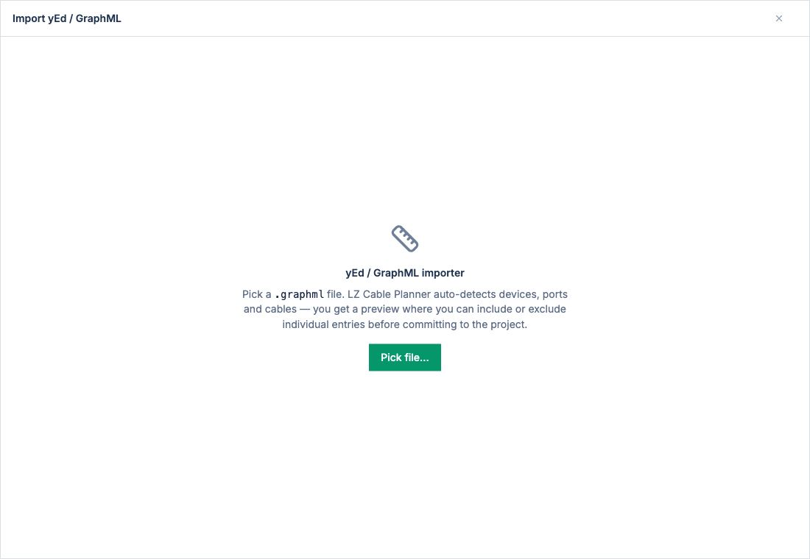

**Tab 1: Equipment** — Lists all detected nodes. The app attempts to match node names against the equipment library (HIGH = confidently identified, MED = possibly, LOW = gap). The columns are:

| Column | Function |
|---|---|
| ☐ (checkbox) | Checkbox for selecting/deselecting equipment. Checked: will be imported |
| Name | The node name from the yEd file; can be manually renamed |
| Category | The detected equipment category (e.g., Camera, Mixer); can be overridden |
| Confidence | Color-coded detection confidence (HIGH/MED/LOW) |

Functions:
- Click a single row to edit the name or category
- Select multiple rows; then bulk-assign a category via the dropdown at the top
- The green **Select all** button marks all equipment; **None** deselects all

**Tab 2: Cables** — Lists all detected connections (edges between nodes).

| Column | Function |
|---|---|
| ☐ (checkbox) | Checkbox for selecting/deselecting cables |
| From | Source equipment name |
| Port | Source port (or empty if not specified) |
| To | Destination equipment name |
| Port | Destination port (or empty) |

Functions:
- Each cable can be individually included or excluded
- Same bulk procedure as equipment (select multiple rows, then action)

**Tab 3: Skipped** — Shows all nodes or edges that cannot be imported (e.g., labels, structural nodes, unassigned categories). The list aids troubleshooting: what was omitted and why?

**Options:**
- **Append** (default) — Imported equipment and cables are added to the existing project
- **Replace** — The entire project is replaced with the import data

**Specifics:**
- Node positions from yEd are preserved (soft mapping to Cable Planner coordinates)
- Unknown categories are marked as "unclear" and can be manually corrected
- Connections without equipment assignment are shown as errors

### Import MultiCam Cameras

*File → Import MultiCam cameras…*

Imports camera definitions from a MultiCam camera list. The file is selected via an operating system file dialog. The format is text-based; the app checks the structure and adds recognized cameras to the equipment library.

The dialog does not open — instead, the file dialog is displayed directly (hidden `<input type="file"`). After file selection, the list is imported and a confirmation is shown.

### Import Equipment from CSV

*File → Import equipment from CSV…*

Imports equipment catalogs from a CSV file (Comma-Separated Values). The format is flexible: the header (Name, Category, Power, Serial Number, …) is recognized automatically. The dialog supports multilingual column names (DE/EN aliases).

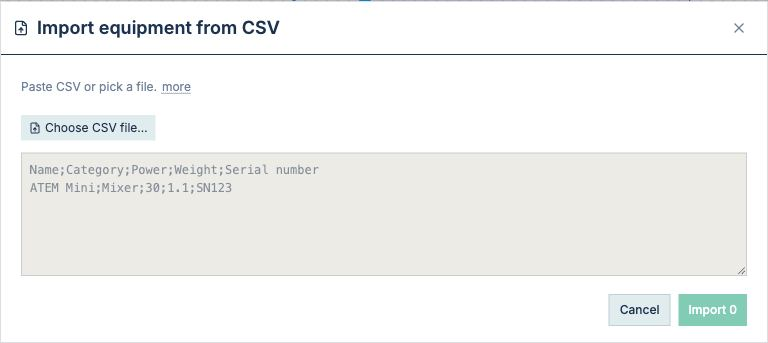

**Workflow:**

1. **Load file** — Click *Select CSV file…* opens the operating system file dialog
2. **Enter/edit CSV text** — The detected text is shown in the text area and can be manually edited
3. **Preview** — All detected columns and their contents are displayed below; known columns are highlighted in green
4. **Silent losses visible** — The app counts and displays:
   - Unknown columns (ignored on import)
   - Rows without names (skipped)
   - Duplicate names (only the first row is imported)
5. **Import** — The green *0 to import* button shows the count of new equipment; clicking it commits the import

**Column Aliases:**

| German | English | Function |
|---|---|---|
| Name | Name | Equipment name (required) |
| Kategorie | Category | Equipment category (e.g., Camera) |
| Leistung | Power | Power consumption in watts |
| Gewicht | Weight | Weight for load calculations |
| Seriennummer | Serial number | Unique equipment ID |

The app remembers the column mapping for subsequent CSV imports.

### Rentman Import

*File → Rentman import…* (only if Rentman integration is enabled)

Connects to the Rentman rental management system and loads equipment from the Rentman classification as an equipment library into LZ Cable Planner. The dialog goes through several steps:

**Steps in the Dialog:**

1. **Authentication** — Enter the Rentman API token (stored in the OS credential store)
2. **Project selection** — Lists all Rentman projects; the user selects one
3. **Category mapping** — Rentman equipment classes are mapped to Cable Planner categories
4. **Preview** — Shows all equipment to be imported
5. **Import** — Confirmation and execution

The integration is enabled in *Settings → Integrations*. The workflow is non-destructive: existing equipment is not overwritten.

### NetBox Import

*File → NetBox import…* (only if NetBox integration is enabled)

Loads a network infrastructure inventory image from NetBox (IPAM/DCIM system). The dialog is similar to the Rentman import: authentication, inventory selection, category mapping, preview, and import.

**Specifics:**
- NetBox device types are interpreted as categories
- Interface specifications (e.g., "SFP+") are retained as port names
- The integration is enabled in *Settings → Integrations*

### Export Whole Project

*File → Export whole project (.avplan)…*

Saves the project in `.avplan` format — a cross-platform exchange format for AV planning software. The format is transparent (JSON) and contains all project data plus metadata for external tools (e.g., av-control-center).

A click opens a Save dialog; the default filename is `<ProjectName>.avplan`.

### Import Whole Project

*File → Import whole project (.avplan)…*

Loads a previously exported `.avplan` project. The project is loaded in the active window.

A click opens an Open dialog; file types are `.avplan` and `.json`.

### Export Identity Map

*File → Export identity map (.avsourcemap)…*

The identity map is a lookup table between internal equipment IDs (as referenced in source systems — e.g., ATEM videohub — and equipment names in the Cable Planner design. The file serves for reconciliation with hardware or other software systems.

A click opens a Save dialog.

### Import Identity Map

*File → Import identity map (.avsourcemap)…*

Loads a previously exported identity map and applies the mappings to current equipment.

A click opens an Open dialog.

### View Linked Venue Plan

*File → View linked venue plan…*

If the project is linked to a venue planning project (e.g., from light-planner) via the `.avplan` format, this dialog can display the linked file. This function aids coordination between cable and venue planning.

### Project File Format: `.cableplan`

The project file is a JSON document with the structure:

```json
{
  "metadata": {
    "name": "My Project",
    "creator": "John Doe",
    "modified": "2026-09-28T10:00:00Z",
    "version": "8.1.0"
  },
  "equipment": [
    {"id": "...", "name": "Camera 1", "category": "Camera", "position": {...}},
    ...
  ],
  "cables": [
    {"id": "...", "from": "...", "to": "...", "type": "SDI"},
    ...
  ],
  "library": [...],
  "fotos": [...]
}
```

Size benchmarks:
- Small projects (< 50 equipment): 50–200 kB
- Medium projects (50–200 equipment): 200 kB–2 MB
- Large projects (> 200 equipment) + photos: > 5 MB

**Backup and Data Loss Prevention:**

- The app saves automatically every 30 seconds
- A `.bak` file sits beside the `.cableplan` (backup of the previous version)
- On crash, the automatic backup is restored on next startup
- Backup errors are indicated in the status bar with a warning icon

### Backup Status in the Status Bar

At the bottom right of the window, the **status bar** displays the backup status:

- **Normal icon (☑)** — Project is current, last save less than 5 seconds ago
- **Rotating icon (⟳)** — Backup copy is running
- **Warning icon (⚠)** — Backup failed (e.g., disk full, write error)

Failed backups are collected and displayed in Settings under *Error Log*.

The `.bak` file is written atomically: it is never left in a half-written state, and power failures during save destroy neither the current nor the old file.

---

## 7. Tools: Plan

Tool dialogs for capturing, analyzing, and planning a facility — from site survey through function groups to delivery.

### Calculate

Specialized calculators for capacity and resource planning.

#### Recording storage calculator

*Tools → Calculate recording storage…*


Calculates storage requirements for video recording based on codec, resolution, framerate, and duration.

- **Inputs**: Video format (HD/4K/8K), codec (DCI/H.265/ProRes/etc.), framerate (25/50/60 fps), recording duration.
- **Output**: Storage size in GB/TB.

#### Projection & display

*Tools → Projection & display…*


Calculates projection parameters for displays and projectors.

- **Inputs**: Display size (diagonal), resolution, distance to audience.
- **Output**: Optimal projection distance and lens parameters.

### Check

Analysis tools for validation and consistency checking of the plan.

#### Analyses

*Tools → Analyses (weight/network/redundancy)…*

A comprehensive analysis tool with 14 tabs for checking all aspects of the facility.

##### Tab: Weight & Heat


Total weight and heat load (BTU/h) per equipment group and overall.

- **Table**: Category, count, weight (kg), power (W), heat (BTU/h), optional value (€).
- **Missing**: Display of equipment without weight values.
- **Download**: CSV export for calculations.
- **Link**: Direct access to power consumption calculator (see below).

##### Tab: Network


Check IP addresses, VLANs, switch ports, and network topology.

- **Address plan**: IP conflicts and missing assignments.
- **VLAN counting**: Which VLANs and how many ports per VLAN.
- **Switch port allocation**: Which device ports at which switch ports.
- **Multicast**: Multicast addresses and groups.

##### Tab: Redundancy


Checks where only one signal or power circuit exists.

- **Connections**: How many independent power or upstream connections per device?
- **Findings**: Red flags for devices with single connections only.

##### Tab: RF / Wireless


Check wireless frequencies (microphones, headphones, cameras) and spectrum conflicts.

- **Frequency table**: All transmitters and receivers with frequency (MHz), bandwidth, power.
- **Conflicts**: Channels too close together (< 0.4 MHz spacing).
- **Spectrum scan**: Optional upload of spectrum measurement data for validation.

##### Tab: Cable Runs


Checks physical routing paths and cable lengths.

- **Findings**: Cables too long, invalid routing complexity.
- **Route details**: Per cable length, conductor count, diameter.

##### Tab: Signal Chain


Traces a signal through all layers — from source to output.

- **Entry**: Choose source and destination.
- **Chain**: Shows path through mixers, routers, players, etc.
- **Conflicts**: Broken or ambiguous paths.

##### Tab: Patch List


Tabular overview of all cable connections.

- **Columns**: Source device, source port → destination device, destination port, cable type, length.
- **Filter**: By device, cable type, or status (planned/installed).
- **Download**: CSV for patch list printouts.

##### Tab: Check Sheet


Verifies that all required device datasheets are attached.

- **Status**: Which devices have PDF datasheet links?
- **Findings**: Missing or outdated datasheets.

##### Tab: Client Summary


Summary for customer communication and project acceptance.

- **Project name, system**: Standard info.
- **Equipment list**: Short version for quotes.
- **Configuration**: Key parameters (cameras, inputs, outputs).

##### Tab: Costs: Plan vs. Actual


Deviations between planned and actual costs.

- **Input**: Quoted and actual prices per equipment line.
- **Variance**: Over-/under-budget, percentage.
- **Tolerance**: Threshold for deviation.

##### Tab: Crew: Hours & Expenses


Work plan: who, when, how long, material budget.

- **Positions**: Technicians, camera operators, audio, etc.
- **Hours**: Setup, operation, teardown.
- **Hourly rate**: Personnel cost calculation.
- **Expenses**: Travel, accommodation, rental equipment.

##### Tab: Naming Scheme


Consistent naming of devices, cables, and network ports.

- **Schema**: Choose from predefined rules (category + number, manufacturer + model, custom).
- **Application**: Which objects to update?
- **Preview**: Shows what new names will look like.

##### Tab: Dante Patch


Validation of Dante audio routing and device certification.

- **Patch matrix**: Transmitter → receiver assignment.
- **Line quality**: Latency, jitter, redundancy per line.
- **Device list**: Dante certification and firmware version.

##### Tab: To Do


Summary of all findings and tasks to complete.

- **Categories**: Weight, network, redundancy, RF, cables, costs, etc.
- **Priority**: Red (critical), yellow (warning), gray (info).
- **Actions**: What needs to be done to release the plan?

#### Plan check

*Tools → Plan check…*


Scans the entire plan for common errors and displays them structured.

- **Filter**: By finding type (error, warning, info) or device/cable.
- **Findings**: Incomplete connections, invalid combinations, missing metadata.
- **Automatic**: Runs in background when saving.

#### Plan vs. found

*Tools → Plan vs. found…*


Compares the planned layout with the captured as-found situation on site.

- **Load survey**: CSV/Excel with names and positions.
- **Matching**: Automatic alignment or manual assignment.
- **Differences**: What's planned but not present? What's on site but not in the plan?
- **Export**: Side-by-side comparison report.

### Plan

Tools for capturing, structuring, and detailing the facility.

#### Survey (capture existing)

*Tools → Survey (capture existing)…*


Documents physically present equipment and their location.

- **Equipment input**: Name, category, assumed location.
- **Room**: Storage location in facility, or free-standing.
- **Photo**: Snapshot of equipment (optional).
- **Notes**: Observations (condition, alternatives, blocked connectors).
- **Guess connectors**: Search device datasheet and fill in connector groups.

#### Drum micing

*Tools → Drum micing…*


Specialized dialog for placing microphones on drum kit components.

- **Drum kit sketch**: Kit with positions (kick, snare, hi-hat, toms, cymbals).
- **Mic slots**: Drag-and-drop mic types to positions.
- **Connectors**: Select devices (mixer, interface) and assign input connectors.
- **Notes**: Name and notes per mic (e.g., kick-outside, snare top).

#### Wireless / vocals (spectrum)

*Tools → Wireless / vocals…*


Plans radio frequencies for wireless microphones and headphones.

- **Bands**: 2.4 GHz, UHF (600–700 MHz), UHF (900 MHz), IR, SMD24.
- **Devices**: Transmitter and receiver models, some with programmable frequencies.
- **Frequency assignment**: Assign channels one-to-one, or automatically minimize conflicts.
- **Spectrum scan**: Upload measurement data (CSV) to validate against real environmental frequencies.

#### Rundown and camera assignments

*Tools → Rundown and camera assignments…*


Structures the timeline of an event and assigns camera tasks.

- **Import segments**: Read from TCS files or enter manually.
- **Cuts / scenes**: Per entry: name, duration, music timing.
- **Camera assignment**: Per camera position (camera 1, camera 2, …) which cut/shot to show?
- **Handover**: Creates instruction cards for camera crew (QR code or printout).

#### Delivery (streaming destinations)

*Tools → Delivery…*


Defines where video/audio is routed (YouTube Live, Zoom, recording, etc.).

- **Destinations**: YouTube Live, Facebook, Twitch, RTMPS server, local recording, multiview monitor.
- **Parameters**: Bitrate, codec, resolution, framerate.
- **Credentials**: API keys, stream URLs (securely stored, not in project file).
- **Monitoring**: Live status, Mbps usage, error rate.

#### LED wall

*Tools → LED wall…*


Plan space and power for LED surfaces.

- **Panel format**: Choose standard sizes or custom (e.g., 500×250 mm).
- **Resolution**: Pixels per meter (256, 312, 500 ppm).
- **Layout**: Width × height in panel units → total size in meters.
- **Weight & power**: Calculated from panel data.
- **Pixel map**: Export coordinates for media server (pixel mapping).

#### Faceplate editor

*Tools → Faceplate editor…*


Places connectors on flat surfaces (wall plate, patchfield, stage box) and prints 1:1 for drilling.

- **Plate**: Choose size and material (19" rack blank, wall plate, custom).
- **Connectors**: Drag-and-drop connector groups.
- **Positioning**: Millimeter-precise placement (grid-based).
- **Labeling**: Automatic from device names, or custom.
- **Print**: 1:1 to printer for hole drilling and label printing.

#### Report editor

*Tools → Report editor…*


Configures display of equipment and cable lists (print & export).

- **Columns**: Selection, order, width.
- **Grouping**: By category, room, status, or custom.
- **Sorting**: A→Z, by value, by date.
- **Filter**: Only devices of certain categories, rooms, or status.
- **Templates**: Save and recall preconfigured layouts.

#### Conductors and colour standards

*Tools → Conductors and colour standards…*


Defines wire colors for cables and connector markers per IEC or custom.

- **Standards**: IEC 60757 (International), EN 50575 (EU), custom.
- **Sets**: Predefined color sequences (e.g., brown/black/gray/white for 4×4 XLR).
- **Assignment**: Which standard for which cable types?
- **Preview**: Shows actual colors of current numbers.

#### Received show-control messages

*Tools → Received show-control messages…*


Shows a log of all show-control commands received by the app (OSC, MIDI, HTTP).

- **Input source**: IP:port, network interface.
- **Data flow**: Timestamp, command, parameters, status (processed/ignored).
- **Errors**: Invalid commands, parse errors.
- **Live view**: Real-time monitor during a show.

### Create & Manage

Tools for building and managing the facility.

#### Connect multiple cables

*Tools → Connect multiple cables…*


Connects many cables at once instead of clicking individually.

- **Table**: Source, source port, destination, destination port, cable type.
- **Paste**: Copy-paste from Excel or CSV.
- **Validation**: Checks for incompatibility (e.g., BNC to HDMI).
- **Apply**: Wire all rows at once.

#### Create new rack

*Tools → Create new rack…*


Creates a new rack container from device templates.

- **Name**: Label (e.g., "Server Rack 1").
- **Height**: Rack units (RU), usually 42 RU.
- **Template**: Optional from standard layouts or empty.
- **Position**: Where to place on canvas?

#### Rack builder

*Tools → Rack builder…*


Populates a rack with devices, arranges them, and visualizes in 3D.

- **Existing racks**: List of editable racks.
- **Device slots**: Height (RU) per device.
- **3D view**: Front view for checking cable lengths and obstructions.
- **Export**: Save rack structure or place on canvas.

#### Generate AI plan

*Tools → Generate AI plan…*


Generates initial plan draft based on text description (AI).

- **Input**: Brief description of facility (e.g., "3 cameras, ATEM mixer, 2 monitors, streaming to YouTube").
- **Options**: Preferred equipment types, budget limits.
- **Draft**: AI selects devices from library and wires them.
- **Adjust**: Edit generated plan.

Requires an AI API key (OpenAI, Google, Anthropic).

#### Revisions & snapshots

*Tools → Revisions & snapshots…*


Saves intermediate versions of a plan to track changes.

- **Snapshots**: Timestamp, optional note.
- **Autosave**: Automatic snapshots after major changes.
- **Comparison**: Two versions side-by-side, differences highlighted.
- **Restore**: Return to an earlier version.

### Device Configuration

Setup of specialized devices (if present).

#### ATEM multiviewer layout

*Tools → ATEM multiviewer layout…*

(Only if an ATEM mixer is present in the facility.)


Sets which sources appear in which multiviewer windows.

- **Layout**: How many windows and positions?
- **Assignment**: Source → window number.
- **Size & position**: Each window individually resizable (if supported by ATEM model).

#### ATEM audio routing

*Tools → ATEM audio routing…*

(Only if an ATEM mixer with audio inputs is present.)


Routes audio inputs (XLR, RCA, Dante) to mixer channel faders.

- **Inputs**: List all audio inputs of the ATEM.
- **Channels**: Which channel gets which input?
- **Sensitivity**: Level per input.

#### ATEM input labels

*Tools → ATEM input labels…*

(Only if an ATEM mixer is present.)


Names the input sources on the ATEM mixer (name on control surface).

- **Inputs**: List all ATEM inputs (1–20+).
- **Names**: Custom name per input (e.g., "Camera 1", "Graphics").
- **Color**: Optional marker color assignment.

---

## 8. Tools

The *Tools* menu contains specialised tasks for planning and building systems: connecting cables, building racks, configuring LED walls, exporting schematics and controlling devices such as ATEM switchers and Videohub.

### Patch list

*Tools → Patch list…*


Shows all connections of the plan as a table — one row per cable, sorted for the patching order on site.

**Columns:** No., From device, Port, To device, Port, Type, Length (m), Colour.

**Layer filter:** The dropdown at the top selects which layer is shown (e.g. video only). The field shows how many cables are visible in total.

**Search field:** Filters by device, port, type or colour — the search runs as you type.

**Export options:**
- **Export CSV:** Comma-separated file for spreadsheets.
- **Export XLSX:** Excel format.
- **Labels + QR (PDF):** Print template for labelling. If you pick a label type (Generic, Brother P-touch, Dymo), the matching export file is offered as well.

### Patching order
Cables are sorted by their position on the set — sources first (top), then targets (bottom). This lets you print the patch list at the desk and work through it line by line.

---

### LED wall

*Tools → LED wall…*

Defines panels, resolution, weight and power of an LED wall and generates the pixel map for the media server.

**Fields:**
- **Panel type:** Manufacturer and model (e.g. Barco E22 Full HD, Unilumin LED panel).
- **Resolution:** Width × height in pixels.
- **Panel size:** Physical dimensions in mm (taken from the datasheet).
- **Number of panels:** Horizontal × vertical (calculates total weight and power).
- **Brightness:** Nits (relevant for planning the cooling).
- **Viewing angle:** Horizontal and vertical, in degrees.

**Pixel map:** After saving you can export the pixel map as CSV or JSON — for the media server configuration (vPro, Notch, …).

---

### Faceplate editor

*Tools → Faceplate editor…*

Places connectors on a faceplate (wall panel, stage box) on a millimetre grid and prints 1:1 strips to attach or to use for milling.

**Workflow:**
1. Choose the equipment (e.g. a wall plate).
2. Place connectors by drag & drop or by entering (X, Y) coordinates.
3. Define labels, zones and colour codes.
4. Print the strip at full size — to stick on, as a milling template or for checking on site.

**Tabs/functions:**
- **Layout:** Overview and placement of the connectors.
- **Labelling:** Labels and legend.
- **Print:** 1:1 print preview, paper size, margins.

---

### Report editor

*Tools → Report editor…*

Adjusts every exportable list (cable BOM, equipment, inventory): show or hide columns, grouping, sorting, filters, and save as a template for later exports.

**Tabs:**
- **Columns:** Turn columns on or off — the list is exported or printed with the selected columns.
- **Group:** Group by a field (e.g. by device type).
- **Sort:** Primary and secondary sort order.
- **Filter:** Show only rows that meet a condition (e.g. only cables > 50 m).

After saving, the template is kept — the next cable export uses these settings.

---

### Conductors and colour standards

*Tools → Conductors and colour standards…*

Shows pin assignments and colour codes for all supported connectors (XLR, HDMI, DB25, DMX, …) — for reference, for soldering cables and for documentation.

**Structure:**
- **Select connector:** Dropdown with all types (RCA, XLR, BNC, jack, Speakon, …).
- **Pinout:** Graphic or table with contact number, name, colour and function.
- **Standard:** For information (e.g. IEC 60268-12 for XLR audio).

Use this tool when soldering cables or to avoid mix-ups during maintenance.

---

### Received show-control messages

*Tools → Received show-control messages…*

Logs all OSC, MIDI and other show-control messages the planner app has received (from a cue system, a camera remote, etc.). It is a read-out, not a system configuration — it shows what arrived but does not store it.

**Columns:** Time, command, source, parameters, status.

**Use:** For testing integrations or for following remote-control actions while recording a rehearsal.

---

### Connect multiple cables

*Tools → Connect multiple cables…*

Creates N cables at once — source port i → target port i. Occupied target ports are skipped.


**Fields:**
- **SOURCE:** Device and side (Outputs/Inputs) + start port number.
- **TARGET:** Device and side (Inputs/Outputs) + start port number.
- **Cable count:** How many connections are created.
- **Cable type:** From a dropdown (XLR Audio, SDI 3G, HDMI, Dante, DMX, Power, …).
- **Length per cable (m):** Applied to all cables (can be changed individually later).

**Preview:** Shows which cables will be created before you confirm. Occupied targets are skipped — "Create 0 cables" means all target ports are already in use.

---

### Create new rack

*Tools → Create new rack…*

Starts a wizard for building a new rack or shelving unit. You define:

1. **Rack type:** 19" standard, floor-plan field or free-standing (e.g. standing shelf).
2. **Size:** Height in RU, depth in mm.
3. **Material & colour:** Housing, side panel.
4. **Position in the plan:** Room and coordinates.

The new rack is inserted into the plan and can be filled with equipment right away.

---

### Rack builder

*Tools → Rack builder…*

Populates and edits racks — places devices in the housing, defines cable routes and exports STL/3D models for visualisation or milling.


**Workflow:**
1. Select a rack from the plan (or create one via "Create new rack").
2. Drag devices from the equipment library into free RU positions.
3. Connect rear sides (A/B) and define cable routes.
4. Save — the 3D model is updated.

**Tabs:**
- **Overview:** Rack with installed devices (front and rear selectable).
- **3D view:** Perspective model for visualising cable routes and space requirements.
- **Cable routes:** List of connections in the rack with lengths and routes.
- **Export:** STL for 3D printing, PDF for technical drawings.

---

### Generate AI plan

*Tools → Generate AI plan…*

Generates a draft cable project from a text description — e.g. "Live concert, 3 cameras, ATEM 2 M/E, multiviewer, audio on Dante". The AI creates devices, connections and floor plan based on standard templates.


**Requirement:** An API key for an AI provider (OpenAI, Anthropic, …) stored under Settings → AI.

**Workflow:**
1. Describe the system in plain text.
2. Click "Generate".
3. A preview is shown.
4. Confirm to insert it into the plan.

The result is a first draft — not a complete plan. You add devices, change connections and check against reality as usual.

---

### Revisions & snapshots

*Tools → Revisions & snapshots…*

Saves snapshots of the plan — to document as-built states, to compare with earlier versions or for archiving.


**Workflow:**
1. Enter a name (e.g. "As-built", "Technical acceptance").
2. Click "Commit" — a complete snapshot is saved.
3. Revisions cannot be changed — you cannot edit them later.
4. To restore: select a revision and click "Restore".

**Difference from undo:** Revisions are milestones kept on purpose. Undo is a temporary buffer for the current working session.

**Tabs:**
- **Snapshots:** List of all revisions with date, user and description.
- **Compare:** Shows the differences between two revisions (new devices, changed cables, …).

---

### Inventory / stock

*Tools → Inventory / stock…* (only with the rental module enabled)

Manages stock — available devices, consumables, damaged items — if your company rents out or stores equipment.

**Tabs:**
- **Stock:** Current quantity of each device (available, rented out, maintenance).
- **Transactions:** Incoming and outgoing items with date and reason.
- **Availability:** Shows whether all devices of the plan are in stock (to make them available or to reorder).

This tool is optional and is enabled by a module that you switch on under Settings → Modules.

---

### ATEM multiviewer layout

*Tools → ATEM multiviewer layout…* (only if an ATEM switcher is in the plan)

Configures which sources are shown on the multiviewer — position, size and extras (e.g. audio meters).

**Prerequisite:** The plan must contain a Blackmagic ATEM switcher. The tool shows its current multiviewer state and lets you change it — tabs, layouts, inputs.

**Use:** To see how the operator sees the sources, and to export the configuration to the switcher script.

---

### ATEM audio routing

*Tools → ATEM audio routing…* (only if an ATEM switcher is in the plan)

Defines audio inputs, mixing and outputs of the ATEM switcher — which Dante input goes to which channels, mic input gain, which master output goes where.

**Structure:**
- **Inputs:** Dante, AES/EBU, microphone with gain.
- **Mixing:** Channel mute, fader, pan.
- **Outputs:** Monitor, multiviewer, codec, etc.

This tool exports an ATEM configuration script that the operator can load on the switcher — if the hardware supports this.

---

### ATEM input labels

*Tools → ATEM input labels…* (only if an ATEM switcher is in the plan)

Labels the inputs of the ATEM switcher — name, display options, extras (e.g. show only the backup feed).

**Procedure:**
1. Assign each ATEM input to a device (e.g. input 3 ← "Camera 1 HD").
2. Enter a display name (max. 20 characters for the ATEM display).
3. Choose options (colour, symbols, …).

The labels are included in the ATEM configuration on export.

---

### Videohub routing / labels

*Tools → Videohub routing / labels…* (only if a Blackmagic Videohub is in the plan)

Configures the Videohub — input and output configuration, routing, labels.

**Tabs:**
- **Routing:** Shows all crosspoints (input X → output Y).
- **Labels:** Labels inputs and outputs.
- **Backup:** Options for reconfiguration under load.

This tool exports a configuration in the Videohub export format (CSV/JSON) that is uploaded to the device — e.g. after a change on site.

---

### GreenGo intercom

*Tools → GreenGo intercom…* (only if a GreenGo system is in the plan)

Shows the intercom configuration of the GreenGo headset system — channels, matrix, priority, routing. It is a display-only tool — changes have to be made in the GreenGo network configuration.

**View:**
- **Channels:** Name, network addresses, group membership.
- **Headsets:** Assigned channels per ear.
- **Paging & gates:** Talk groups with priorities.

Use this tool for documentation and to check that the routing logic matches the cable project.

---

### Notes

- Many of these tools (ATEM, Videohub, GreenGo, LED wall) only appear in the menu if the corresponding devices are in the current plan. Empty menu entries are intentional — there is nothing to configure in this plan.
- All exports (PDF, CSV, STL, JSON) use the project file name to avoid mix-ups.
- Some tools save templates (e.g. report editor, rack templates) — these are kept across projects.

---

## 9. Export & Print

The export section is the hub for all outputs: plans as PDF/image, patch lists, bill of materials, cloud storage and specialized documentation for fixed installations. Every sheet leaving the plan originates here.

### Patch List

*File → Tools → Patch list…*


Table of all cables in the plan — one row per cable showing source and destination equipment, port, cable type, length and color. Built specifically for the technician in the field laying individual cables, not for plan abstractions like bills of materials.

**Columns:**
- **Number**: Cable number (empty if unassigned)
- **Source** → **Destination**: Equipment name and port
- **Type**, **Length**: Cable specification
- **Color**: Cable marking
- **Multicore**: Bundle name (if part of a snake)
- **Fiber**: For optical cables, fiber number and role (TX/RX)
- **Layer**: Video, Audio, Control, Network, Power, Other

**Filter & Sort:**
- Filter by layer (e.g. show only video cables)
- Sort by source equipment, destination equipment, cable type, length or color
- Free-text search across all columns

**Export Formats:**
- **CSV**: Tabular, for editing in Excel or as print template
- **Label format**: CSV for label printer software (Generic, Brother, Dymo); includes source port, destination port and cable length in the format your printer software expects
- **PDF labels + QR**: Small stickers per cable with QR code (for tracking) and printed details; A4 or roll format
- **PDF patch list**: The table as printable PDF — one page per device showing its cable assignments

### Fixed Installation: Docs & Handover

*File → Tools → Fixed installation: docs & handover…*

Documentation hub for installers and operators. Each tab produces a standalone CSV or PDF output document for one aspect of the fixed installation.

The tabs:

**Overview** — Installation preparation checklist:
- Installer lists: pull list (who takes what), termination list (where connectors are terminated), schedule (order of work steps), cable BOM (type+length aggregated)
- Operator asset register: equipment inventory with serial numbers and storage location
- Change log: who changed what when; can be cleared

**Handover package** — Markdown manifest of all documents with version and QR for tracking:
- Automatically includes all sheets: installer lists, technical docs, signal paths, …
- Each sheet bears its stamp (revision + date)

**QR & Asset IDs** — Equipment marking:
- Auto-assign numbers for equipment and cables (if not yet done)
- Generate QR label PDF for sticking on

**Editor ID** — Name of installer/technician (appears in every log entry as author)

### Stage Plot

*File → Tools → Stage plot (SVG)…*

Bird's-eye view of the plan as **SVG** (vector graphic): equipment only, no cables, overhead view of stage/venue. Perfect for printing or technical drawings.

### Export & Print

*File → Export & Print…*


Central export dialog with seven tabs covering all output formats. All actions are non-destructive — no changes to the plan itself.

#### Tab: Plan

Export the canvas plan as **PDF, PNG, JPEG, SVG or DXF**.

**PDF (Raster):**
- Classic raster PDF (JPEG snapshot of the plan)
- With title block: project name, revision, change fingerprint, QR code
- Print-ready, text blurs at high zoom

**PDF (Vector, Beta):**
- Chromium printToPDF — text remains selectable and sharp at any zoom
- Smaller file size
- **No title block** — revision, fingerprint and QR appear only in the raster PDF

**PNG, JPEG:**
- Bitmap formats for email, Slack, websites
- PNG: transparency possible, sharp for small areas
- JPEG: compressed, smaller files

**SVG:**
- Vector graphic for web and further editing; all elements remain selectable

**DXF:**
- CAD format for plotters and desktop planning
- Equipment, cables and text on separate layers

**Options:**

- **PDF theme**: Dark (like canvas) or Light (recommended for printing)
- **Monochrome-safe**: Print layer text on every cable instead of colors — for black-and-white printers where video cables would otherwise be indistinguishable from audio cables
- **Render mode** (vector PDF only):
  - Raster (Classic): JPEG snapshot, reliable, but text blurs at zoom
  - Vector: Chromium printToPDF, sharp text, smaller file, but no title block
- **Page size** (vector PDF only): Auto (A0-compat), A4–A0+, Original (full canvas size for plotter)
- **Layers**: Which cable types (Video, Audio, Control, Network, Power, Other) are included in the PDF; selection is synchronized with the canvas view

#### Tab: Patch Sheets

For each selected equipment, a port-usage list — perfect for sticking on the device.

- **Select equipment**: Check box next to each device or "Select all"
- **Choose format**: A4 or A3 (prompted after click)
- **Action**:
  - "Download PDF": all selected devices into one PDF
  - "Print": direct to OS printer
  - "Label CSV": compact table as CSV (one row per device instead of full page)

#### Tab: Cable Bill of Materials (BOM)

All cables aggregated by type and length — for ordering.

- **Table**: Cable type + length, quantity, Rentman planning (editable)
- **Export**:
  - CSV: for Excel editing
  - PDF: print-ready with Rentman column
- **Rentman integration**: If device library is linked to Rentman, output quantities and prices can be pulled directly

#### Tab: Equipment Bill of Materials

What equipment the plan needs — covered by inventory (stock)?

- **Three states per equipment**:
  - Green (Covered): Equipment is known in stock (via catalog identity)
  - Orange (PROPOSAL): Name match — only the guess that it's the right equipment; awaits confirmation
  - Red (Not in stock): Equipment not in inventory
- **Pick list**: only the green equipment, sorted by storage location — the list a technician takes when packing

#### Tab: Racks & Groups

Export stored racks and groups individually as PDF.

- List of all racks and groups in the plan
- **Per rack**: one patch sheet per contained equipment, showing internal cabling
- Action: "Download PDF" or "Print"

#### Tab: Tally Map

The chain: role (show position) → equipment (e.g. camera) → mixer input → UMD address (character overlay on multiviewer).

Derived from the plan and verified. Ideal for reading through or configuring tally-pi hardware.

- **CSV**: for human reading
- **JSON**: for tally-pi configuration
  - (Note: GPIO pins for physical lamps belong to hardware, not the plan)

#### Tab: Document Bundle

Multiple sheets as one print-ready stack: one page per sheet, column headers on each follow-up page, color and format selectable.

- **Select sheets**: Check boxes next to each sheet
- **Format**: A4, A3, A2, A1, A0
- **Color mode**: Color or black-and-white (each entry remains readable)
- **Action**: "Print" or "Download PDF"
- Each sheet bears its stamp (revision + date) — later a technician can hold a stack of stamped sheets against the current plan and verify whether everything is still current.

### Cloud & Share Link

*File → Cloud & share link…*


Save plan to cloud (optional), manage revisions, generate a read link for opening on another device.

**Prerequisite:** Sign in to device library (under *Settings → Device library*).

**Features:**

- **Save now**: Current plan is uploaded as new revision to cloud
- **Revisions**: List of all previous versions (with change fingerprint + storage time)
  - A revision can be restored (becomes the newest)
  - Download: save revision as .cp file locally
- **Share links**: External viewers open the plan in the web viewer (read-only) without signing in
  - Create link: enter recipient's email
  - Copy link (for email, Slack, documentation)
  - Delete link (revoke access)
  - Set expiry date (optional)
- **Other cloud projects**: Browse existing cloud projects, open, download or delete from cloud

**Privacy:**
- As long as nobody clicks "Save now", the plan stays local.
- The server checks sign-in — the file identity is device-specific, not file-specific.

### Export as Viewer File

*File → Export as viewer file…*

Export plan to **`.cpviewer` format**. External reviewers (freelancers, other teams) can later open the plan in the web viewer, annotate and mail the file back.

(Action: direct download; no dialog)

### Import Annotations

*File → Import annotations from viewer file…*

Open a `.cpviewer` file with annotations from a reviewer and merge the marks / comments into the current plan. Enables a feedback workflow without direct cloud connection.

(Action: file dialog; no upload to server)

### Compare Plan Revisions

*File → Compare plan revisions…*

Hold two `.cp` files against each other — e.g. current version versus version from yesterday to discover changes.

- Equipment added/removed
- Cable added/removed/rerouted
- Port rename
- etc.

Differences are highlighted visually, details in a table.

### Documents Handed Out

*File → Documents handed out…*

Register of all sheets exported from this plan so far. Why? So a technician can take an old printout to the construction site tomorrow and check whether it's still current — or whether the plan has changed since then.

**Columns:**
- **Timestamp**: When it was handed out
- **Sheet**: Which sheet (patch list, plan PDF, BOM, …)
- **Change fingerprint**: Unique identifier of the plan state when handed out
- **Revision** (if cloud): Revision number when uploaded to cloud
- **Editor**: Who handed it out (from settings)

The register is part of the project and saved with it.

---

© 2026 Lars Zumpe Media Production · free to use, proprietary license

---

## 10. Settings

The Settings dialog contains 15 tabs for configuring all aspects of the application. Open the dialog via the command palette (*Ctrl+K*, then type "Settings…") or through the menu.

### Project

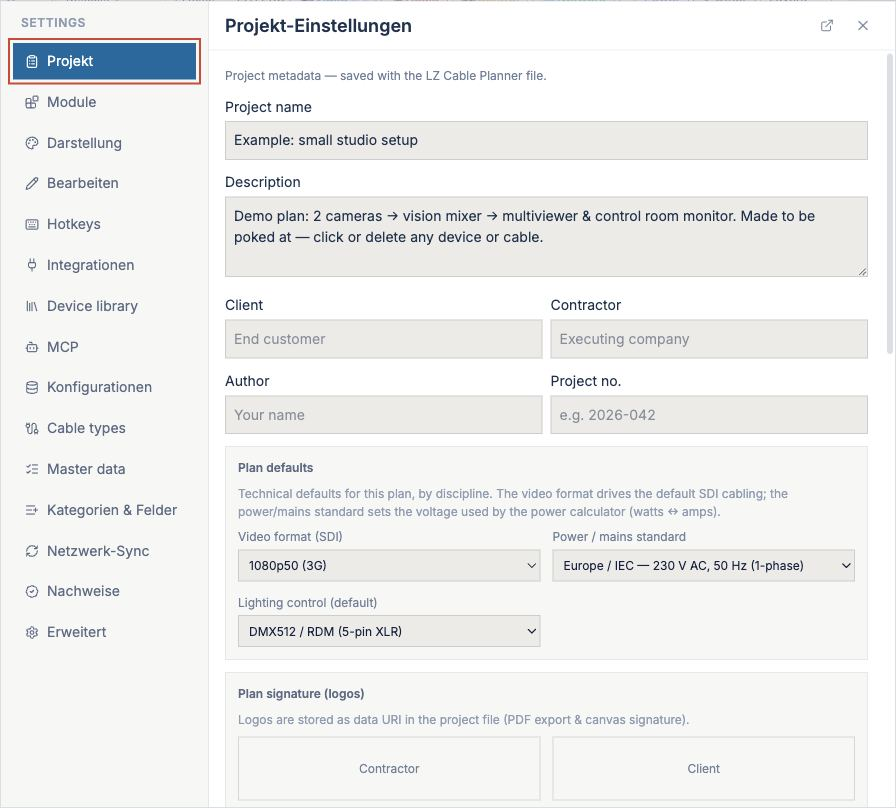

Configure project-specific settings:

#### Library Export / Import

Save your own device templates and groups as a JSON file. On import, existing entries with the same name are NOT overwritten (merge-by-name).

| Option | Effect |
|--------|--------|
| **Export library** | Saves all device templates, groups, and rack presets as a JSON file |
| **Import library…** | Loads a previously exported file. Only new entries are added |

#### Cable Numbering

Automatic, collision-free cable IDs from a fixed scheme. Numbers are displayed on the canvas, in the patch list, and on labels.

| Option | Effect |
|--------|--------|
| **Auto-assign a number to new cables** | Automatically assigns the next number to new cables |
| **Prefix** | Characters before the number (e.g., "C") |
| **Separator** | Character between prefix and number (e.g., "-") |
| **Digits** | Number of places for the number (1-6) |
| **Start number** | First number in the scheme |
| **Separate counter per layer (V/A/N/P…)** | Numbers are counted per signal type instead of continuously |
| **Renumber all cables** | Applies the current scheme to all existing cables |

Example: With prefix "C", separator "-", and 3 digits: "C-001", "C-002", etc.

#### Estimate Cable Lengths

Estimates cable lengths from the on-canvas distance between devices (straight line × scale + slack). Overwrites existing lengths.

| Option | Effect |
|--------|--------|
| **Metres per 100 px** | Scaling factor (e.g., 2 = 2 m per 100 screen pixels) |
| **Slack factor** | Additional length for safety (1.2 = 20% margin) |
| **Estimate all cable lengths** | Calculates lengths for all existing cables |

### Appearance

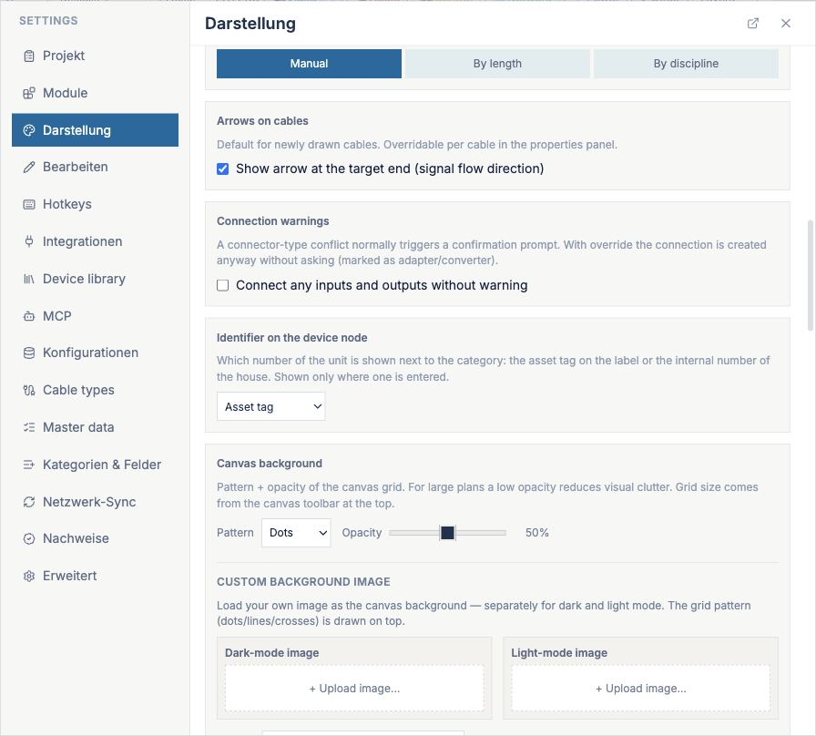

Configure the visual appearance:

#### Language and Theme

| Option | Effect |
|--------|--------|
| **Language** | Choose between German, English, and other supported languages |
| **Canvas theme** | Light or dark for the work area |

#### Port Colors

| Option | Effect |
|--------|--------|
| **Color ports by type** | Colors SDI, audio, power, etc. differently |
| **Colors for connector types** | Choose individual colors for each type |
| **Colors for device categories** | Choose colors for cameras, mixers, monitors, etc. |

#### Cable Display

| Option | Effect |
|--------|--------|
| **Cable colors** | Manual, by length, or by layer (V/A/N/P) |
| **Show arrows** | Small arrows indicate signal direction |
| **Cable bumps** | Humps at crossing points for visual clarity |
| **Port label size** | Size of port labels |

#### Custom Palette

Colors for canvas background and grid lines (overrides theme defaults):

| Option | Effect |
|--------|--------|
| **Enable custom palette** | Use custom colors |
| **Background** | Canvas background color |
| **Grid stroke** | Color of grid lines |

### Editing

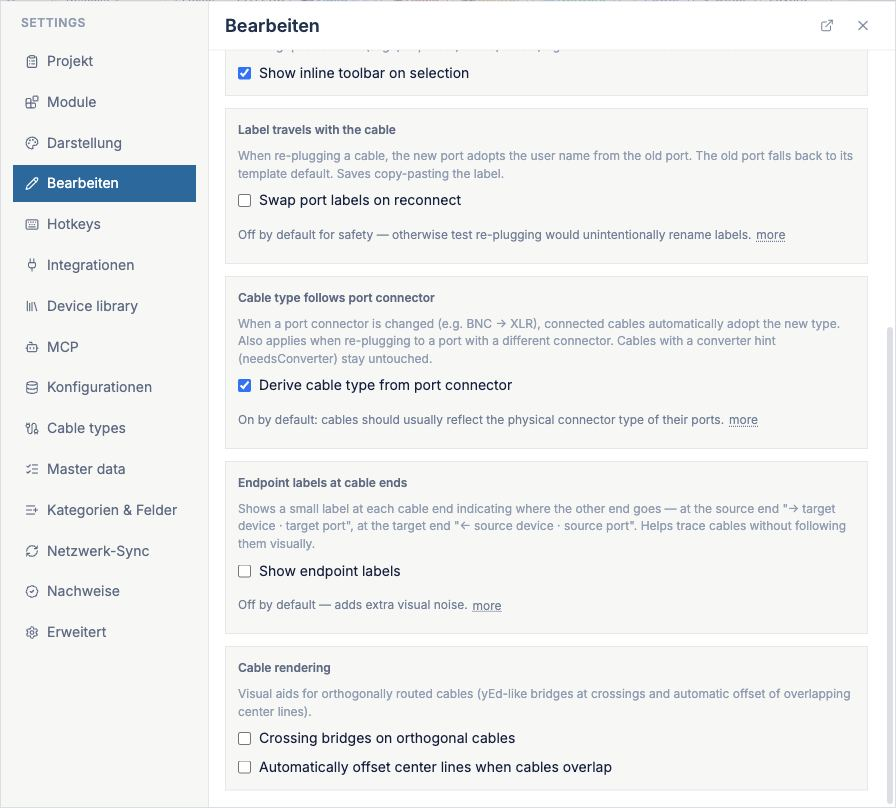

Standard behaviors when editing cables and devices:

#### Default Cable Routing

| Option | Effect |
|--------|--------|
| **Orthogonal** | Right-angled, grid-like cables |
| **Straight** | Direct lines |
| **Curved** | Smooth curves |

#### Endpoint Labels

Small labels at each cable end showing where the other end leads.

| Option | Effect |
|--------|--------|
| **Show endpoint labels** | At source end "→ target device · target port", at target end "← source device · source port" |

#### Cable Type Follows Port Connector

| Option | Effect |
|--------|--------|
| **Derive cable type from port connector** | When a port connector type changes (e.g., BNC → XLR), connected cables automatically adapt |

#### Grid

| Option | Effect |
|--------|--------|
| **Grid spacing** | Size of the snap grid in pixels |
| **Snap to grid** | Devices snap to the grid when moved |

#### Connection Warnings

| Option | Effect |
|--------|--------|
| **Show warnings for invalid connections** | Displays warnings when incompatible devices are connected |

### Cable Types

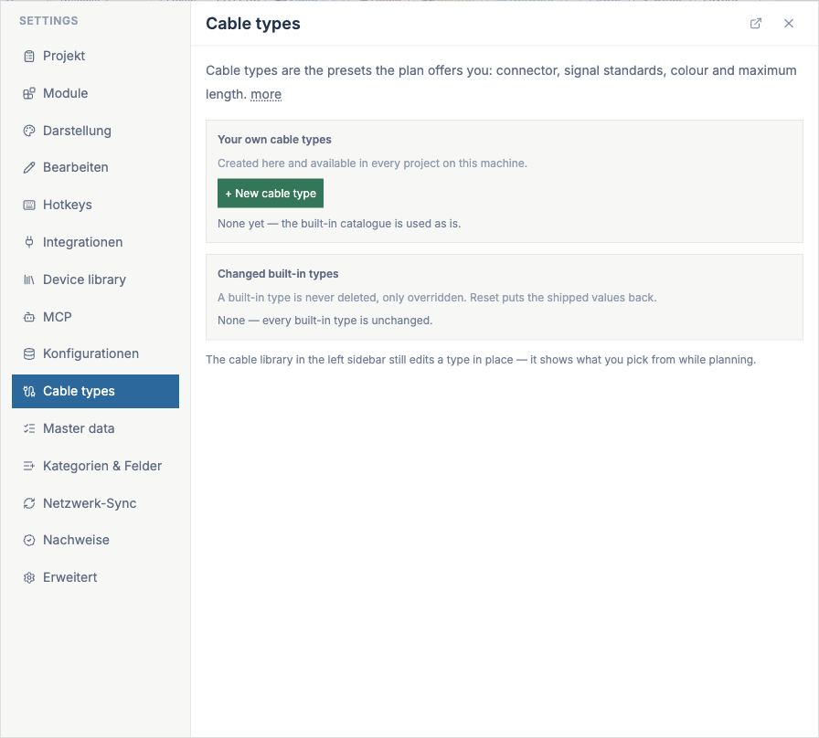

Define and manage cable types:

| Option | Effect |
|--------|--------|
| **New cable type** | Creates a new cable type |
| **Edit cable type** | Changes name, color, or standard length |
| **Delete cable type** | Removes an unused cable type |

Each cable type has:
- A unique name (e.g., "SDI Cable")
- A color for canvas display
- Optional: standard length and description

### Master Data

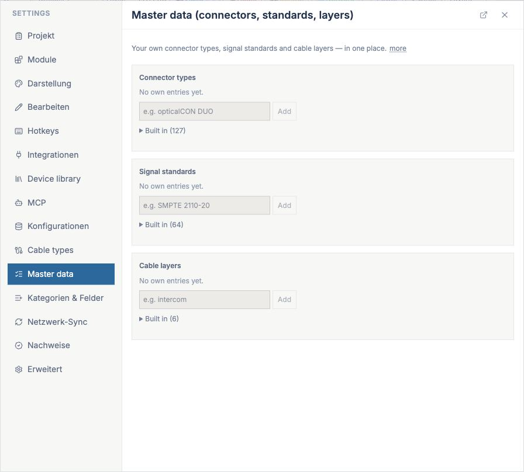

Management of connector types, standards, and layers:

#### Connector Types

| Option | Effect |
|--------|--------|
| **New connector type** | Creates a new connector type (e.g., 3G-SDI, MADI) |
| **Edit connector type** | Changes the name or display name |

#### Standards

| Option | Effect |
|--------|--------|
| **Video standard** | PAL, NTSC, SDI, HDMI, etc. |
| **Power standard** | IEC, USA, EU, etc. |

#### Layers

Signal types for color coding:

| Option | Effect |
|--------|--------|
| **Video (V)** | Video streams |
| **Audio (A)** | Audio streams |
| **Network (N)** | Data connections |
| **Power (P)** | Power supply |

### Configurations

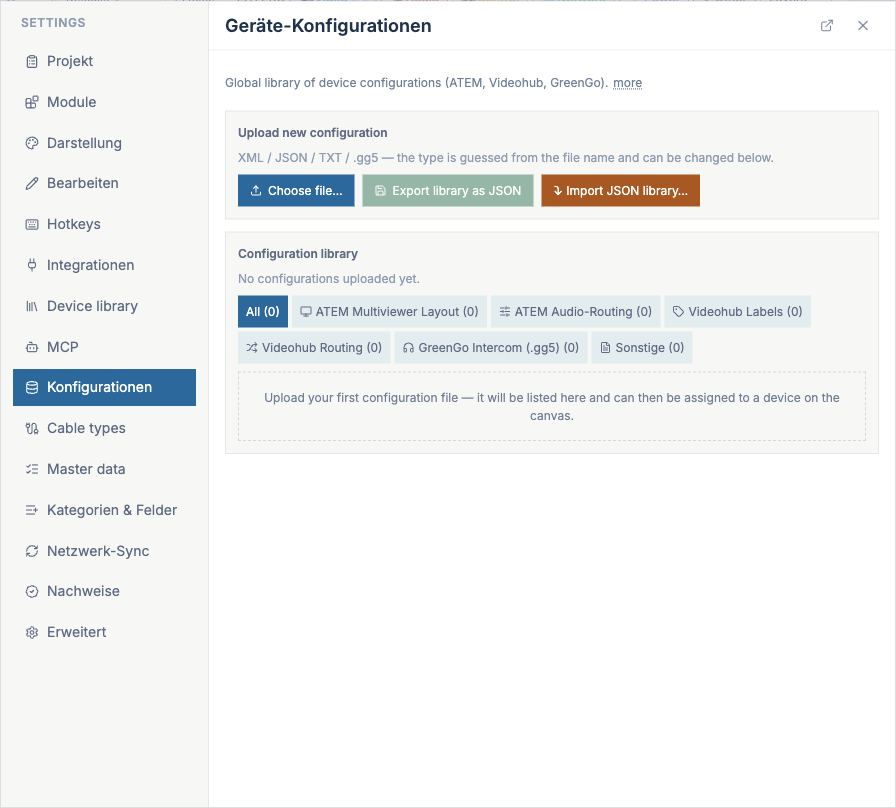

Saved device configurations (e.g., different firmware versions or settings):

| Option | Effect |
|--------|--------|
| **New configuration** | Creates a named configuration |
| **Apply configuration** | Applies a saved configuration to a device |
| **Delete configuration** | Removes an unused configuration |

### Device Library

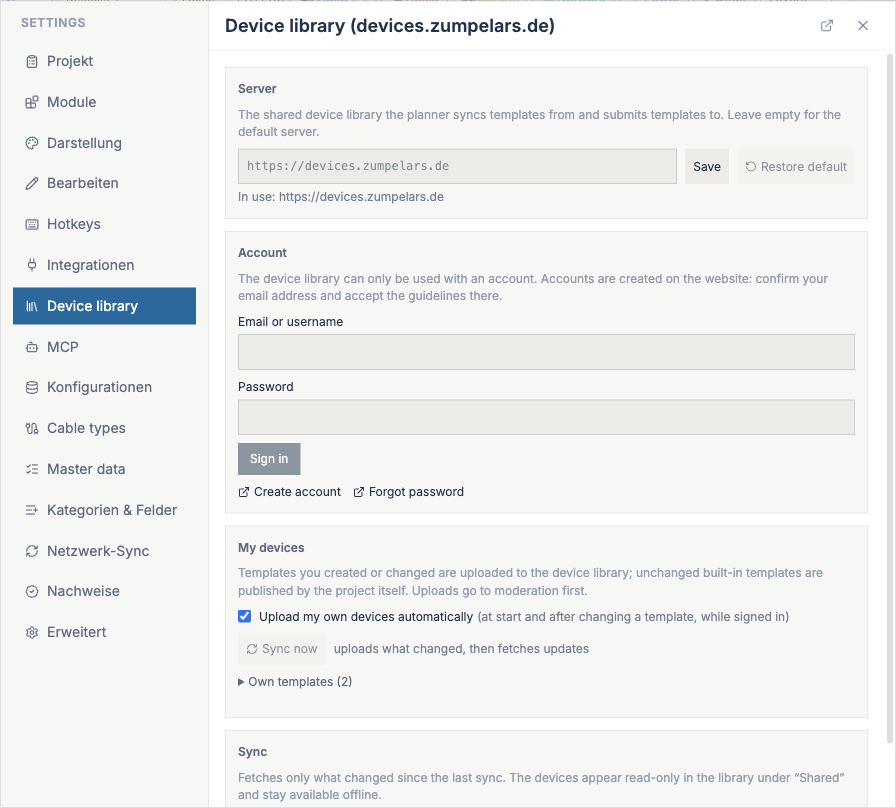

Connection to the online device database (devices.zumpelars.de):

| Option | Effect |
|--------|--------|
| **Sign in…** | Register or sign in with an account |
| **Upload devices** | Sends your own device templates to the database |
| **Uploaded devices** | Shows which devices you have already shared |

**Note:** These settings are only available in the desktop client. Browser mode does not support login.

### Integrations

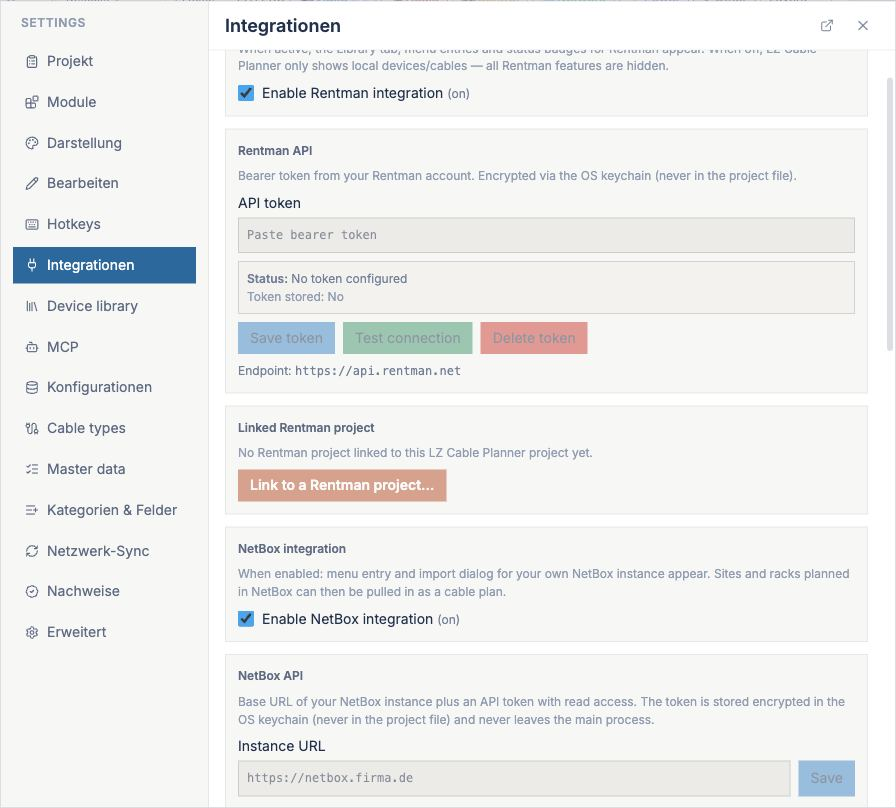

External services and AI providers:

#### Fill-in Source

Determines where the "Fill in" button gets device information from:

| Option | Effect |
|--------|--------|
| **Web search** | Searches Wikipedia and DuckDuckGo (no API key needed) |
| **AI model** | Uses an AI model (requires API key) |

#### AI Providers

| Option | Effect |
|--------|--------|
| **Provider** | Choose between Claude, OpenAI, Google Gemini |
| **API key** | Enter the provider's API key |
| **Show / hide key** | Toggles visibility of the key |

#### Rentman Integration

| Option | Effect |
|--------|--------|
| **Rentman API token** | Token for the Rentman interface |
| **Link project** | Connects the current project to a Rentman project |

#### GreenGo Presets

| Option | Effect |
|--------|--------|
| **Save preset** | Saves the current plan as a GreenGo configuration |
| **Load preset** | Loads a previously saved GreenGo configuration |
| **Delete preset** | Removes a saved preset |

### MCP

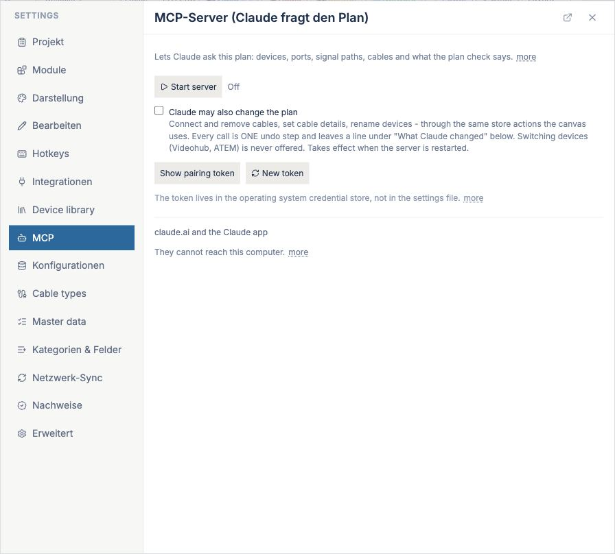

MCP server configuration (Claude queries the plan):

| Option | Effect |
|--------|--------|
| **Enable MCP server** | Toggles the connection to MCP servers |
| **Server address** | URL or path to the MCP server |
| **Authentication** | Username and password (if needed) |

**Note:** MCP servers are not available in browser mode.

### Modules

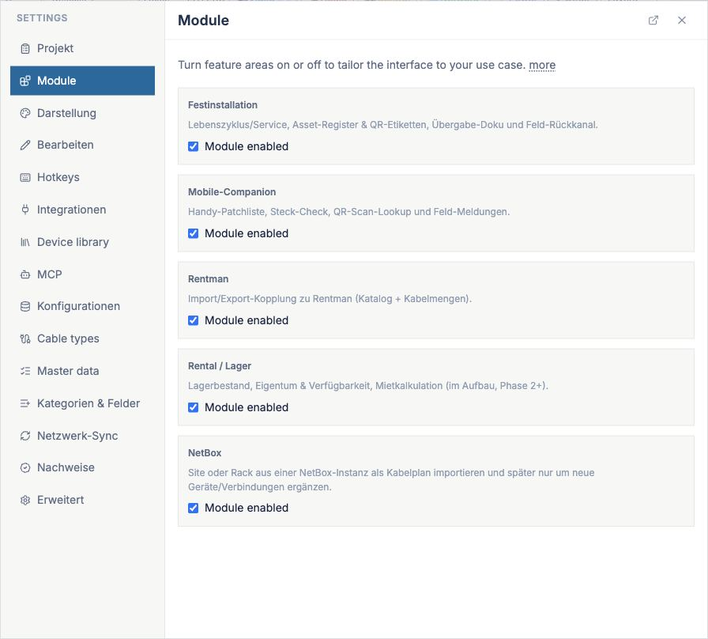

Installed and available modules:

| Module | Status | Effect |
|--------|--------|--------|
| **ATEM Control** | Enabled/Disabled | Controls Blackmagic ATEM mixer |
| **Videohub** | Enabled/Disabled | Connection to Blackmagic Videohub |
| **Rentman** | Enabled/Disabled | Rentman integration |
| **Mobile Share** | Enabled/Disabled | Share smartphone view |

Each module can be enabled or disabled.

### Certificates

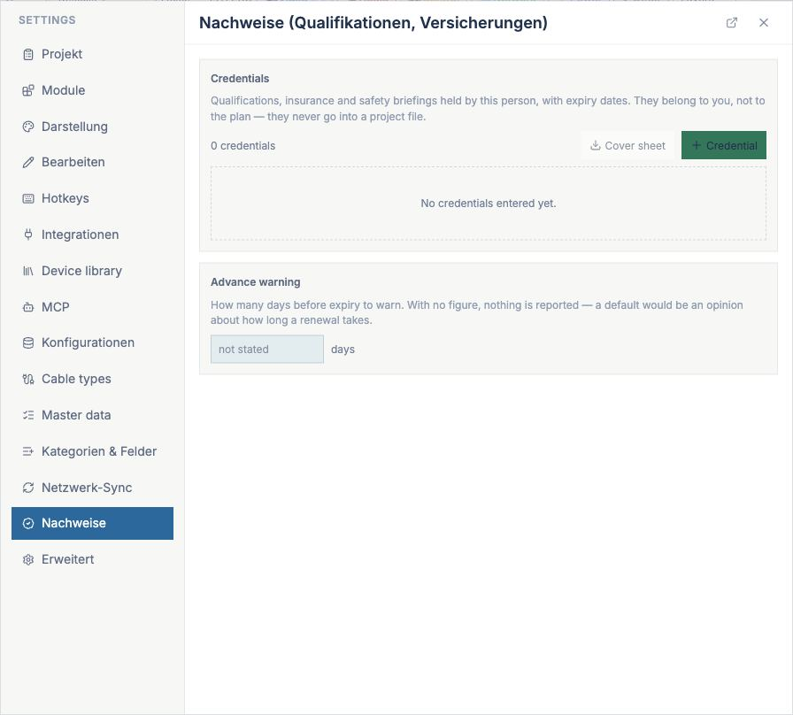

Management of qualifications and insurance:

| Option | Effect |
|--------|--------|
| **New certificate** | Creates a new qualification/insurance certificate |
| **Edit certificate** | Changes name, expiration date, or description |
| **Delete certificate** | Removes a certificate |

Certificates can be attached to people or devices.

### Schema Builder

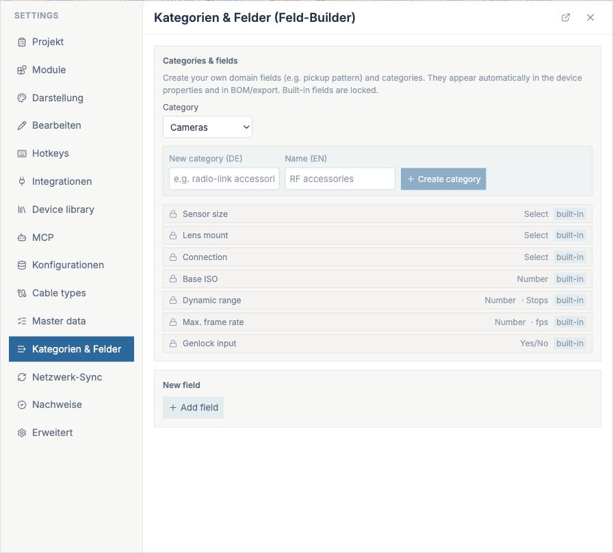

Define custom categories and fields for devices:

#### Categories

| Option | Effect |
|--------|--------|
| **New category** | Creates a new device category (e.g., "Special Cameras") |
| **Rename category** | Changes the name |
| **Delete category** | Removes an unused category |

#### Fields

| Option | Effect |
|--------|--------|
| **New field** | Creates a new attribute (text, number, dropdown, etc.) |
| **Edit field** | Changes type, validation, or default value |
| **Delete field** | Removes a field from all devices |

### Sync

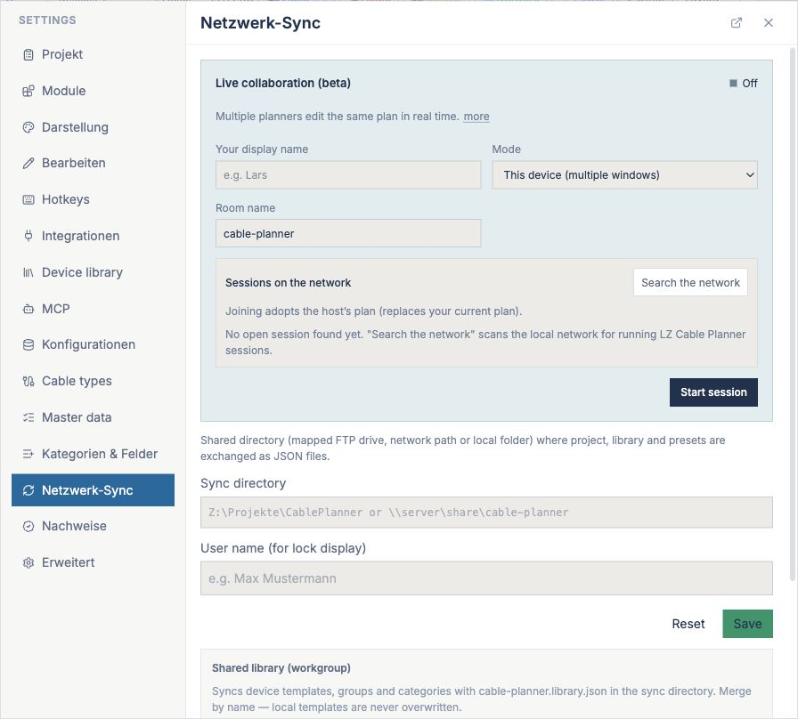

Network synchronization for collaboration:

| Option | Effect |
|--------|--------|
| **Enable sync** | Allows others to see changes live |
| **Relay server** | Address of the signaling server |
| **Room code** | Unique code for this plan (share with colleagues) |

Other users can connect to your plan if they have the room code.

### Keyboard Shortcuts

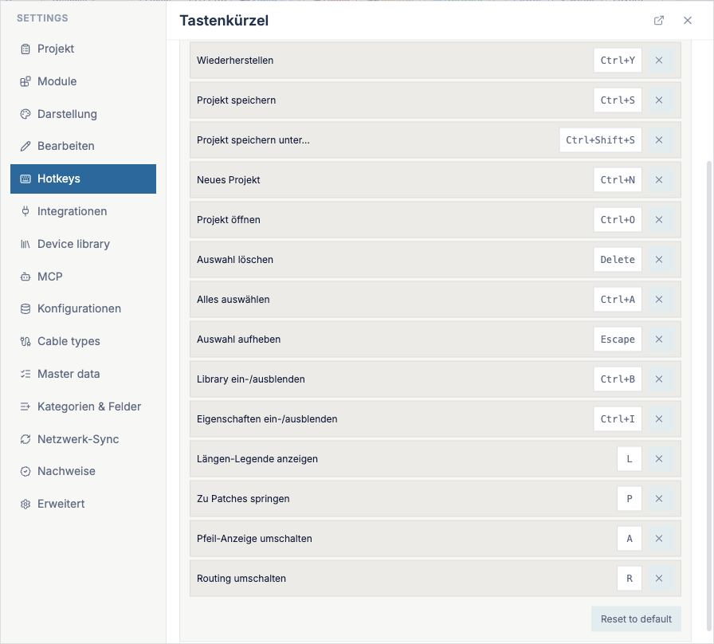

Customize keyboard shortcuts:

| Action | Default Shortcut | Effect |
|--------|------------------|--------|
| **New project** | Ctrl+N | Creates a blank project |
| **Open project** | Ctrl+O | Opens a file |
| **Save project** | Ctrl+S | Saves changes |
| **Command palette** | Ctrl+K | Opens search and navigation |
| **Settings** | (Ctrl+,) | Opens this dialog |

All shortcuts can be customized. Click an action to define a new shortcut.

### Advanced

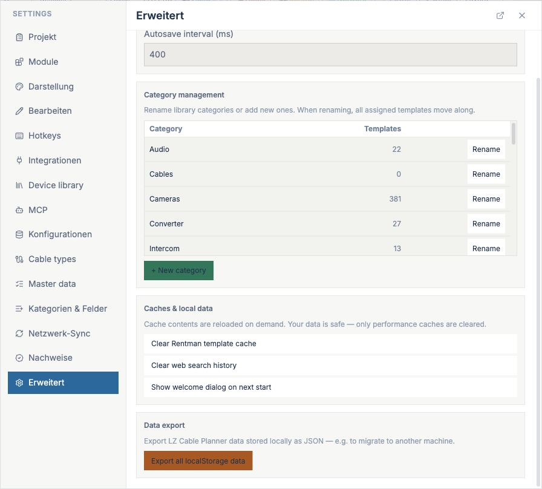

Advanced options for developers and power users:

| Option | Effect |
|--------|--------|
| **Data export** | Exports project and application data as a ZIP file |
| **Reset database** | Deletes all local data (cannot be undone) |
| **Enable logging** | Writes detailed logs for debugging |
| **Show log file** | Opens the current log file |
| **Clear cache** | Deletes the local screen cache |
| **Open DevTools** | Opens the browser developer tools |

Use these options only if you know what you are doing. They can damage your project.

---

## 11. Claude (MCP)

Claude can answer questions about the open plan — devices, ports, signal paths,
cables and the plan check.

**On this computer**

1. *Settings → MCP* → switch on. The server listens on `127.0.0.1` only and
   uses a pairing token from the keychain.
2. Copy the command shown there, for example:

   ```
   claude mcp add --transport http cable-planner http://127.0.0.1:<port>/mcp --header "Authorization: Bearer <token>"
   ```

3. Reading is the default. **Writing** is a second switch: Claude can then
   connect and remove cables, set cable details and rename devices. Each call
   is one undo step and is listed under *What Claude changed*.

**From claude.ai, the phone or another machine**

1. Put the project into the cloud (*File → Cloud & share link…*).
2. In claude.ai: *Settings → Connectors → Add custom connector* with
   `https://devices.zumpelars.de/mcp` and sign in with your device library
   account.
3. Read-only, over your own cloud projects. Disconnect under *Account →
   Security → Connected apps* on devices.zumpelars.de.

Switching commands for ATEM or Videohub are never offered.

---

## 12. Web edition and tablet

- Open **https://larszu.github.io/cable-planner/** and add it to the home
  screen; it runs full-screen with its own icon.
- Touch: pinch zooms the plan, two fingers pan, a **long press** opens the
  context menu.
- Not available in the browser (no socket, listening port or keychain): ATEM,
  Videohub, NetBox, LAN sync, phone access, MCP server, show control,
  switching, Tally-Pi, Rentman export, update check. *Settings → Integrations*
  lists them with the reason.

---

## 13. Data, safety and troubleshooting

- **Projects**: local JSON files. The app writes them atomically with a backup
  copy.
- **App data** (library, recent projects, settings) lives in the app-data
  folder `Cable Planner`.
- **Secrets** (API tokens, stream credentials, device library sign-in) live in
  the operating system's keychain. The web edition keeps the device library
  sign-in in the browser's storage.
- **"No recovery copy"** in the status bar: save the project to a file.
- **No still image preview**: install ffmpeg, and check the device is in the
  local network.
- **Device library unreachable**: the app keeps working with the devices from
  the last sync.

Questions and bug reports:
[GitHub Issues](https://github.com/larszu/cable-planner/issues).


© 2026 Lars Zumpe Medienproduktion · free to use, proprietary licence
